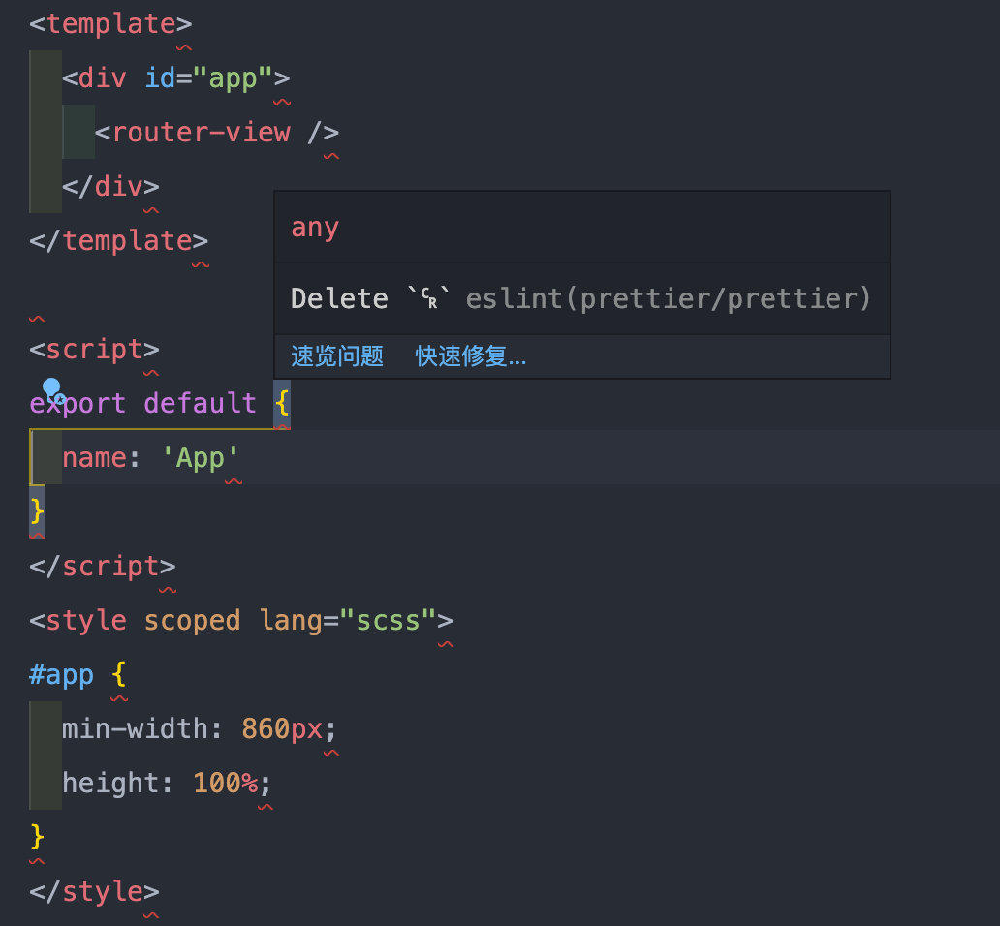

linux 或 unix 环境的换行符很简单—— `LF`，即我们熟知的 `\n`。但是在 windows 平台，默认的换行符是 `CRLF`，即 `\r\n`。

很多时候我们都是跨平台开发项目，如果项目中使用了 eslint 控制代码规范，就会因此遇到麻烦。因为 eslint 默认的换行符风格要求是 unix 的。

```json
"linebreak-style": [
  "error",
  "unix"
]
```

<!-- more -->

当把项目 clone 到 windows 平台时，git 会尝试把 `LF` 转换为 `CRLF`，这时你如果随便打开一个源码文件，就会“砰”地发现，全篇爆红，每一行都报错。报错信息为 `Delete`␍`eslint(prettier/prettier)`。



## 解决方案

**注意：** 以下措施做完，已出现问题的文件并不会自动修复，建议 **重新拉取代码**。

### VSCode `setting.js` 配置

> 如果你用的是 VSCode 的话

```bash
# 设置文件换行符为 LF
"files.eol": "\n"
```

### 修改全局的 GIT 配置

以下方式二选一：

- 方式 1 直接修改 `~/.gitconfig` 配置文件

```bash
# 追加如下配置
[core]
    autocrlf = false
```

- 方式 2 命令行执行以下命令，效果一样

```bash
git config --global core.autocrlf false
```

### 项目根目录下 `.editorconfig` 配置

```bash
# /.editorconfig
root = true

[*]
autocrlf = false
end_of_line = lf
```
