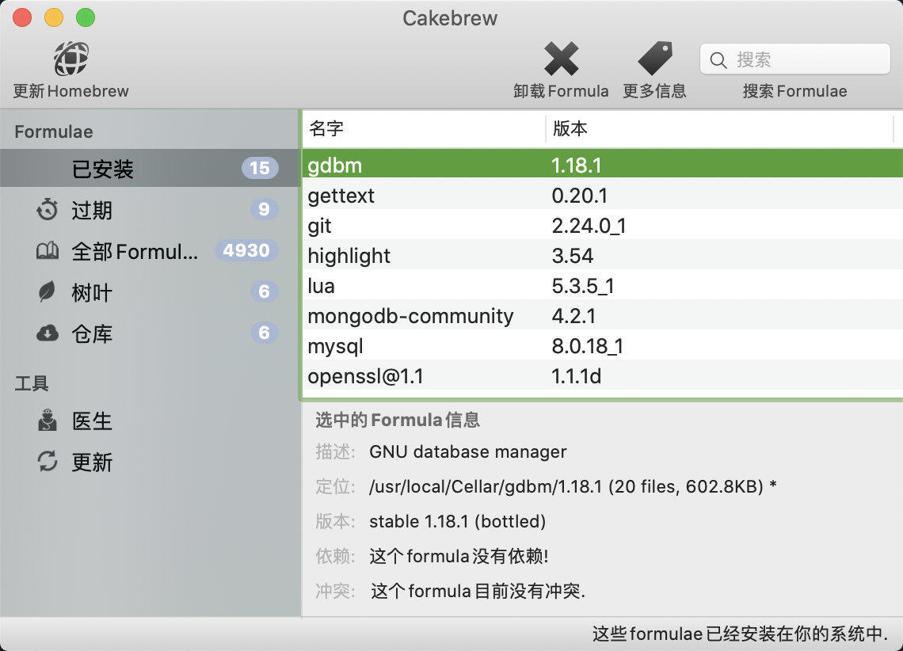
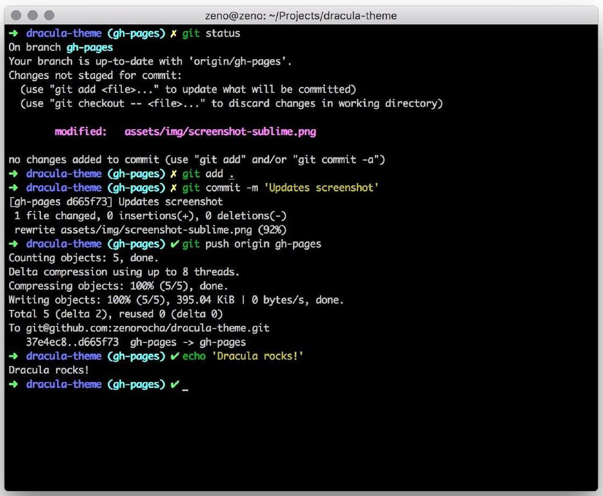

## 安装 Homebrew

Homebrew 是什么，官网的解释很到位：

> - [Homebrew](https://brew.sh/index_zh-cn) 是 macOS（或 Linux）缺失的软件包的管理器。
> - 使用 Homebrew 安装 Apple（或您的 Linux 系统）没有预装但 [你需要的东西](https://formulae.brew.sh/formula/)。

<!-- more -->

### 安装

```bash
# 复制以下命令到终端执行
/bin/bash -c "$(curl -fsSL https://raw.githubusercontent.com/Homebrew/install/master/install.sh)"
```

### 使用

#### 安装应用程序

`brew install` 命令一般用来安装非 GUI（用户图形界面）类型的程序，比如 git、yarn、mysql 等。

安装的时候，如果出现 `Updating Homebrew...`，说明 Homebrew 正在尝试更新。但是尴尬的是，由于天朝特色，这一步是连不上 Homebrew 官方的服务器的（虽然俺也不知道为啥能安装 Homebrew 却不能更新...）。这时候可以通过 `ctrl + c` 去打断更新 Homebrew，随后稍等一两秒，就会继续执行安装命令了。

我有试过更换各种国内的 Homebrew 镜像源，根本没用，后来无意中发现一种方式可以更新 Homebrew，这个后面讲。

```bash
brew install <程序名>
# 例如
brew install git
```

#### 查看已安装的程序列表

```bash
brew list
```

#### 卸载应用程序

```bash
brew uninstall <程序名>
# 例如
brew uninstall git
```

#### 显示程序信息

这一步可以当作是搜索，如果没有对应的程序可安装则会报错 `Error: No available formula with the name "程序名"`。

```bash
brew info <程序名>
```

### Homebrew Cask

**Homebrew Cask** 是 Homebrew 的扩展。使用它可以安装 GUI 程序，不用再去各个软件的官网或者 App Store 上搜索下载。一行命令搞定，逼格满满。

#### 安装软件

老规矩，出现 `Updating Homebrew...`，敲 `ctrl + c`。

```bash
brew cask install <程序名>
# 例如
brew cask info qq
```

#### 查看已安装的程序列表

```bash
brew cask list
```

#### 卸载程序

```bash
brew cask uninstall <程序名>
# 例如
brew cask uninstall qq
```

#### 显示程序信息

和 `brew info` 一样，这一步可以当作是搜索，如果没有对应的程序可安装则会报错 `Error: Cask '程序名' is unavailable: No Cask with this name exists.`。

```bash
brew cask info <程序名>
```

## Cakebrew

Cakebrew 是一个 GUI 工具，可以用来管理用 Homebrew Cask 安装的程序，并且它可以帮我们 **更新 Homebrew**。

这就是我之前说的更新 Homebrew 的方法。

### 安装 Cakebrew

`brew cask install cakebrew`

### 使用

如图：



点击左上角的 **更新 Homebrew** 就可以更新 Homebrew 了。耐心等待，安装完成会有提示。

## 修改计算机名和主机名

- 计算机名：相当于这台电脑的昵称，随便起，比如 `某某人的MBP`
- 主机名：是这台电脑在局域网中的名字，可以简单理解为对外的一个名字，最好是英文。如 `wxc_mac`。

### 修改计算机名

```bash
sudo scutil --set ComputerName <名字>

# 例如
sudo scutil --set ComputerName 某某人的MBP
```

### 修改主机名

```bash
sudo scutil --set HostName <名字>

# 例如
sudo scutil --set HostName wxc_mac
```

## 最新版 Git 替代自带的 Git

细心的小伙伴可能会发现，mac 自带 git。但是自带的 git 版本不高，而且安装的目录都不知道在哪，心里不踏实，所以我选择手动安装最新的 git。

安装：

```bash
brew install git
```

安装完之后 `git --version` 查看一下，诶？怎么版本没有变化。别急，这是因为，当前的全局 git 命令还被老版本的 git 霸占着，我们需要通过软链接命令去更新下全局 git 的命令读取位置。

```bash
sudo ln -sf /usr/bin/git /usr/local/bin/git
```

这时候 `git --version` 查看版本就是最新安装的版本了。

## python3 替代自带的 python2

跟 git 一样，mac 有自带的旧版本 python。如果不安装 python3，开发过程中可能会遇到问题，特别是安装一些依赖的时候。

安装 python3 和 安装 git 如出一辙：

```bash
brew install python

sudo ln -sf /usr/bin/python /usr/local/bin/python
```

## Oh My Zsh

[Oh My Zsh](https://ohmyz.sh/)：Mac 上最好用的终端环境。Mac 上默认的终端环境是 `bash`。

### 安装

```bash
sh -c "$(curl -fsSL https://raw.github.com/ohmyzsh/ohmyzsh/master/tools/install.sh)"
```

### 更换主题

Oh My Zsh 可以内置了很多主题，你可以在 `~/.oh-my-zsh/themes` 路径下查看。如果想更换为内置主题，比如想把主题更换为 `tonotdo.zsh-theme` 这个主题，只需要修改 `~/.zshrc` 文件，找到 `ZSH_THEME="xxx"` 这一行（默认一般在第9行），然后把 `xxx` 改为 `tonotdo`。

> 注意：每次修改了 `~/.zshrc` 文件，都需要重新 `source` 一下以应用更新。

```bash
source ~/.zshrc
```

#### 第三方主题 —— Dracula 主题

[Dracula](https://draculatheme.com/zsh/) 是我最喜欢的 zsh 主题，优雅简洁好看。当然 Dracula 不光有 zsh 的主题，它能依托的平台非常多，感兴趣的可以去官网查看。



安装第三方主题的方式有两种：

- 方法一是直接把主题文件下载并拷贝到 `~/.oh-my-zsh/themes` 下，然后改 `~/.zshrc` 文件的主题配置。
- 方法二是把第三方主题文件下载到自定义的一个目录，然后通过软连接的方式去映射主题文件。


这里我选择第二种，官网的安装方法也是第二种。

首先在 `~` 目录下新建专门存储 Oh My Zsh 相关第三方内容的自定义文件夹，比如我的叫 `.wxc-zsh`

```bash
mkdir .wxc-zsh
```

这是一个隐藏文件夹，如果想在访达中查看，需要敲 `command + shift + .` 来显示所有文件。再按一次隐藏。

随后 `cd` 到 `.wxc-zsh`，在里面新建 `themes` 文件夹专门用于存放主题。然后把 Dracula 主题克隆到该文件夹

```bash
cd .wxc-zsh

mkdir themes

cd themes

git clone https://github.com/dracula/zsh.git dracula
```

随后通过软连接把 `~/.wxc-zsh/themes/dracula/dracula.zsh-theme` 映射到  `~/.oh-my-zsh/themes/dracula.zsh-theme` 下。

**注意：** 软连接命令连接的两个路径，不能是相对路径，必须是全路径。

比如我的 Mac 上命令这么敲：

```bash
 ln -s /Users/wxc/.wxc-zsh/themes/dracula/dracula.zsh-theme /Users/wxc/.oh-my-zsh/themes/dracula.zsh-theme
```

路径请自行修改

最后别忘了修改 `~/.zshrc` 文件的主题配置和 `source` 一哈

## iTerm2

[iterm2](https://iterm2.com/) 是 Mac 上最好用的第三方终端工具，比自带的强很多。

安装：

```bash
brew cask install iterm2
```

## Sourcetree

[Sourcetree](https://www.sourcetreeapp.com/) 是全平台免费的 git GUI 工具。唉，说起来光看颜，我是更喜欢 Gitkraken 的，可惜最新版本开始收费了。

安装：

```bash
brew cask install sourcetree
```

## NodeJs

推荐直接去 [官网](https://nodejs.org/zh-cn/) 下载 **长期支持版** 的安装包，不要搞幺蛾子的 NVM 去管理 node 版本，亲身尝试，真的很坑，坑到哭的那种。如果非要想去管理 node 版本，可以选择安装一个全局的 npm 包：[`n`](https://www.npmjs.com/package/n)。

## VSCode

```bash
brew cask install visual-studio-code
```

VSCode 的详细配置，请参考我另一篇文章 [VSCode 的插件与配置](https://www.jianshu.com/p/284fa273e20f)

## mirror-config-china

为中国内地的 Node.js 开发者准备的镜像配置，大大提高 node 模块安装速度。

```bash
# 安装
npm i -g mirror-config-china --registry=https://registry.npm.taobao.org
# 查看npm配置
npm config list
# 查看环境变量
source ~/.zshrc && env
```

---

待补充...
