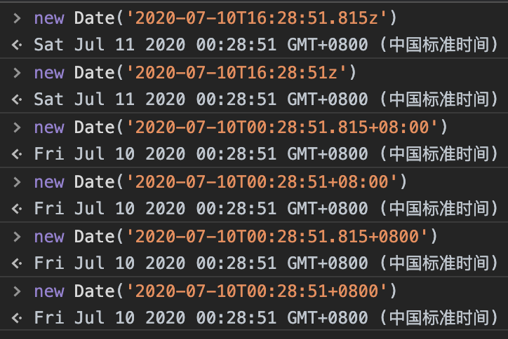
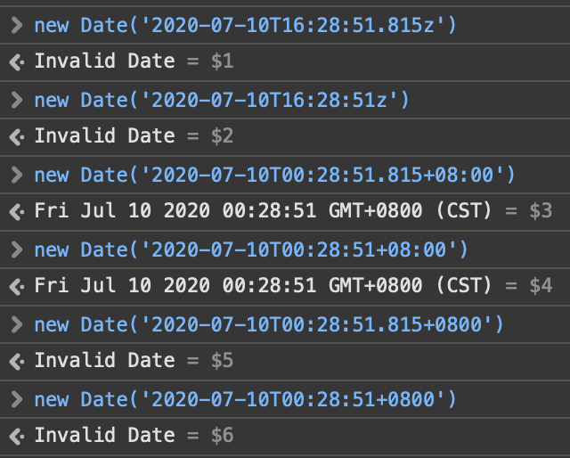

## 概念罗列

在前端开发中，对于日期的处理往往没有想象中简单。这里面涉及到几个概念：

- GMT
- UTC
- 时间戳
- ISO-8601

以上四个名词是我认为比较关键的名词，理解它们，能很好得帮助我们处理日期格式。

<!-- more -->

## 格林威治标准时间 GMT 和 世界协调时间 UTC

之所以把这两个概念放在一起，是因为它们其实约等于同一个概念。

首先我需要声明，GMT 和 UTC **并不是日期格式** ——我有很长的一段时间都是把它们理解为是两种日期格式，但其实这个理解是完全错误的。

它们其实是两种时间标准。或者说是两种规范准则。它们定义了某时某刻的 **世界标准时间** 应该是多少。什么是世界标准时间？指的是0时区的时间。各国各地区的时间都是以这个世界标准时间为基础，加减上时区偏移的数值，换算过来的。

假设此时此刻的世界标准时间是 `2020年7月10号 16:28:51`。那么，此时此刻的北京时间是 `2020年7月11号 00:28:51`。GMT 和 UTC 这两种标准背后有着相应的计算逻辑，计算出了当前的世界时间必须是 `2020年7月10号 16:28:51`，这个时间点也可以书写成 `Fri, 10 Jul 2020 16:28:51 GMT`，怎么表示都可以，只要能表明年月日时分秒。

GMT 是前世界时间的标准，UTC 是现代世界时间的标准。从精确度来讲，UTC 要比 GMT 更精准一些。但是实际上二者的差别非常微小。并且一般日常生活中说时间只会说到秒，体现不出二者的差别。所以一般认为 GMT 和 UTC 等同。

## 时间戳（timestamp）

> 时间戳是指 以 GMT（格林威治标准时间） 为标准，从1970年1月1日开始算起，到当前时间的 **总秒数/总毫秒数**。

既然是在 GMT 的基础上做的计算，那么时间戳本身就是与时区无关的一个数值。

依旧假设此时此刻的时间是 `2020年7月10号 16:28:51`，这个字符串并不能明确表示出所在的时区，在美国和在美国说出这个时间，那代表的时刻就完全不一样，中间相差近12个小时。

假设此时此刻的时间戳是 `1594398531000`，那么不管我在美国还是在中国，它都是代表了同一个时刻。

如果你需要开发一个国际项目或者服务器设置的时区与客户端不一致时，那么前后端可以事先把时间处理成时间戳，再进行前后端交互。这样就不会产生时区的错乱。

## ISO-8601 国际标准时间格式

跟 GMT 和 UTC 不同，[**ISO-8601**](https://www.iso.org/iso-8601-date-and-time-format.html) 代表的是一种时间字符串的格式。

以前面的世界标准时间 `2020年7月10号 16:28:51` 为例，用 ISO-8601 规定的格式可以写作：

```js
// UTC 标准时区
'2020-07-10T16:28:51.815z'
'2020-07-10T16:28:51z'

// UTC 标准时区+8
'2020-07-10T00:28:51.815+08:00'
'2020-07-10T00:28:51+08:00'

// UTC 标准时区+8
'2020-07-10T00:28:51.815+0800'
'2020-07-10T00:28:51+0800'
```

- 其中 `T` 是年月日和时分秒之间的分隔符。
- 如果表示的是 UTC 标准时区，末位以 `z` 结尾，代表了 0 时区。
- 如果想要表示时区，比如东八区，末位去掉 `z`，追加 `+08:00` 或者 `+0800`。这更像是一种注解，它表示前面的 `2020-07-10T00:28:51` 是东八区时间。
- `.815` 代表毫秒数，有了更精确，没有就代表0毫秒。
- 其实还有一种 basic 格式的写法：`20200710T162851`。但经过我的尝试，浏览器并不能解析这种格式，实际也很少见，所以不赘述。

[**ISO-8601** 官网](https://www.iso.org/iso-8601-date-and-time-format.html) 阐述了 ISO-8601 一个作用：

> It gives a way of presenting dates and times that is clearly defined and understandable to both people and machines.（它提供了一种清晰明了显示日期和时间的方式，使人和机器都可以理解。）

按照官网所述，这种格式既可以让人理解顺畅，又可以让机器理解。那么在开发时，前后端的日期时间传递，都用这种格式是不是更好呢？毕竟时间戳一点都不直观。

别急，先来看看 ISO-8601 格式在浏览器中的表现。

- 首先是 Chrome：



- 其次 Safari：



很明显，Safari 拖了后腿。它并不能很好的解析某些 ISO-8601 的格式。如果后端接口直接返回 ISO-8601 格式，前端通过 `new Date()` 去解析，在 Safari 浏览器中就会报错： `Invalid Date`。

这显然不是我们想要的。

那有办法可以解决 Safari 的问题吗？

答案是肯定的。除了通过 `new Date()` 去解析时间字符串，我们还可以借助第三方的 **时间处理插件**。

下面我来讲解三款常用插件对于 ISO-8601 格式的解析：

### Moment.js

作为老牌的日期时间处理工具，[Moment.js](http://momentjs.cn/) 可谓鼎鼎大名。

Moment 从2.7.0版本开始，提供了针对于[特殊格式的解析](http://momentjs.cn/docs/#/parsing/special-formats/)功能

- 解析 ISO-8601

```js
moment('2020-07-10T16:28:51z', moment.ISO_8601)

moment('2020-07-10T00:28:51+08:00', moment.ISO_8601)
```

- 格式化成 ISO-8601

```js
moment().utc().format('YYYY-MM-DDTHH:mm:ss.SSS[Z]') // 2020-07-10T16:28:51z
// or
moment().toDate().toISOString() // 2020-07-10T16:28:51z
```

### date-fns

相比于 Moment.js 的笨重，[date-fns](https://date-fns.org/) 更像是一个年轻的小伙。它可以按需引入，彰显模块化的优点。

- 解析 ISO-8601

```js
import { parseISO } from 'date-fns'

parseISO('2020-07-10T16:28:51z')

parseISO('2020-07-10T00:28:51+08:00')
```

- 格式化成 ISO-8601

```js
import { formatISO } from 'date-fns'

formatISO(new Date()) // 2020-07-10T16:28:51z
```

### Day.js

相比于 Moment.js 和 date-fns 的功能全面，[Day.js](https://day.js.org/) 就显得异常轻量。它的核心包只有 **2k** 大小。

正因为太简约，dayjs 的核心包功能并不具备解析 ISO-8601 格式的功能。需要引入相应的辅助插件：

- 解析 ISO-8601

```js
import dayjs from 'dayjs'
import customParseFormat from 'dayjs/plugin/customParseFormat'
dayjs.extend(customParseFormat)

dayjs('2020-07-10T16:28:51z', 'YYYY-MM-DDTHH:mm:ss.000ZZ')

dayjs('2020-07-10T00:28:51+08:00', 'YYYY-MM-DDTHH:mm:ss.000ZZ')
```

- 格式化成 ISO-8601

```js
dayjs().format() // 2020-07-10T00:28:51+08:00

// or

dayjs().format('YYYY-MM-DDTHH:mm:ssZ[Z]') // 2020-07-10T16:28:51z

// or
import dayjs from 'dayjs'
import utc from 'dayjs/plugin/utc'
dayjs.extend(utc)
dayjs().utc().format() // 2020-07-10T16:28:51z
```

---

有了以上插件的帮助，前后端数据传递就可以愉快的使用 ISO-8601 格式了。相比于时间戳，追踪时间问题的时候更友好一些。
