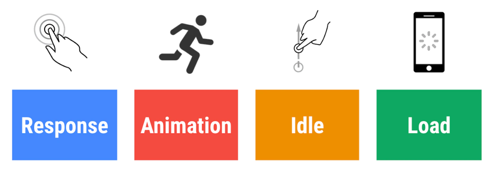
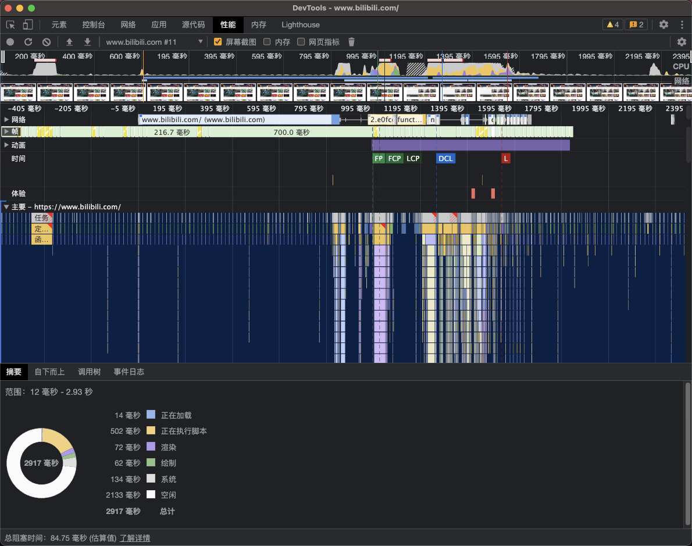
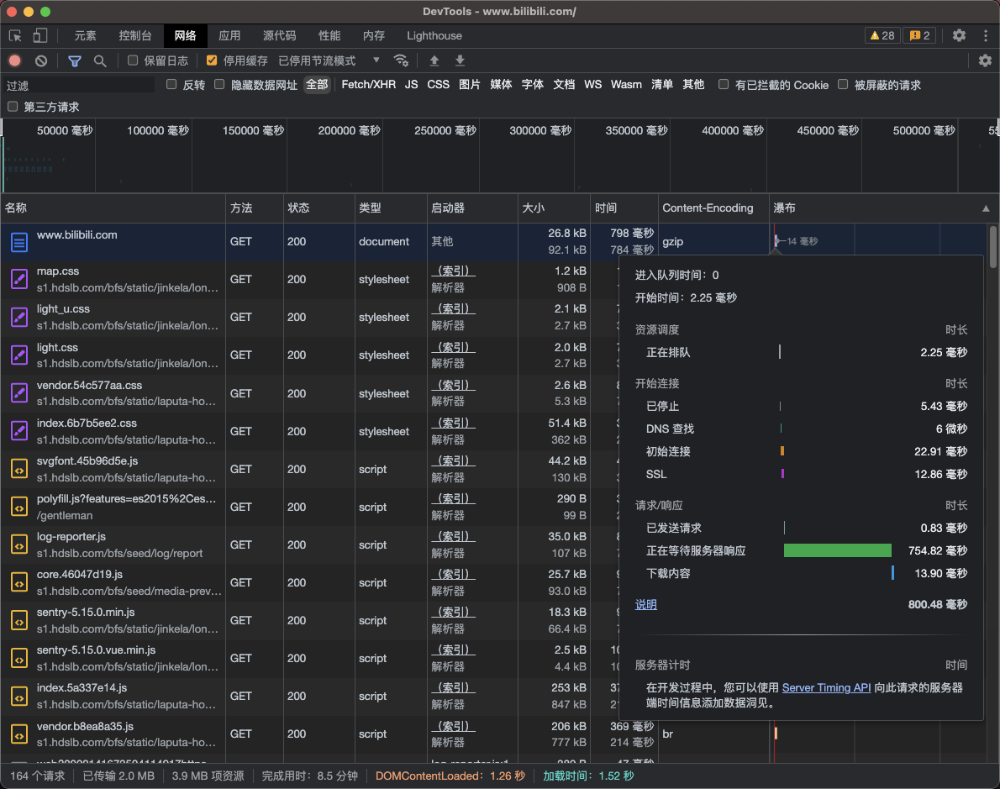
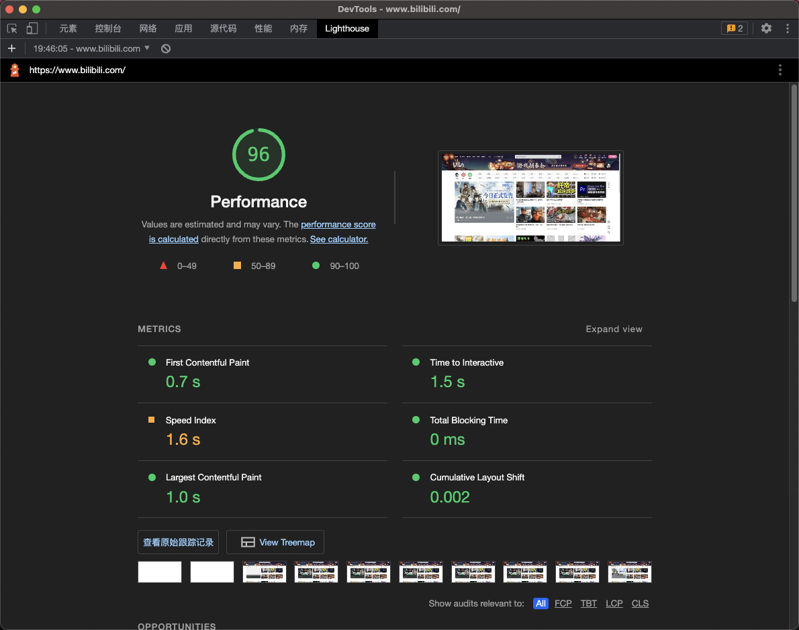
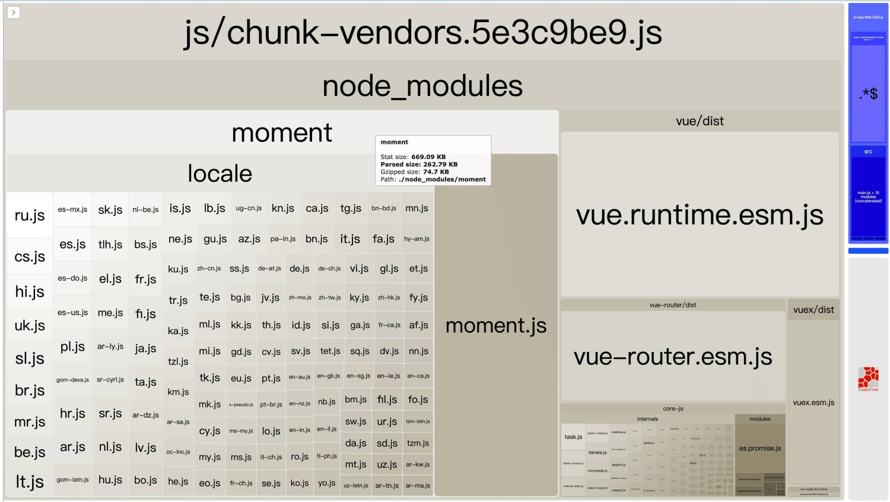
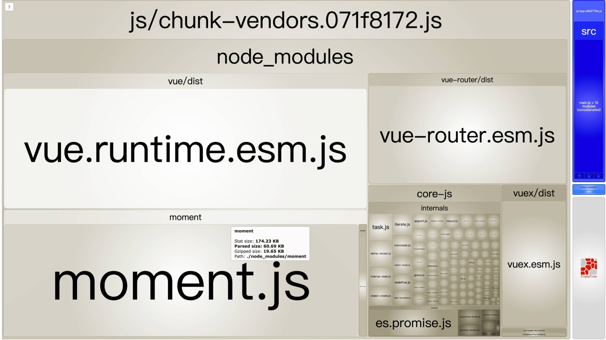
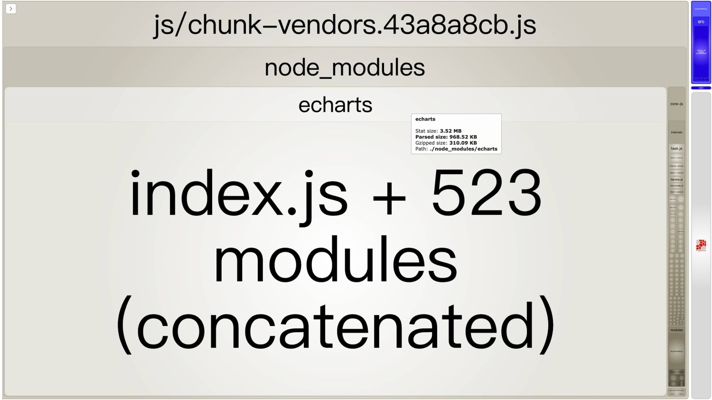
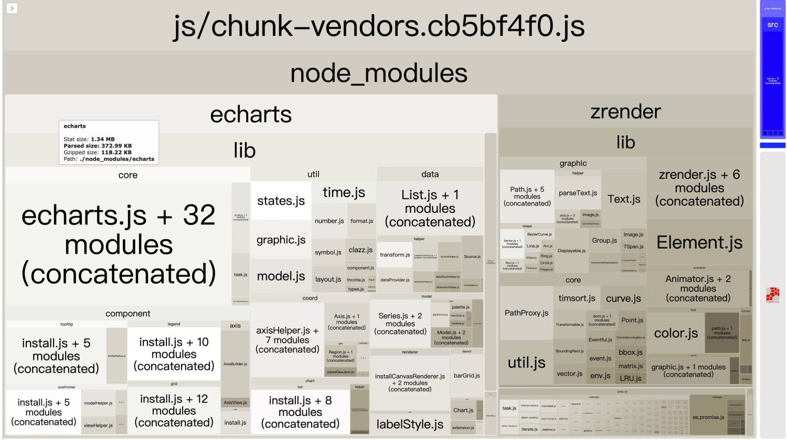
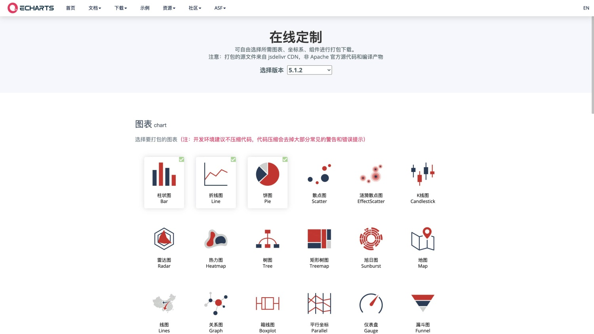
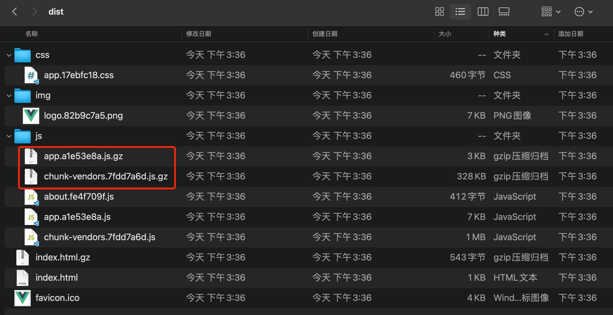

# Vue2 项目可以做哪些性能优化措施？

为什么在 2023 年了还提 Vue2 项目的性能优化？其一是很多公司的项目肯定还是 Vue2 的，其二是这是一篇重新整理再发布的文章 🤣。

---

Vue CLI 帮我们很轻松地创建初始的 Vue2 项目，但是如果只使用默认的配置，再加上不优雅的代码组织，打包发布后就会出现文件体积过大、首屏加载速度慢、占用内存高、页面缩放时很卡顿等各种各样的性能问题。

所以要对项目做各种有针对性的性能优化措施。而性能优化的最终目的是为了提高用户的使用舒适度，从而留住用户。

## 01. 性能标准

性能在实际的应用场景中，永远都是有瓶颈的，没有绝对的标准，只有在当前的硬件软件条件下做到最好。

硬要说标准的话，谷歌公司在 2020 年发表过一篇文章：[《使用 RAIL 模型衡量性能》](https://web.dev/rail/)，其中提到了**RAIL 模型**，可以作为一个很好的**参考标准**：

- _响应 Response_：在 50 毫秒内处理事件
- _动画 Animation_：在 10 毫秒内生成一帧
- _空闲 Idle_：最大限度增加空闲时间
- _加载 Load_：在 5 秒内交付内容并实现可交互



## 02. 性能检测

本片文章我们是站在一名前端工作者的角度，对一个 Vue2 开发的站点进行性能检测。可以通过以下几种方式检测出站点的大体性能，从而确定优化的方向。

前三种属于 Chrome 的内置功能，也是前端开发中常用的功能，就不展开描述了。

### 2.1 Chrome 性能面板

主要关注在**页面渲染过程**中各阶段的耗时。



### 2.2 Network 瀑布图

主要关注各资源的大小和加载时间。



### 2.3 Lighthouse

Lighthouse 会自动测试网站性能，并给出可读性强的报告。



### 2.4 webpack 包内容分析

集成 webpack 的项目，可以通过 `webpack-bundle-size-analyzer` 插件生成包分析视图，Vue CLI 默认配置中内置了该插件，可以通过在打包命令后追加 `--report`或`--report-json` 两种参数来生成分析文件。

- `--report`：打包后在 `dist` 目录下生成 `report.html` 文件
- `--report-json`：打包后在 `dist` 目录下生成 `report.json` 文件
-

我们主要关注 `report.html` 文件，可以很直观地看到所有包的大小和占比。

为了方便，我们可以自定义一个 `npm script`。

```json
# package.json
{
  "scripts": {
    "build:report": "vue-cli-service build --report"
  },
}
```

敲 `npm run build:report` 命令后，会进行打包操作，并在 `dist` 目录下生成 `report.html` 文件，`report.html` 文件打开如下图所示：


## 03. 优化措施

有了以上的性能检测，应该能知道自己的网站有什么样的性能问题，可以有针对地对具体性能问题做具体优化。

优化的措施，涉及到很多的知识，浏览器工作原理、浏览器缓存机制、HTTP 协议、服务器相关、前端工具链等，方方面面，都需要我们在前端耕耘的过程，逐步积累。

当然也可以先抄作业，之后再慢慢理解其中的原理。下面我会列举我在项目中使用过的性能优化措施，包括普适性的和只针对于 Vue2 项目的。

以下涉及到 Vue CLI 的相关配置，需要 Vue CLI 版本 >= 3.0，Vue CLI 3 和 Vue CLI 4+的配置方式也有一定差异，请注意自己的版本。

### 3.1 路由懒加载

[路由懒加载](https://router.vuejs.org/zh/guide/advanced/lazy-loading.html#路由懒加载)是非常有效的减少首屏加载时间的技巧，可以把不同路由对应的组件分割成不同的代码块，然后当路由被访问的时候才加载对应组件。

建议除了登录页面、首页、404 等页面，其他业务性质的页面全部采用懒加载模式。

- 例如：

```js
const router = new VueRouter({
  routes: [{ path: '/foo', component: () => import('@/views/Foo.vue') }]
})

// or

const Foo = () => import('@/views/Foo.vue')
const router = new VueRouter({
  routes: [{ path: '/foo', component: Foo }]
})
```

- 还可以把某几个路由下的所有组件都打包在同个异步块（chunk）中：

```js
// 通过特殊的注释语法来提供 chunk name
const router = new VueRouter({
  routes: [
    {
      path: '/user/detail',
      component: () =>
        import(/* webpackChunkName: "user" */ '@/views/UserDetail.vue')
    },
    {
      path: '/user/setting',
      component: () => import(/* webpackChunkName: "user" */ '@/views/Foo.vue')
    },
    {
      path: '/user/profile',
      component: () => import(/* webpackChunkName: "user" */ '@/views/Foo.vue')
    }
  ]
})
```

### 3.2 异步组件

[异步组件](https://v2.cn.vuejs.org/v2/guide/components-dynamic-async.html#异步组件)和路由懒加载的原理类似，都是将应用分割成小一些的代码块，并且只在需要的时候才从服务器加载一个模块。

Vue 可以用一个工厂函数的方式定义组件，这个工厂函数会异步解析组件定义，在这个组件需要被渲染的时候才会触发该工厂函数，且会把结果缓存起来供未来重渲染。

- 注册异步组件

```js
Vue.component('async-webpack-example', function (resolve) {
  // 这个特殊的 `require` 语法将会告诉 webpack
  // 自动将你的构建代码切割成多个包，这些包
  // 会通过 Ajax 请求加载
  require(['./my-async-component'], resolve)
})

// or

Vue.component(
  'async-webpack-example',
  // 这个动态导入会返回一个 `Promise` 对象。
  () => import('./my-async-component')
)
```

- 在单文件组件中异步引入组件

```js
new Vue({
  // ...
  components: {
    'my-component': () => import('./my-async-component')
  }
})
```

### 3.3 函数式组件

如果一个组件没有管理任何状态，没有监听任何传递给它的状态，也没有生命周期方法，只是接受一些 prop，那么就可以使用[函数式组件](https://v2.cn.vuejs.org/v2/guide/render-function.html#函数式组件)，函数式组件的性能要优于普通组件。

- 注册函数式组件

```js
Vue.component('my-component', {
  functional: true,
  // Props 是可选的
  props: {
    // ...
  },
  // 为了弥补缺少的实例
  // 提供第二个参数作为上下文
  render: function (createElement, context) {
    // ...
  }
})
```

- 单文件组件通过 `functional` 声明

```html
<template functional> </template>
```

### 3.4 Vue 内置指令的使用注意

#### 3.4.1 `v-for` 须为每一项设置唯一 `key` 属性

在不指定唯一`key`时，当 Vue 更新使用 `v-for` 渲染的元素列表时，它默认使用“就地更新”的策略，即 Vue 不会按需更新改变了的项，而是刷新整个循环列表。

当指定了唯一 `key` 后，相当于给了 Vue 一个提示，以便它能跟踪每个节点的身份，从而重用和重新排序现有元素。

```html
<div v-for="item in items" v-bind:key="item.id">
  <!-- 内容 -->
</div>
```

::: tip 注意
不要使用 `index` 作为 `key` 使用，除非在不得已的情况下，比如：

- 要渲染的数据是字符串数组，其中从业务层面必然存在重复的数据
- 要渲染的对象数组中，没有可以作为唯一 `key` 的一个或多个字段（多个字段是指：有时候我们需要用多个字段拼接作为唯一 `key`）
  :::

#### 3.4.2 `v-for` 与 `v-if`

**永远不要把 **`**v-if**`** 和 **`**v-for**`** 同时用在同一个元素上。**

当它们处于同一节点时，`v-for` 的优先级比 `v-if` 更高，这意味着 `v-if` 将分别重复运行于每个 `v-for` 循环中。

如果是想要有条件地跳过循环的执行，那么可以将 `v-if` 置于外层 DOM 元素（或 `<template>`）上。例如：

```html
<ul v-if="todos.length">
  <li v-for="todo in todos">{{ todo }}</li>
</ul>
<p v-else>No todos left!</p>
```

需要显示部分数据时，可以通过计算属性或方法产出一份处理好的数据。

- 使用计算属性

```html
<li v-for="n in evenNumbers">{{ n }}</li>
data: { numbers: [ 1, 2, 3, 4, 5 ] }, computed: { evenNumbers: function () {
return this.numbers.filter(function (number) { return number % 2 === 0 }) } }
```

- 使用方法

```html
<ul v-for="set in sets">
  <li v-for="n in even(set)">{{ n }}</li>
</ul>
data: { sets: [[ 1, 2, 3, 4, 5 ], [6, 7, 8, 9, 10]] }, methods: { even: function
(numbers) { return numbers.filter(function (number) { return number % 2 === 0 })
} }
```

### 3.5 Vue 内置 API 的使用注意

#### 3.5.1 区分 `computed` 和 `方法` 的使用场景

`computed` 和 `方法`都可以做同样的事情：

```html
<div id="example">
  <p>Original message: "{{ message }}"</p>

  <p>Computed reversed message: "{{ reversedMessage }}"</p>
  <p>
    Use the method to generate reversed message: "{{ generateReversedMessage()
    }}"
  </p>
</div>
```

```js
const vm = new Vue({
  el: '#example',
  data: {
    message: 'Hello'
  },
  computed: {
    // 通过计算属性产出处理好的数据
    reversedMessage: function () {
      return this.message.split('').reverse().join('')
    }
  },
  methods: {
    // 通过方法产出处理好的数据
    generateReversedMessage: function () {
      return this.message.split('').reverse().join('')
    }
  }
})
```

不同的是**计算属性是基于它们的响应式依赖进行缓存的**。

- 当需要用缓存时，使用计算属性，不希望有缓存，用方法来替代。
- 有性能开销比较大的计算时，尽量使用计算属性。

#### 3.5.2 区分 `computed` 和 `watch` 的使用场景

虽然计算属性和侦听属性在一定程度上可以做同样的事情，比如：

```html
<div id="demo">{{ fullName }}</div>
```

```js
const vm = new Vue({
  el: '#demo',
  data: {
    firstName: 'Foo',
    lastName: 'Bar',
    fullName: 'Foo Bar'
  },
  watch: {
    firstName: function (val) {
      this.fullName = val + ' ' + this.lastName
    },
    lastName: function (val) {
      this.fullName = this.firstName + ' ' + val
    }
  }
})
const vm = new Vue({
  el: '#demo',
  data: {
    firstName: 'Foo',
    lastName: 'Bar'
  },
  computed: {
    fullName: function () {
      return this.firstName + ' ' + this.lastName
    }
  }
})
```

但是计算属性的核心逻辑是**依赖一份或多份数据最终产出一个处理后的值**，而侦听属性的核心逻辑是**监听到一个数据的变化后，处理后续的一系列逻辑**。侦听属性的使用场景明显要大于计算属性，尽管它们一定程度上可以做同样的事情。

在符合**“最终产出一个处理后的值”**的直觉下，尽量使用计算属性，其他情况使用侦听属性。

### 3.6 组件销毁时，需移除手动绑定的事件

组件实例销毁后会调用 `destroyed` 钩子，该钩子被调用后，对应 Vue 实例的所有指令都被解绑，所有的事件监听器被移除，所有的子实例也都被销毁。

但是通过 `addEventListener` 手动绑定的事件，不会被销毁，需要在销毁前手动移除：

```js
mounted() {
  element.addEventListener("resize", handleResize)
},
beforeDestroy() {
  element.removeEventListener("resize", handleResize)
}
```

::: tip 注意
如果同一个事件监听器分别为“事件捕获（`capture` 为 `true`）”和“事件冒泡（`capture` 为 `false`）”注册了一次，这两个版本的监听器需要分别移除。移除捕获监听器不会影响非捕获版本的相同监听器，反之亦然。具体请参考[EventTarget.removeEventListener() - Web API 接口参考 | MDN](https://developer.mozilla.org/zh-CN/docs/Web/API/EventTarget/removeEventListener)。
:::

### 3.7 `Object.freeze()` 优化静态数据

如果组件中只是单纯需要展示初始值，不会有后续的变化，或者只会进行整体替换的操作，不需要响应细微的变化时，那么可以用`Object.freeze()`来做冻结数据，`Object.freeze()`会阻止修改现有的`property`，也意味着响应系统无法再追踪变化。例如：

```js
const obj = {
  foo: 'bar',
  ...
}

Object.freeze(obj)

new Vue({
  el: '#app',
  data: obj
})
new Vue({
  el: '#app',
  data: {
    logs: []
  },
  async created() {
    const res = await axios.get('/api/logs')
    Object.freeze(res)
    this.logs = res
  }
})
```

### 3.8 虚拟滚动技术

如果需要滚动展示**超长的列表**，需要用上虚拟滚动技术。什么是虚拟滚动？简单来讲，就是只渲染当前可见的 DOM 节点，其余部分为“虚拟”的。

[vue-virtual-scroller](https://github.com/Akryum/vue-virtual-scroller/tree/v1/packages/vue-virtual-scroller) 是一个优秀的虚拟滚动库，可以帮助我们快捷地实现虚拟滚动。

使用示例：

```js
import Vue from 'vue'
import VueVirtualScroller from 'vue-virtual-scroller'

Vue.use(VueVirtualScroller)
```

```vue
<template>
  <RecycleScroller
    class="scroller"
    :items="list"
    :item-size="32"
    key-field="id"
    v-slot="{ item }">
    <div class="user">
      {{ item.name }}
    </div>
  </RecycleScroller>
</template>

<script>
export default {
  props: {
    list: Array
  }
}
</script>

<style scoped>
.scroller {
  height: 100%;
}

.user {
  height: 32%;
  padding: 0 12px;
  display: flex;
  align-items: center;
}
</style>
```

### 3.9 图片懒加载

对于图片展示较多的站点，懒加载是很有必要的性能优化方式。Vue2 可以使用 `vue-lazyload` 这个开源库对图片进行懒加载处理。

使用示例：

```js
// main.js

import Vue from 'vue'
import App from './App.vue'
import VueLazyload from 'vue-lazyload'

Vue.use(VueLazyload)

// or with options
const loadimage = require('./assets/loading.gif')
const errorimage = require('./assets/error.gif')

Vue.use(VueLazyload, {
  preLoad: 1.3,
  error: errorimage,
  loading: loadimage,
  attempt: 1
})
// ...
```

```vue
<template>
  <ul>
    <li v-for="img in list" :key="img.id">
      
    </li>
  </ul>
</template>
```

### 3.10 生产环境打包禁止生成 Source Map

Source Map 文件可以使浏览器能够像调试源代码一样调试被混淆压缩后的 `JavaScript` 代码，所以在非生产环境，Source Map 文件对于调试是有利的。

但是 Source Map 文件有一定的安全隐患，有心人士可以通过 Source Map 文件中的映射，更容易地还原出前端完整代码。

所以生产环境应该禁止输出 SourceMap，这样既可以加速生产环境的构建，又可以规避一部分信息安全问题。

Vue CLI 的`productionSourceMap`配置可以控制生产环境不输出 Source Map 文件：

```js
// vue.config.js

module.exports = {
  // 如果你不需要生产环境的 Source Map
  productionSourceMap: false
}
```

### 3.11 生产环境打包移除`console`和`debugger`

Vue CLI 内置了`terser-webpack-plugin`插件，使用它可以控制是否移除`console`和`debugger`。

- Vue CLI 3 配置方式：

```js
// vue.config.js

const TerserPlugin = require('terser-webpack-plugin')
module.exports = {
  chainWebpack: config => {
    if (process.env.NODE_ENV === 'production') {
      config.optimization.minimizer([
        new TerserPlugin({
          terserOptions: {
            compress: {
              // 移除所有的日志打印
              // drop_console: true,
              // 移除所有的 debugger
              drop_debugger: true,
              // 该配置可以只移除一部分 log，但是必须设置 drop_console 为 false，如果值为 ['console.*'] 也是移除所有
              pure_funcs: ['console.log']
            }
          }
        })
      ])
    }
  }
}
```

- Vue CLI 4+配置方式

```js
// vue.config.js

module.exports = {
  chainWebpack: config => {
    config.when(process.env.NODE_ENV === 'production', config => {
      config.optimization.minimizer('terser').tap(args => {
        // 移除所有的日志打印
        // args[0].terserOptions.compress["drop_console"] = true;
        // 移除所有的 debugger
        args[0].terserOptions.compress['drop_debugger'] = true
        args[0].terserOptions.compress['pure_funcs'] = ['console.log']
        return args
      })
    })
  }
}
```

### 3.12 分割大块代码

Vue CLI 中的 webpack 内置了`SplitChunksPlugin`插件，使用它可以把大的代码快分割成小的代码。把一个大的文件的加载转变为多个小文件的**并行加载**，从而提高加载速度。

一般情况下，默认的配置就可以满足常规需求，默认配置如下：

```js
// vue.config.js

module.exports = {
  chainWebpack: config => {
    config.optimization.splitChunks({
      chunks: 'async', // 处理的 chunk 类型
      minSize: 20000, // 允许新拆出 chunk 的最小体积
      minRemainingSize: 0,
      minChunks: 1, // 拆分前被 chunk 公用的最小次数
      maxAsyncRequests: 30, // 每个异步加载模块最多能被拆分的数量
      maxInitialRequests: 30, // 每个入口和它的同步依赖最多能被拆分的数量
      enforceSizeThreshold: 50000, // 强制执行拆分的体积阈值并忽略其他限制
      cacheGroups: {
        // 缓存组
        defaultVendors: {
          test: /[\\/]node_modules[\\/]/, // 模块路径/文件名匹配正则
          priority: -10, // 缓存组权重
          reuseExistingChunk: true // 复用已被拆出的依赖模块，而不是继续包含在该组一起生成
        },
        default: {
          minChunks: 2, // default 组的模块必须至少被 2 个 chunk 共用 (本次分割前)
          priority: -20,
          reuseExistingChunk: true
        }
      }
    })
  }
}
```

你也可以参考我是用的配置：

```js
// vue.config.js

module.exports = {
  chainWebpack: config => {
    config.optimization.splitChunks({
      chunks: 'all',
      minSize: 20000,
      automaticNameDelimiter: '-',
      cacheGroups: {
        vendor: {
          test: /[\\/]node_modules[\\/]/,
          name(module) {
            const packageName = module.context.match(
              /[\\/]node_modules[\\/](.*?)([\\/]|$)/
            )[1]
            return `chunk.${packageName.replace('.', '-').replace('@', '')}`
          },
          priority: 10
        }
      }
    })
  }
}
```

### 3.13 提取公共代码（Vue CLI 4 无需配置）

Vue CLI 3 中的 webpack 版本是 3.x，内置了`CommonsChunkPlugin`插件，而 Vue CLI 4+中 webpack 版本是 4.x，在 webpack 4.x 中已经弃用了`CommonsChunkPlugin`插件。

Weppack 官网描述如下：

The CommonsChunkPlugin has been removed in webpack v4 legato. To learn how chunks are treated in the latest version, check out the [SplitChunksPlugin](https://webpack.docschina.org/plugins/split-chunks-plugin/).

Vue CLI 3 中，使用`CommonsChunkPlugin`插件可以把第三方库和公用模块的代码提取出来，避免同样的代码重复得出现在各个子`chunk`中，增大总包的体积，影响网站的加载速度。

配置示例：

```js
// vue.config.js

module.exports = {
  chainWebpack: config => {
    config.optimization.CommonsChunkPlugin({
      name: 'vendor',
      minChunks: (module, count) => {
        return (
          module.resource &&
          /\.js$/.test(module.resource) &&
          module.resource.indexOf(path.join(__dirname, '../node_modules')) === 0
        )
      }
    })
  }
}
```

### 3.14 按需引入第三方库

很多第三方的库本身就是模块化的，天然支持按需引入，有一些则需要做一定的优化处理。

#### 3.14.1 UI 框架组件的按需引入

各主流的 UI 框架都有按需引入的相关指南，按照文档走就行。

- [Element 按需引入](https://element.eleme.cn/#/zh-CN/component/quickstart#an-xu-yin-ru)
- [Ant Design Vue 按需引入](https://2x.antdv.com/docs/vue/getting-started-cn#按需加载)
- [Vant 按需引入](https://vant-ui.github.io/vant/v2/#/zh-CN/quickstart#fang-shi-yi.-zi-dong-an-xu-yin-ru-zu-jian-tui-jian)

科普时间：

其实可以看到，国内主流的 Vue2 UI 框架，按需引入的功能都使用了 bable 的插件，基本就是这两种：`babel-plugin-import`、`babel-plugin-component`。它俩啥区别？

- `babel-plugin-import`是 Ant Design 团队最先出的，其他绝大部分按需引入的插件都是在此基础上魔改的。
- `babel-plugin-component`是饿了么团队在前者的基础 fork 后改动的，因为 fork 的时间太早（2016 年 4 月），饿了么团队修复了一些早期 bug 却并没有 PR 到 Ant Design 的原仓库，后来 ant-design 也有修复那些 bug，再后来 Ant Design 的有一些配置项的变动，饿了么团队却没有跟进合并。

所以二者类而不同。

#### 3.14.2 Moment.js 2.x 的优化

`Moment.js`是老牌的日期处理工具，正因为老牌，所以不能按需引入，其次通过分析图可见，打包后的`moment.js`除了主包外，还有大量的语言包，占用体积比较大。



有两个优化方向：

- 第一种：釜底抽薪，直接干掉`moment.js`，选择使用可以按需加载的`Day.js`或`date-fns`
- 第二种：想办法去除冗余的语言包，尽可能减少主包的体积

第一种最直接，但是如果由于历史原因必须要用`moment.js`（比如 Ant Design Vue 内置了`moment.js`，无法丢弃），那就只能使用第二种方案。

参考[《How to optimize moment.js with webpack》](https://github.com/jmblog/how-to-optimize-momentjs-with-webpack)，可以使用`webpack.IgnorePlugin()`忽略`moment.js`语言包，改为手动引入的语言包的方式。

```js
// vue.config.js

const webpack = require('webpack')

module.exports = {
  chainWebpack: config => {
    config
      .plugin('ignore')
      // 忽略 moment/locale 下的所有文件，优化 moment 的体积
      // https://github.com/jmblog/how-to-optimize-momentjs-with-webpack
      .use(new webpack.IgnorePlugin(/^\.\/locale$/, /moment$/))
  }
}
```

来看看效果：

```js
import moment from 'moment'
import 'moment/locale/zh-cn'

moment.locale('zh-cn')

console.log('现在时间：', moment().format('MMMM')) // 现在时间： 八月
```




#### 3.14.3 Lodash 4.x 的按需引入

很多文章对于`Lodash`的优化，都是使用`lodash-webpack-plugin`这个插件，但是实际使用下来会有很多的问题，详情请见黑猫的[《为什么你应该立即停止使用 lodash-webpack-plugin》](https://zhuanlan.zhihu.com/p/349260482)。

可以选择另一种方案，安装`Lodash`的 ES 版本：`lodash-es`。

```js
// 整个 lodash 都会被打包，压缩后 72K
import { head } from 'lodash'
head([1, 2, 3])

// 打包压缩后 1K
import { head } from 'lodash-es'
head([1, 2, 3])

// 打包压缩后 1K
import head from 'lodash/head'
head([1, 2, 3])
```

另外，得益于 ES6+的各种黑科技，其实在大多数情况下，我们对于`Lodash`和`Underscore`等工具函数库的需求并不大，很多方法都有替代方案。详情请见[《You don't (may not) need Lodash/Underscore》](https://github.com/you-dont-need/You-Dont-Need-Lodash-Underscore)。

#### 3.14.4 ECharts 5.x 的按需引入

ECharts 的图表非常丰富，这也导致了它的全量包体积很大，如果全量引入：



有两种方式可以做到按需引入，推荐第一种。

- 第一种方式：按需引入 ECharts 图表和组件

从 5.x 开始，官方提供了[按需引入方式](https://echarts.apache.org/zh/tutorial.html#在打包环境中使用 ECharts)：

```js
// 引入 echarts 核心模块，核心模块提供了 echarts 使用必须要的接口。
import * as echarts from 'echarts/core'
// 引入柱状图图表，图表后缀都为 Chart
import { BarChart } from 'echarts/charts'
// 引入提示框，标题，直角坐标系组件，组件后缀都为 Component
import {
  TitleComponent,
  TooltipComponent,
  GridComponent
} from 'echarts/components'
// 引入 Canvas 渲染器，注意引入 CanvasRenderer 或者 SVGRenderer 是必须的一步
import { CanvasRenderer } from 'echarts/renderers'

// 注册必须的组件
echarts.use([
  TitleComponent,
  TooltipComponent,
  GridComponent,
  BarChart,
  CanvasRenderer
])
```

来看一下效果：



- 第二种方式：使用官方的在线定制功能

如果你觉得按需引入的方式心智负担很重，也可以选择使用官方的[在线定制功能](https://echarts.apache.org/zh/builder.html)按需生成`echarts.min.js`文件。



### 3.15 使用 CDN 提升加载速度

::: tips
最好是使用公司自己搭建或购买的 CDN 服务，不要盲目地使用第三方的 CDN 服务，主要是安全问题：

- 你不知道这个第三方 CDN 服务是否一直能稳定提供服务
- 一些公司的内网会屏蔽掉第三方 CDN 站点
  :::

使用 CDN 的方式有两种：

- 第一种是打包后的静态资源全部托管在 CDN 服务器，只留入口的`index.html`放在自己服务器

第一种方案，需要配置`vue.config.js`中的`assetsDir`为 CDN 对应的目录：

```js
module.exports = {
  // 放置生成的静态资源 (js、css、img、fonts) 的 (相对于 outputDir 的) 目录。
  assetsDir: 'https://cdn.xxx.com/xxx'
}
```

- 第二种是把一些第三方的库换成 CDN 的资源，当然在此基础上，打包后的静态资源依然可以再执行一下第一种的操作，做一个套娃处理

针对于第二种方案，不是所有依赖都一股脑的使用 CDN 资源，我的思路是只托管那些必须全量引入的依赖，比如`Vue`、`Vue Router`、`Vuex`、`Axios`、`NProgress`、`JQuery`等。像`Element`、`Ant Design Vue`这些 UI 框架，我一般不使用 CDN，因为它们本身可以按需引入，并且如果使用 CDN，动态改变主题颜色的操作就会变得更加复杂。

其次还要考虑开发时体验，在开发时如果直接使用 CDN 资源，没有代码提示，效率上会有影响。我们可以借助 Vue CLI 内置的[html-webpack-plugin](https://github.com/jantimon/html-webpack-plugin#options) 插件，只在生产环境使用 CDN 资源：

```js
// vue.config.js

const CDN_CONFIGS = {
  externals: {
    vue: 'Vue',
    'vue-router': 'VueRouter',
    vuex: 'Vuex',
    axios: 'axios',
    nprogress: 'NProgress'
  },
  links: [
    'https://cdn.bootcdn.net/ajax/libs/nprogress/0.2.0/nprogress.min.css'
  ],
  scripts: [
    'https://cdn.bootcdn.net/ajax/libs/vue/2.6.11/vue.min.js',
    'https://cdn.bootcdn.net/ajax/libs/vue-router/3.2.0/vue-router.min.js',
    'https://cdn.bootcdn.net/ajax/libs/vuex/3.5.1/vuex.min.js',
    'https://cdn.bootcdn.net/ajax/libs/axios/0.21.0/axios.min.js',
    'https://cdn.bootcdn.net/ajax/libs/nprogress/0.2.0/nprogress.min.js'
  ]
}

module.exports = {
  chainWebpack: config => {
    config.when(process.env.NODE_ENV === 'production', config => {
      config.set('externals', CDN_CONFIGS.externals)

      config.plugin('html').tap(args => {
        args[0].USE_CDN = true
        args[0].links = CDN_CONFIGS.links
        args[0].scripts = CDN_CONFIGS.scripts
        return args
      })
    })
  }
}
```

### 3.16 使用 Gzip 提升加载速度

Gzip 本身是一种用于文件压缩与解压缩的文件格式，HTTP 协议里的`gzip`编码是一种用来改进 web 应用程序性能的技术，前提是服务器和客户端（浏览器）必须共同支持`gzip`，基本现代浏览器都支持`gzip`。

#### 3.16.1 开启服务端 Gzip 功能

以 Nginx 为例（我只配置过 Nginx😥），开启 Gzip 有两种形式，**实时压缩**和**静态压缩**。

- 用`ngx_http_gzip_module`模块实时压缩

`ngx_http_gzip_module`模块是 Nginx 默认集成的，不需要额外编译安装。

通过`ngx_http_gzip_module`模块拦截请求，并对需要做 Gzip 的资源进行实时压缩，会**消耗一点服务器 CPU 资源**。

```properties
# 开启 Gzip
gzip on;

# 设置允许压缩的文件最小字节数
gzip_min_length 1k;

# 设置压缩级别，取值 1-9，数字越大压缩的越好，也更消耗 CPU 的资源和时间
gzip_comp_level 2;

# 设置允许进行压缩的文件类型。JavaScript 有多种形式。其中的值可以在 mime.types 文件中找到。
gzip_types text/plain application/javascript application/x-javascript text/css application/xml text/javascript application/x-httpd-php image/jpeg image/gif image/png application/vnd.ms-fontobject font/ttf font/opentype font/x-woff image/svg+xml;

# 是否在 HTTP header 中添加 Vary: Accept-Encoding，建议开启
gzip_vary on;

# IE 6 及以下 禁用
gzip_disable "MSIE [1-6]\.";

# 设置压缩所需要的缓冲区大小
gzip_buffers 4 16k;

# 设置压缩针对的 HTTP 协议版本
gzip_http_version 1.0 | 1.1;
```

- 用`http_gzip_static_module`模块静态压缩

`http_gzip_static_module`模块不消耗 CPU 资源，该模块**需要额外安装（安装方式请自行查询）**。

开启配置很简单：

```properties
gzip_static  on;
```

实时压缩和静态压缩结合使用，效果更佳。Nginx 会首先尝试使用静态压缩，如果有则直接返回`.gz`的预压缩文件，否则尝试动态压缩。

```properties
gzip_static       on;

gzip              on;
gzip_min_length   1k;
gzip_comp_level   1;
gzip_types        text/plain application/javascript application/x-javascript text/css application/xml text/javascript application/x-httpd-php image/jpeg image/gif image/png application/vnd.ms-fontobject font/ttf font/opentype font/x-woff image/svg+xml;
gzip_vary         on;
gzip_disable      "MSIE [1-6]\.";
gzip_buffers      4 16k;
gzip_http_version 1.0 | 1.1;
```

#### 3.16.2 开启静态压缩时，前端打包时需准备好`.gz`文件

`http_gzip_static_module`模块需要我们事件准备压缩好的资源。

前端可以利用到`compression-webpack-plugin`这个 webpack 插件，在打包的时候同时生成`.gz`格式的文件。

不要安装版本 7.x 或者 8.x，版本不适配，会报以下错误：`TypeError: Cannot read property 'tapPromise' of undefined`，只能安装低版本的 6.x 或 5.x：

```js
npm i -D compression-webpack-plugin@6.x
# or
npm i -D compression-webpack-plugin@6.1.1
```

`vue.config.js`配置：

```js
// vue.config.js

const CompressionWebpackPlugin = require('compression-webpack-plugin')

module.exports = {
  chainWebpack: config => {
    config.when(process.env.NODE_ENV === 'production', config => {
      config.plugin('compression').use(
        new CompressionWebpackPlugin({
          filename: '[path][base].gz',
          algorithm: 'gzip',
          test: /\.js$|\.css$|\.html$/,
          // 仅处理大于此大小的资源（以字节为单位），
          threshold: 1024,
          minRatio: 0.8
        })
      )
    })
  }
}
```

压缩效果如下，所有大于 1kb 的资源都生成了同名的`.gz`文件：



---

以上就是本篇文章的所有内容啦，希望对你有帮助 🥰。
