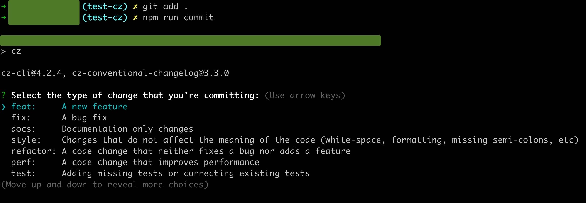

# 前端怎样约束 Git 提交信息？

优雅的 Git 提交信息，可以很直观表达仓库的变更，方便团队协作、问题追溯。并且可以很方便地根据 `git log` 产出 `CHANGELOG`。

怎么样才能算是**优雅**的 Git 提交信息呢？可以参考：[《约定式提交规范（Conventional Commits）》](https://www.conventionalcommits.org/zh-hans/v1.0.0/)。

---

《约定式提交规范（Conventional Commits）》是一种基于提交信息的轻量级约定，它提供了一组简单规则来创建清晰的提交历史，更有利于编写自动化工具。

当然，光有规范肯定不行，规范是死的，人是活的，如果没有工具约束，规范就是白谈。

下面来聊聊怎样使用相关工具去约束 Git 提交信息。

## 01. 相关工具的安装和配置

### 1.1 Husky

Git 本身就有[钩子（hooks）](https://git-scm.com/book/zh/v2/自定义-Git-Git-钩子)的功能，能在特定的重要动作发生时触发自定义脚本。钩子被存储在 Git 目录下的 `hooks` 子目录中，即项目根目录的 `.git/hooks` 中。

但是 Git 的钩子，配置比较繁琐，并且我们需要用到的比如 `pre-commit` 钩子，属于**客户端钩子**，并不会同步到其他协作人员的 `.git` 目录中。

而 [Husky](https://github.com/typicode/husky) 的出现，可以让我们很方便地配置 Git 钩子，解决了 Git 原生钩子配置繁琐、协作人员之间不能同步的问题。

以下关于 Husky 的讲解，都是 `5.0` 及以后的版本。`5.0` 及以后的版本，初始化后，会在项目根目录下生成 `.husky` 目录，可以在其中添加自定义钩子配置文件。

#### 1.1.1 安装

```shell
npm install husky -D
```

#### 1.1.2 设置 NPM 的 `prepare` 脚本

拓展知识：`prepare` 脚本属于生命周期脚本，如果你配置了该脚本，那么在你每次 `npm install` 的时候，`prepare` 脚本都会自动执行，当然也可以手动调用：`npm run prepare`。你可以查阅[官方文档](https://docs.npmjs.com/cli/v8/using-npm/scripts#life-cycle-scripts)，了解其他的生命周期脚本。

```json
// package.json
{
  "scripts": {
    "prepare": "husky install"
  }
}
```

```shell
# 手动运行一次
npm run prepare
```

每次运行 `npm run prepare`，都会在 `.husky/_` 下生成 `husky.sh` 和 `.gitignore` 两个文件，如果原本有的话，会被覆盖。

在 `.husky` 下的自定义钩子文件，都需要引入 `.husky/_/husky.sh` 脚本，由于 `.husky/_` 下的两个文件没有被 Git 管理，有时候切换分支时，`.husky/_` 下的文件会丢失，导致 `git commit` 时报错，这时只需重新执行下 `npm run prepare` 命令。

#### 1.1.3 添加钩子

先添加两个空的钩子：`pre-commit`、`commit-msg`，后面需要用到。

```shell
npx husky add .husky/pre-commit ""
npx husky add .husky/commit-msg ""
```

### 1.2 Commitlint

上面我们安装了 Husky，并且添加了两个钩子，但此时还不能约束开发人员的 Git 提交信息。我们需要借助 [Commitlint](https://github.com/conventional-changelog/commitlint) 来辅助校验提交信息。

#### 1.2.1 安装

```shell
npm install @commitlint/cli @commitlint/config-conventional -D
```

- `@commitlint/cli` 是 Commitlint 命令行工具本体
- `@commitlint/config-conventional` 是基于「约定式提交规范」的配置文件

#### 1.2.2 配置使用「约定式提交规范」

```shell
echo "module.exports = {extends: ['@commitlint/config-conventional']}" > .commitlintrc.js
```

#### 1.2.3 配置 Husky 的 `commit-msg` 钩子

- 可以通过脚本写入到 `.husky/commit-msg`

```shell
npx husky add .husky/commit-msg 'npx --no -- commitlint --edit "$1"'
```

- 也可以直接在 `.husky/commit-msg` 中添加

```shell
#!/bin/sh
. "$(dirname "$0")/_/husky.sh"

npx --no -- commitlint --edit "$1"
```

#### 1.2.4 测试提交

```shell
git add .

# 应该失败
git commit -m "测试"

# 应该成功
git commit -m "chore: 使用 Husky + Commitlint 规范 Git 提交信息"
```

### 1.3 lint-staged

[lint-staged](https://github.com/okonet/lint-staged) 可以配合 Husky 的 `pre-commit` 钩子，在 Git 提交之前，对暂存的文件运行 linters 校验。

#### 1.3.1 安装

官方推荐的方式是运行 `npx mrm@2 lint-staged`，默认会把配置写入到 `package.json`，不过我不喜欢这种方式，我一般手动安装：

```shell
npm i lint-staged -D
```

#### 1.3.2 配置 Husky 的 `pre-commit` 钩子

```shell
#!/bin/sh
. "$(dirname "$0")/_/husky.sh"

npx lint-staged
```

#### 1.3.3 配置文件范围

lint-staged 默认会对所有暂存的文件进行 lint。我们可以通过配置文件缩小文件范围，以及配置 lint 的方式。

在根目录下创建 `.lintstagedrc` 配置文件，文件范围根据具体项目修改：

```json
{
  "src/**/*.{vue,js,jsx,cjs,mjs,ts,tsx,cts,mts}": [
    "prettier --write",
    "eslint --fix"
  ]
}
```

更多 `.lintstagedrc` 地配置可以参考[官方文档](https://github.com/okonet/lint-staged#readme)。

## 02. 约定式提交规范

上面我们下载并配置了一通工具，也是时候了解下，什么是[约定式提交规范](https://www.conventionalcommits.org/zh-hans)，该怎么样书写规范的 Git 提交信息了。

### 2.1 语法

```shell
<type>[optional scope]: <description>

[optional body]

[optional footer(s)]

# 译文
<类型>[可选 范围]: <描述>

[可选 正文]

[可选 脚注]
```

1. 类型和描述必填，其他可选。
2. 类型包括（可以参考 [Angular 约定](https://github.com/angular/angular/blob/22b96b9/CONTRIBUTING.md#type)）：

- `build`：影响构建系统或外部依赖关系的更改（示例范围：gulp、Brocoli、npm）
- `ci`：对 CI 配置文件和脚本的更改（示例范围：Travis、Circle、BrowserStack、SauceLabs）
- `docs`：仅文档的更改
- `feat`：新功能开发
- `fix`：bug 修复
- `perf`：提高性能的代码更改（性能优化）
- `refactor`：既不修复错误也不添加功能的代码更改（代码重构）
- `style`：不影响代码含义的更改（空白、格式、缺少分号等）
- `test`：添加缺失的测试代码或修改现有的测试代码

1. 范围在 Commitlint 的拓展下，可以支持多个，用 `/`、`\` 或 `,` 分割。
2. 正文可以多行，每行正文都是一段描述性的句子，每行正文前后都需要有空行。
3. 脚注可以多行，脚注和脚注之前不需要空行。脚注语法：

```shell
<Word-token>:<space><value>
<Word-token><space>#<value>
```

### 2.2 示例

- 不包含正文的提交说明

```
docs: 更新 README.md
```

- 包含范围的提交说明

```
feat(userManage): 开发用户管理模块
```

- 包含了 `!` 字符以提醒注意破坏性变更的提交说明

```
feat!: 产品发货时向客户发送邮件
```

- 包含了范围和破坏性变更 `!` 的提交說明

```
feat(api)!: 产品发货时向客户发送邮件
```

- 包含了描述并且脚注中有破坏性变更的提交说明

```
feat: 允许默认的配置对象扩展其他配置

BREAKING CHANGE: 配置文件中的 `extends` 现在用于扩展其他配置文件
```

- 包含了 `!` 和 `BREAKING CHANGE` 脚注的提交说明

```
chore!: 放弃对 Node 6 的支持

BREAKING CHANGE: 使用的 JavaScript 功能将不再支持 Node 6
```

- 包含多行正文和多行脚注的提交说明

```
fix: 防止请求打架

为当前请求设置请求 ID 和一个唯一标志。取消掉当前请求之前的请求响应。

删除之前用于缓解请求打架问题设置的超时器，现在已经不需要了。

Reviewed-by: Wang
Refs: #demo
```

### 2.3 Commitizen

如果你不能清楚的记得不同的类型对应的含义，又不想频繁翻阅文档，可以选择安装 [Commitizen](https://github.com/commitizen/cz-cli)，它可以辅助填写 Git 提交的必填信息。

#### 2.3.1 初始化

如果你使用的是**npm 5.2+，**可以直接使用 `npx`，不需要全局安装 Commitizen。如果你使用的是**npm 5.2**以下的版本，请自行查阅[官方文档](https://github.com/commitizen/cz-cli#making-your-repo-commitizen-friendly)。

运行以下命令进行初始化：

```shell
npx commitizen init cz-conventional-changelog --save-dev --save-exact
```

#### 2.3.2 配置

上一步的初始化操作，会帮我们安装 `cz-conventional-changelog`，并且在 `package.json` 中写入 `config` 配置：

```json
"config": {
  "commitizen": {
    "path": "./node_modules/cz-conventional-changelog"
  }
}
```

但是我不喜欢把配置信息放在 `package.json` 中，显得杂乱，我选择把配置剥离。

在根目录下创建 `.czrc` 文件，在其中写入同样的配置，并把 `package.json` 中的 `config` 删除。

```json
{
  "path": "./node_modules/cz-conventional-changelog"
}
```

最后可以选择在 `package.json` 配置一个脚本命令，避免每次都要敲 `npx cz` 这样不太熟悉的命令：

```json
"scripts": {
  "commit": "cz"
}
```

#### 2.3.3 使用

```shell
# 先暂存需要提交的文件
git add xxx
# or 暂存所有
git add .

# 启动 Commitizen
npm run commit
```

你会看到以下命令行引导：


只需要跟着引导选择、输入、回车。

#### 2.3.4 `npx: command not found`

Husky 和 Commitlint 安装配好后，在 VSCode 左侧源代码管理工具里 `git commit` 时，可能会报错：`.husky/commit-msg: line 4: npx: command not found`。

网上该问题的帖子解决方案大多是在钩子配置文件中写死本地 npm 的环境变量，我觉得不可取，除非是私人项目。

以我的经验，等配置完，重启下 VSCode，基本就能识别到 `npx` 命令了。

---

以上，希望对你有帮助。
