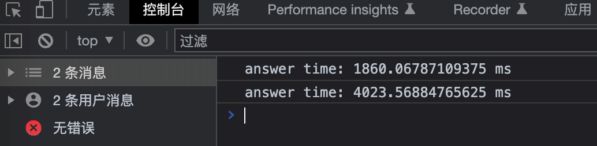

# Console 的高级用法你知道吗？

`Console` 对象提供了浏览器控制台调试的接口（如：Firefox 的[Web Console](https://firefox-source-docs.mozilla.org/devtools-user/web_console/index.html)）。在不同宿主环境上它的工作方式可能不一样，但通常都会提供一套共性的功能。

---

`Console` 对象所提供的 `console.*(...)` 这样的方法，其实是**宿主环境**（比如：浏览器、NodeJS 等）提供的用于控制台调试的，它并不是 JavaScript 正式语法的一部分。

它本质上是一个 I/O 操作，但是又不是简单意义上的**宏任务**，宿主环境的区别会导致 `console.*(...)` 方法有一定细微的差别，在某些条件下，某些浏览器并不会把传入的内容立即输出。至于到底什么时候控制台 I/O 会延迟，这是一个不确定的问题。

所以调试时，不要盲目相信 `console` 的输出，特别是打印引用类型时。比如以下代码：

```js
const obj = { a: 1 }
console.log(obj)
obj.b = 2
```

输出如下：


看着好像没问题，但是这里的 `{a: 1}`，其实是 `obj` 对象的快照。把它展开，就会发现问题所在，在打印 `obj` 的那一刻，理应不存在属性 `b`：


如果非要用 `console.*(...)` 方法做一些细致的调试，可以在打印引用对象或数组时进行序列化+反序列化，防止疑问产生：

```js
const obj = { a: 1 }
console.log(JSON.parse(JSON.stringify(obj)))
obj.b = 2
```

## 01. 不同级别的基础信息打印

```js
// 打印内容的通用方法
console.log('普通信息')
// 打印一条资讯类说明信息
console.info('资讯类说明信息')
// 打印一条警告信息
console.warn('警告信息')
// 打印一条错误信息
console.error('错误信息')
// 打印一条 debug 级别的消息。控制台配置为显示调试输出时才显示该消息
console.debug('调试信息')
```

不同级别的信息在控制台会被标记为不同的颜色，其中 `log` 和 `info` 表现相同。


## 02. 列表型的数据打印成表格

`console.table()` 可以将**列表型**的数据打印成表格，这里的列表型数据指的是*数组或者对象*。

表格的第一列是 `index`。如果数据 `data` 是一个数组，那么这一列的单元格的值就是数组的索引。如果数据是一个对象，那么它们的值就是各对象的属性名称。

语法：

```js
console.table(data [, columns])
```

- `data` 必须，且必须是一个数组或者是一个对象
- `columns` 可选，需要显示的列的名称的数组。如果没有 `columns` 参数，则会打印所有列。

点击每列的顶部标签，可以让表格排序。

### 2.1 打印单一数据类型

- 打印一个由字符串组成的数组

```js
console.table(['哈哈', '嘿嘿', '嘻嘻'])
```


- 打印一个属性值是字符串的对象

```js
function Person(firstName, lastName) {
  this.firstName = firstName
  this.lastName = lastName
}

const me = new Person('小错', '王')

console.table(me)
```


### 2.2 打印复合的参数类型

如果需要打印的元素在一个数组中，或者需要打印的属性在一个对象，并且他们本身就是一个数组或者对象，则将会把这个元素显示在同一行，每个元素占一列。

- 打印一个二元数组

```js
const people = [
  ['张三', '李四'],
  ['张龙', '赵虎'],
  ['王二', '麻子']
]
console.table(people)
```


- 打印一个包含对象的数组

```js
function Person(firstName, lastName) {
  this.firstName = firstName
  this.lastName = lastName
}

const zhangsan = new Person('三', '张')
const lisi = new Person('四', '李')
const wanger = new Person('二', '王')

console.table([zhangsan, lisi, wanger]) // 如果数组包含对象，则列标签是对象的属性名。
```


- 打印一个属性名是对象的对象

```js
function Person(firstName, lastName) {
  this.firstName = firstName
  this.lastName = lastName
}

const family = {}

family.mother = new Person('羊', '刘')
family.father = new Person('龙', '张')
family.daughter = new Person('三', '张')

console.table(family)
```

如果对象的属性为对象，打印出来的 `index` 是外层对象的属性名。


### 2.3 控制显示的列

```js
function Person(firstName, lastName) {
  this.firstName = firstName
  this.lastName = lastName
}

const liuyang = new Person('羊', '刘')
const zhanglong = new Person('龙', '张')
const zhangsan = new Person('三', '张')

const family = {}
family.mother = liuyang
family.father = zhanglong
family.daughter = zhangsan

console.table([liuyang, zhanglong, zhangsan], ['firstName'])
console.table(family, ['lastName'])
```


## 03. 打印某个操作的时长

可以通过 `console.time` 启动一个计时器来跟踪某一个操作的占用时长。

语法：

```js
console.time(timerName)
```

- `timerName` 每一个计时器必须填写的唯一的名字

通过 `console.timeEnd` 结束特定的计时器，并打印其从开始到结束所用的毫秒时间。

语法：

```js
console.timeEnd(timerName)
```

页面中最多能同时运行 10000 个计时器。

在计时结束之前，也可以通过 `console.timeLog` 来打印中途某个操作的时间。

语法：

```js
console.timeLog(timerName)
```

示例：

```js
console.time('answer time')
alert('点击继续')
console.timeLog('answer time')
alert('做一堆其他的事情......')
console.timeEnd('answer time')
```



## 04. 给打印编组

可以使用嵌套组来把一组关联的打印合并。用 `console.group()` 可以创建新的嵌套块，用 `console.groupCollapsed()` 创建默认折叠的块。嵌套组需要通过 `console.groupEnd()` 闭合。

示例：

```js
// 为了方便观察，我用缩进表示了层级
console.log('A1')
console.group()
console.log('B1')
console.info('B2')
console.group()
console.warn('C1')
console.warn('C2')
console.groupCollapsed()
console.error('D1')
console.error('D2')
console.groupEnd()
console.warn('C3')
console.groupEnd()
console.debug('B3')
console.info('B4')
console.groupEnd()
console.debug('A2')
```


## 05. 堆栈跟踪

通过 `console.trace` 可以追踪函数的调用路径。这么说起来很抽象，简单来讲就是，把 `console.trace()` 放在一个方法中，一旦 `console.trace()` 被调用了，那么就会输出从一开始到 `console.trace()` 的所有方法的执行路径。

通过例子或许能很好的理解——

### 5.1 示例一：

```js
function outer() {
  function inner() {
    console.trace()
  }
  inner()
}

outer()
```


由于是堆栈信息，所以得倒着看，执行到 `console.trace()` 的时候，是调用了 `outer` 和 `inner` 这两个方法。

### 5.2 示例二：

```js
function add(a, b) {
  console.trace()
  return a + b
}
function add1(a, b) {
  return add(a, b)
}
function add2(a, b) {
  return add1(a, b)
}
function add3(a, b) {
  return add2(a, b)
}

const result = add3(1, 1)
```


同理，执行到 `console.trace()` 的时候，是调用了 `add1`、 `add2`、`add3` 和 `add` 这四个方法。

`console.trace()` 有时候对于接手别人写的复杂模块的时候，还是挺有用的。

## 06. 打印花里胡哨

### 6.1 样式占位符

很多编程语言的打印方法，都有占位符这样的东西。比如 C 语言的 `printf("%d ", 10)`，其中的 `%d` 表示*十进制整型数据*，这里输出 10。

JavaScript 也有占位符，不过用的比较少。但是通过占位符可以实现一些花里胡哨的信息。

JavaScript 支持的占位符：

- `%s`：字符串

- `%d`：整数

- `%i`：整数
- `%f`：浮点数

- `%o`：DOM 对象

- `%O`：JavaScript 对象

- `%c`：CSS 样式

其中的 `%c` 是 JavaScript 特有的，可以标记从该 `%c` 开始后续行的样式。

例如：

```js
console.log(
  `欢迎加入我们的%c大家庭`,
  `font-size: 30px; font-weight: bold; color: #ef475d`
)
```


也可以标记多个样式，只需要 `%c` 和样式对应上。例如：

```js
console.log(
  `欢迎加入我们的%c大家庭
%c啦啦啦
      `,
  `font-size: 30px; font-weight: bold; color: #ef475d`,
  `font-size: 24px; font-weight: bold; color: cornflowerblue`
)
```


学会了 `%c` 的用法，就能玩出很多花样。

比如这样：

```js
console.log(
  `%c


                               %c FBI WARNING %c


%c        Federal Law provides severe civil and criminal penalties for
        the unauthorized reproduction,distribution, or exhibition of
         copyrighted motion pictures (Title 17, United States Code,
        Sections 501 and 508). The Federal Bureau of Investigation
         investigates allegations of criminal copyright infringement
                 (Title 17, United States Code, Section 506).


`,
  'background: #000; font-size: 18px; font-family: monospace',
  'background: #f33; font-size: 18px; font-family: monospace; color: #eee; text-shadow:0 0 1px #fff',
  'background: #000; font-size: 18px; font-family: monospace',
  'background: #000; font-size: 18px; font-family: monospace; color: #ddd; text-shadow:0 0 2px #fff'
)
```


### 6.2 ASCII Art

ASCII Art，是指用一串或一片字符，去构成图案。它是早期互联网上，带宽小、流量少、部分终端不能显示图片的背景下，产出一种表达形式。文字表情（颜文字）其实就是 ASCII Art 的一种。

听起来比较抽象，直接上才艺：

- 文字表情（颜文字）

```
╮(￣▽ ￣)╭
```

- 艺术字

```
 __   ___              _____
 \ \ / (_)            / ____|
  \ V / _  __ _  ___ | |    _   _  ___
   > < | |/ _` |/ _ \| |   | | | |/ _ \
  / . \| | (_| | (_) | |___| |_| | (_) |
 /_/ \_\_|\__,_|\___/ \_____\__,_|\___/
```

- 图片

```js
/**
 *
 *                             _ooOoo_
 *                            o8888888o
 *                            88" . "88
 *                            (| -_- |)
 *                            O\  =  /O
 *                         ____/`---'\____
 *                       .'  \\|     |//  `.
 *                      /  \\|||  :  |||//  \
 *                     /  _||||| -:- |||||-  \
 *                     |   | \\\  -  /// |   |
 *                     | \_|  ''\---/''  |   |
 *                     \  .-\__  `-`  ___/-. /
 *                   ___`. .'  /--.--\  `. . __
 *                ."" '<  `.___\_<|>_/___.'  >'"".
 *               | | :  `- \`.;`\ _ /`;.`/ - ` : | |
 *               \  \ `-.   \_ __\ /__ _/   .-` /  /
 *          ======`-.____`-.___\_____/___.-`____.-'======
 *                             `=---='
 *          ^^^^^^^^^^^^^^^^^^^^^^^^^^^^^^^^^^^^^^^^^^^^^
 *                     佛祖保佑        永无BUG
 *
 */
```

ASCII Art 这个概念或许你很陌生，但是以上的例子，你应该很熟悉。

除了颜文字，其他的 ASCII Art 的表现形式，通过手敲肯定是不现实的（人形图案打印机除外）。你可以通过以下网站生成 ASCII Art：

- [Lunicode](https://lunicode.com/bigtext)
- [ASCII Art Generator - Online “HD” Color Image to Text Converter ▄▀▄▀█▓▒░](https://asciiart.club/)
- [Text to ASCII Art Generator (TAAG)](http://patorjk.com/software/taag/)
- [1 Line Art | ASCII art in one line](http://1lineart.kulaone.com/)

---

还有很多其他有趣的玩法，比如通过 `background-image` 引入图片等。这里就不赘述了，等你去探索。

以上，希望对你有用。
