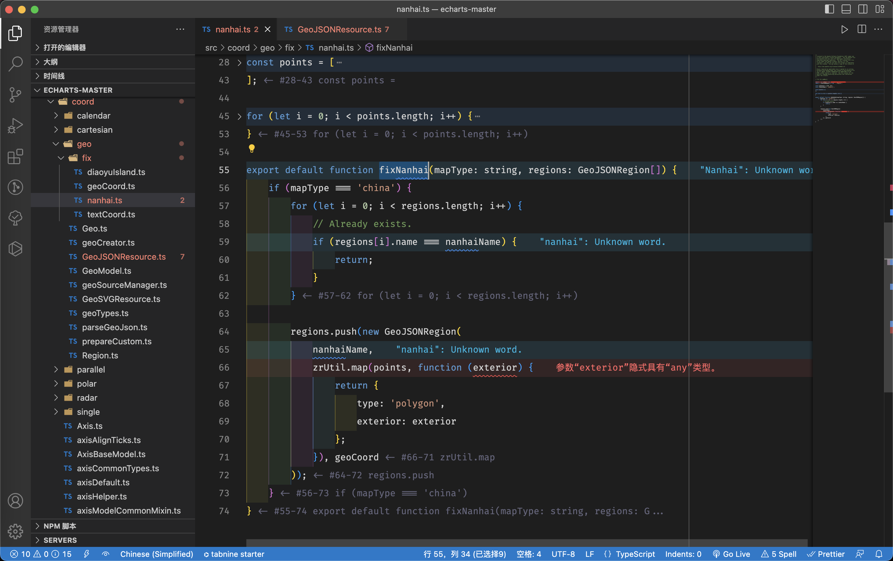

# 使用ECharts地图时你应该了解的知识

本篇文章是科普向，非实战指南，详细的使用请对照官网配置项手册：[geo](https://echarts.apache.org/zh/option.html#geo)、[series-map](https://echarts.apache.org/zh/option.html#series-map)。

---

2018年3月，百度将ECharts项目捐赠给Apache基金会，ECharts成为了Apache基金会孵化级项目，同时也是首个由百度贡献给国际顶级基金会的开源项目。


2021年1月26日晚，Apache基金会正式官宣[Apache ECharts](https://echarts.apache.org/zh/index.html)顺利通过孵化阶段，晋升为Apache顶级项目。

到了2023年的今天，ECharts的第五个大版本了已经发布两年了。从v4到v5，ECharts有了很多的[新特性](https://echarts.apache.org/handbook/zh/basics/release-note/v5-feature/)，本篇主要介绍地图相关的使用。


结合[升级指南](https://echarts.apache.org/handbook/zh/basics/release-note/v5-upgrade-guide/)，v5版本有以下的变动，使用的时候需要注意：

- v5移除了内置的GeoJSON
- action名变更
  - `mapToggleSelect` ➡️ `toggleSelect`
  - `mapSelect` ➡️ `select`
  - `mapUnSelect` ➡️ `unselect`
- 事件名变更
  - `mapselectchanged` ➡️ `selectchanged`
  - `mapselected` ➡️ `selected`
  - `mapunselected` ➡️ `unselected`
- 选项`series.mapType`已经不推荐使用。使用`series.map`代替。
- 选项`series.mapLocation`已经不推荐使用。

## 01. 地图的基石——GeoJSON

[GeoJSON](https://geojson.org/)是用于描述各种地理区域数据的一种格式。它是一种国际通用的规范，[《GeoJSON规范》](https://tools.ietf.org/html/rfc7946)发布于2016年。


用JavaScript的概念来讲，GeoJSON就是一个JSON对象，它可以通过符合规范的键值对来描述地理信息。


一个有效的GeoJSON大概长这样：

```json
{
  "type": "FeatureCollection",
  "features": [
    {
      "type": "Feature",
      "properties": {},
      "geometry": {
        "coordinates": [
          116.43063202970814,
          39.96344762877294
        ],
        "type": "Point"
      }
    },
    {
      "type": "Feature",
      "properties": {},
      "geometry": {
        "coordinates": [
          [
            116.46519108511751,
            39.88763321805527
          ],
          [
            121.48769570803233,
            31.26687775248952
          ]
        ],
        "type": "LineString"
      }
    },
    {
      "type": "Feature",
      "properties": {},
      "geometry": {
        "coordinates": [
          [
            [
              112.85356201413333,
              43.37087847681994
            ],
            [
              112.85356201413333,
              37.914976897592496
            ],
            [
              119.75011160256912,
              37.914976897592496
            ],
            [
              119.75011160256912,
              43.37087847681994
            ],
            [
              112.85356201413333,
              43.37087847681994
            ]
          ]
        ],
        "type": "Polygon"
      }
    }
  ]
}
```


我们可以在[GeoJSON.io](https://geojson.io/)中查看效果，地图上深灰色的部分就是上面的GeoJSON示例所表达的信息，它包含一个点`Point`、一个面`Polygon`和一条线`LineString`：


GeoJSON规定，一个`GeoJSON Object`中必然有`type`属性，它有固定的几个取值：`Feature`、`FeatureCollection`和其他`geometry type（几何类型）`：


不同的`type`取值，所需的必要成员也不同：

- 取值`FeatureCollection`时，必须有成员：`features`
- 取值`Feature`时，必须有成员：`geometry`
- 取值几何类型时，必须有成员：`coordinates`


从上面示例的GeoJSON中可以看出，不同类型的层级结构大概是这样的：`FeatureCollection`->`Feature`->`geometry type`。


GeoJSON除了必要的成员外，还可以自定义成员或者在`properties`中添加自定义属性，以配合所使用的解析GeoJSON的工具。比如ECharts会默认读取`Feature`对象下的`properties.name`作为地域的中文名。


当然把自定义属性放在其他地方也可以，只要必须的属性在就行。比如ECharts的GeoJSON，在与`type`同级放了个`id`。

```json{6}
{
  "type": "FeatureCollection",
  "features": [
    {
      "type": "Feature",
      "id": "710000",
      "properties": {
        "id": "710000",
        "cp": [
          121.509062,
          24.044332
        ],
        "name": "台湾",
        "childNum": 6
      }
    }
  ]
}
```


GeoJSON不光可以应用在ECharts绘制地图，还可以在各种地图插件中使用，比如高德地图中，可以通过`Loca.GeoJSONSource`加载自定义GeoJSON数据源。

## 02. 中国地图GeoJSON

### 2.1 下载中国地图的GeoJSON

[前言](https://www.yuque.com/wangxiaocuo/coding-blog/wagzirug6pv02bcv#tK8vp)中提到，ECharts v5已经移除了内置的GeoJSON，所以ECharts v5已经不能开箱即用地显示中国地图了。


我推荐三种方式，可以很方便地找到中国地图相关的GeoJSON：


方式一：下载[ECharts v4.x](https://github.com/apache/echarts/releases/tag/4.9.0)源码，在`map/json/`下可以找到


方式二：下载最新版本的ECharts源码，虽然v5移除了内置的GeoJSON，但是在`test/data/map/json/`下还藏了一份。和v4.x不同的是，它还多了一个叫`china-new.json`的GeoJSON，我在项目中用的就是这一份GeoJSON，后面我会讲解其中的区别。


方式三：在[DataV.GeoAtlas地理小工具](https://datav.aliyun.com/portal/school/atlas/area_selector)上下载最新的GeoJSON


你也可以去GitHub上下载，很多仓库备份了中国地图相关的GeoJSON，这里贴一个官方推荐的第三方资源：[echarts-maps](https://github.com/echarts-maps)。

### 2.2 对比一下中国地图GeoJSON

通过以上三种方式，就中国地图而言，我们实际上得到了四份中国地图的GeoJSON，为了方便区分，我重新命名下：

- `china.json`（by ECharts v4.x），命名为：`china-v4.json`
- `china.json`（by ECharts v5.x），命名为：`china-v5.json`
- `china-new.json`（by ECharts v5.x），命名为：`china-new-v5.json`
- `china.json`（by DataV.GeoAtlas），命名为：`china-datav.json`


其中`china-v4.json`和`china-v5.json`是一模一样的。


从文件大小看，`china-v5.json`和`china-datav.json`是有明显差异的，前者只有后者的十分之一大小：


通过对比具体内容发现，大小差异除了因为`china-datav.json`在`properties`中塞了更多的拓展属性外，最大的原因是`coordinates`的差异。


拿北京市举例，`china-v5.json`中，`coordinates`的值，是一堆乱码一样的字符串，而`china-datav.json`的`coordinates`的值虽然是正经的坐标数值，但是光一个北京市的坐标数据，格式化后就占了**979**行。


为什么同一区域的坐标数据，二者如此不同？


如果翻阅ECharts源码就可以发现，这是因为ECharts在注册地图解析GeoJSON（`parseGeoJSON`）时，如果识别到GeoJSON是被**压缩**的（`GeoJSON.UTF8Encoding === true`），会先行遍历解码的操作。


这种压缩后的GeoJSON是ECharts专用的，如果其他工具需要用到，需要事先自行进行解码操作。


核心解码代码如下：

```js
// src/coord/geo/parseGeoJson.ts

function decodeRing(
    coordinate: string,
    encodeOffsets: number[],
    encodeScale: number
): number[][] {
    const result = [];
    let prevX = encodeOffsets[0];
    let prevY = encodeOffsets[1];

    for (let i = 0; i < coordinate.length; i += 2) {
        let x = coordinate.charCodeAt(i) - 64;
        let y = coordinate.charCodeAt(i + 1) - 64;
        // ZigZag decoding
        x = (x >> 1) ^ (-(x & 1));
        y = (y >> 1) ^ (-(y & 1));
        // Delta deocding
        x += prevX;
        y += prevY;

        prevX = x;
        prevY = y;
        // Dequantize
        result.push([x / encodeScale, y / encodeScale]);
    }

    return result;
}
```


测试解压北京市的坐标数据，结果和ECharts GeoJSON的坐标大体相同，只是小数点会有一些差异：


除了ECharts和DataV.GeoAtlas的GeoJSON有差异，还可以看到v5的`china-new.json`要比v4和v5的`china.json`大了一丶丶。这涉及到南海诸岛相关的显示和配置的差异，[后面](https://www.yuque.com/wangxiaocuo/coding-blog/wagzirug6pv02bcv#scHIA)会仔细讲解。


::: warning 警告
**南海诸岛历来都是我国领土的组成部分，所以不要想着去隐藏南海诸岛！中华人民共和国的主权和领土完整神圣不可侵犯！作为技术人员，任何情况下去绘制中国地图，都不能缺失任何领土！**
:::


另外，ECharts还提供了的JS版的GeoJSON（v4.x在`map/js/`下，v5.x在`test/data/map/js/`下），多了一个自动注册的功能，注册名称与文件同名。我不太喜欢用，想要按需加载，得手动创建`<script>`标签，并且注册地图的名称不能修改。

## 03. `geo`和`series-map`的区别

通过查阅官网文档，会发现，有两种方式显示地图，一种是通过[geo](https://echarts.apache.org/zh/option.html#geo.map)，一种是通过[series-map](https://echarts.apache.org/zh/option.html#series-map.type)。


它俩有啥区别？我们应该用哪个？


- `geo`是一个地理坐标系组件，它所绘制出来的地图，本质上是一个地图模样的坐标系。它没有`data`属性，无法直接给地图上每个区域绑定额外的数据。既然它是坐标系，那么在坐标系的基础上，可以`series`填充其他图形，比如在地图上绘制散点图。
- `series-map`和其他类型（柱状图、折线图......）的`series`一样，都是指定了一个`type`，然后用数据去驱动展示图形。默认情况下，它会自己生成内部专用的`geo`组件。


它们可以一起使用，以达到更加复杂的效果。`series-map`可以使用用`series-map.geoIndex`指定一个`geo`组件。这样的话，`series-map`和其他`series`（例如散点图）就可以共享一个`geo`组件了。并且，`geo`组件的颜色也可以被这个`series-map`控制，从而用`visualMap`来更改。


通俗点讲，`geo`是一个坐标系，逼格更高，可以作用于所有`series`。而`series-map`只是`series`的一种。`series-map`在不指定公用的`geo`组件的情况下，默认会自己生成一个自己专用的。


两者一起用的话，`series-map`在不指定`geo`组件时，会出现两个叠加的地图，可以通过设置两个地图不同样式实现地图**外边缘发光**的效果。而普通的需求（比如只需要展示地图热力图），只用`series-map`就够了。


地图外边缘发光效果示例：
```js
const option = {
  backgroundColor: 'transparent',
  geo: {
    map: 'china', // 使用中国地图
    roam: false, // 不允许缩放和拖动
    itemStyle: {
      borderColor: '#a18a3a', // 边框颜色
      borderWidth: 0.5, // 边框宽度
      shadowColor: '#a18a3a', // 阴影颜色
      shadowBlur: 100 // 阴影大小
    },
    emphasis: {
      itemStyle: {
        areaColor: '#2a333d' // 高亮区域颜色
      },
      label: {
        show: false
      }
    }
  },
  series: [
    {
      type: 'map',
      map: 'china',
      zlevel: 1,
      nameProperty: 'id',
      nameMap,
      roam: false,
      select: {
        disabled: true
      },
      itemStyle: {
        areaColor: '#2F4858',
        borderColor: '#a18a3a',
        borderWidth: 1
      },
      emphasis: {
        itemStyle: {
          show: false,
          areaColor: null
        },
        label: {
          show: false
        }
      },
      data: [
        {
          name: '南海诸岛',
          value: 0,
          label: { show: false },
          itemStyle: {
            opacity: 0
          },
          tooltip: {
            extraCssText: 'opacity: 0;'
          }
        }
      ]
    }
  ]
}
```

## 04. 关于南海诸岛

当注册的地图名称为`china`时，在`src/coord/geo/fix/nanhai.ts`中专门针对南海做了特殊处理，会自动在右下角追加一个简略的南海缩略图。




下面有一份简单的示例代码：


在其他条件不变时，通过修改`url`，来切换不同的GeoJSON数据源，看看显示的效果：

- `china-v5.json`


- `china-new-v5.json`


- `china-datav.json`


嗯？我们中好像出现了叛徒，说好的简略的南海缩略图呢，怎么`china-new-v5.json`你的缩略图这么别致？不光有名称，还带有岛屿？


这是因为，`china-new-v5.json`直接在GeoJSON中添加了南海诸岛缩略图：


再回过头来看看上面上面三种GeoJSON的图，它们各有各的特点：

- `china-v5.json`：陆地地图在画布中占比大看着舒服，南海领海缩略图很简陋，看不到南海岛屿
- `china-new-v5.json`：陆地地图在画布中占比大看着舒服，南海领海缩略图够详细，能看道南海岛屿
- `china-datav.json`：陆地地图只占了一半多点，有大面积留白，看着不太舒服


这么一对比，`china-new-v5.json`明显更占优势，显示的效果更好，且自带南海诸岛缩略图，不需要非得设置注册名称是`china`。


如果我们去查看百度的产品对于ECharts的运用，比如[百度指数](https://index.baidu.com/v2/index.html)，就可以发现，官方实战用的应该也是`china-new-v5.json`。（哦，应该叫前官方👻，官网的[地图demo](https://echarts.apache.org/examples/zh/editor.html?c=map-usa)都已经是美国的形状了）


## 05. 地图热力图

假设我们有一份地图区域数据，那么结合`visualMap`，就可以实现热力图的效果：

```js
const data = [
  {
    name: '上海',
    value: 9000
  },
  {
    name: '江苏',
    value: 8000
  },
  {
    name: '青海',
    value: 600
  }
]
async function init() {
  const url = './geo-jsons/china-new-v5.json'
  const res = await fetch(url)
  chinaGeoJson = await res.json()

  echarts.registerMap('china', chinaGeoJson)
  const myChart = echarts.init(document.getElementById('chart'))

  myChart.setOption({
    tooltip: {
      trigger: 'item'
    },
    visualMap: {
      type: 'piecewise',
      max: 10000,
      min: 0,
      text: ['高', '低'],
      calculable: true
    },
    series: [
      {
        name: '测试指标',
        type: 'map',
        map: 'china',
        data
      }
    ]
  })
}

init()
```


从代码中可以发现，`data`中的数据，只有`name`和`value`，没什么特殊的。它之所以会被自动绑定到对应的区域中，是因为`series-map.nameProperty`默认为`name`，它会把`name`作为主键用于关联数据点和GeoJSON地理要素。即`data`中的`name`的值只要与GeoJSON中`properties`中的`name`的值一一对应上，就能正常显示出热力图。


但要是对不上了？`china-new-v5.json`中默认是`上海`、`江苏`、`新疆`，但如果后端返回给前端的数据是`上海市`、`江苏省`、`新疆维吾尔自治区`呢？


显然，有时候用`name`去作为数据与GeoJSON映射的主键，会出现问题。


当然如果前后端约束好了，并且数据来源明确，不会出现乱糟糟的数据，直接用`name`当然没问题。


可以通过修改`series-map.nameProperty`来修改默认的关联主键。但设置什么字段比较合适呢？我们回过头来观察下两个来源的GeoJSON，会发现有一个东西是唯一的，那就是行政区划代码，ECharts的叫`id`，DataV.GeoAtlas的叫`adcode`。


一般公司都会爬一份行政区划代码，作为基础数据使用。


目前最新的城乡区划代码可以参考：[国家统计局>>统计用区划和城乡划分代码](http://www.stats.gov.cn/tjsj/tjbz/tjyqhdmhcxhfdm/)。这是最新的标准，实际使用的时候，一般只需要取前6位使用。


其中省份区划代码没有明确标注，可以通过截取市的区划代码的前两位，后面拼上6个0，也可以直接[百度百科](https://baike.baidu.com/item/行政区划代码/5650987)查看，省份的区划代码很多年没变了。

其中也不包含我国台湾省、香港特别行政区和澳门特别行政区。台湾省：`710000`，香港特别行政区：`810000`，澳门特别行政区：`820000`。


如果你的地图有下钻功能，那么GeoJSON中的城乡区划代码可能是旧的，需要根据实际后端返回的数据做更新。


另外，在显示热力图时，`china-new-v5.json`的南海诸岛由于属于GeoJSON的一个区域，所以也会显示`tooltip`：


可以通过以下设置隐藏掉：

```js
data.unshift({
  name: '南海诸岛',
  value: 0,
  itemStyle: {
    opacity: 0,
    label: { show: false }
  },
  tooltip: {
    extraCssText: 'opacity: 0;'
  }
})
```


------

以上，希望对你有用。
