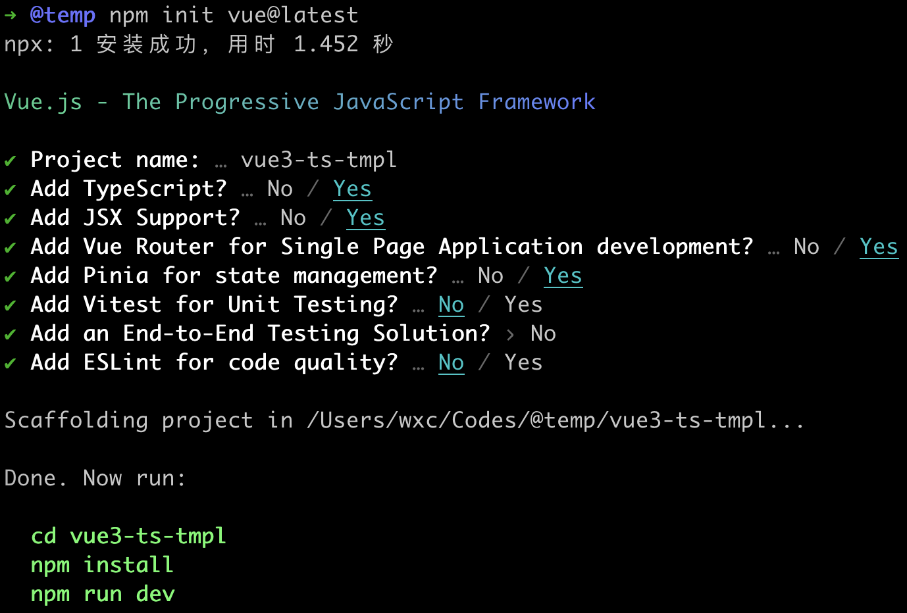
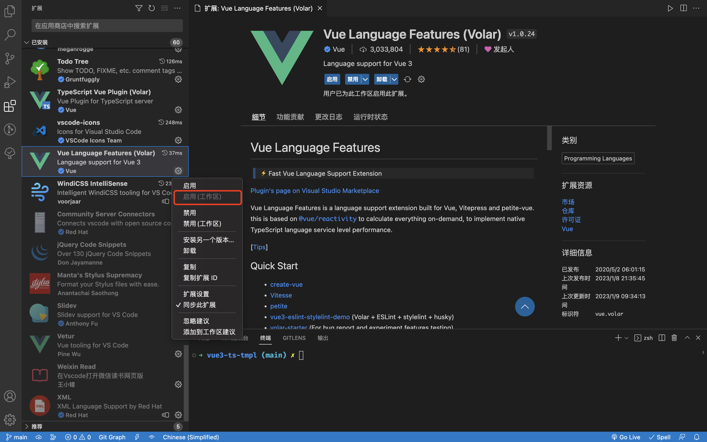
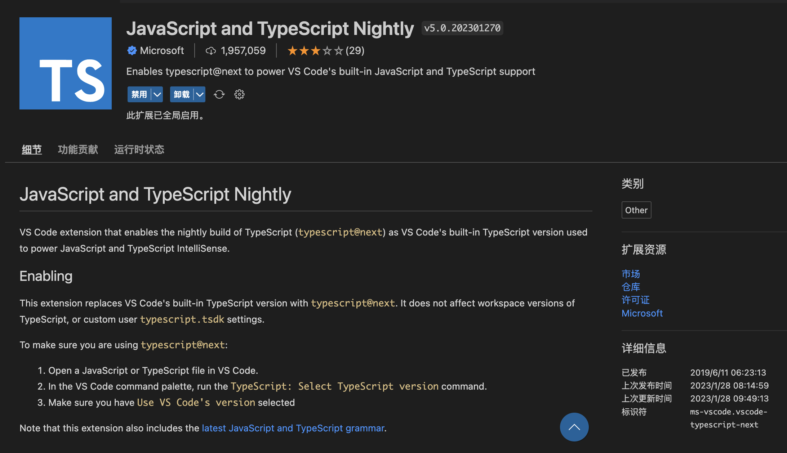
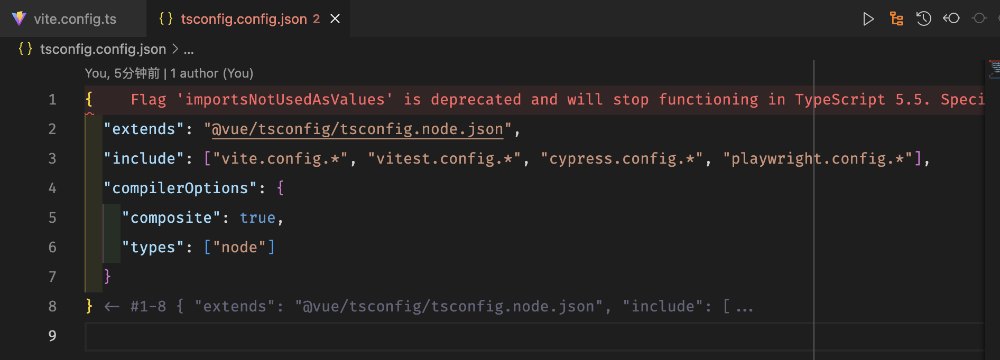
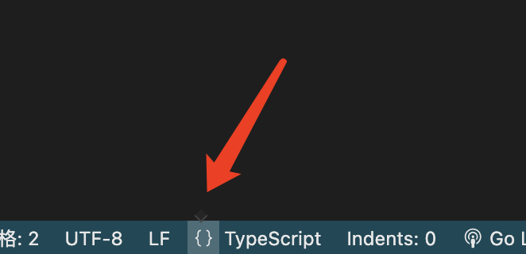
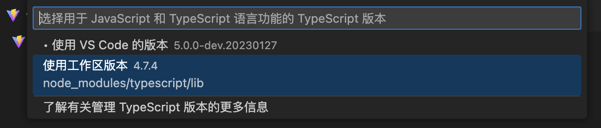
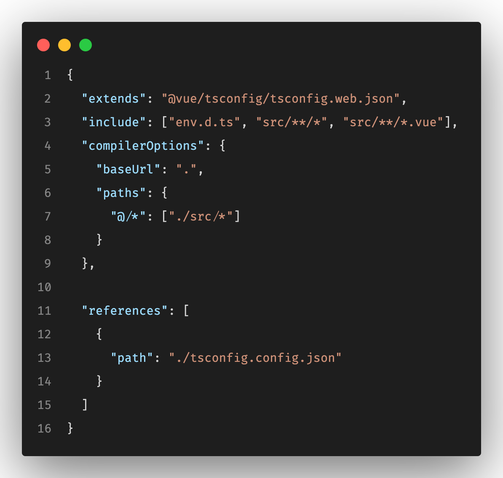
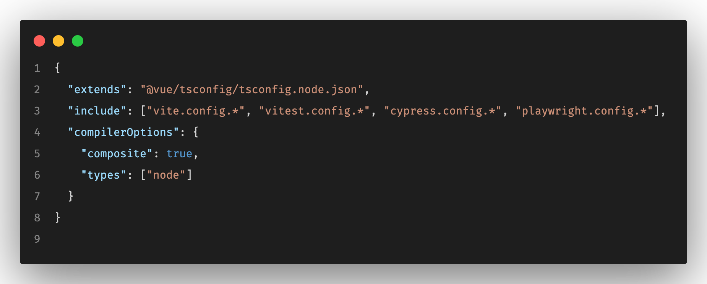

# 从头搭一个 Vite+Vue3+ts 的基础模板

[Vue3](https://cn.vuejs.org)自 2020 年 09 月 18 日发布至今已经两年多了，相关生态日渐丰满，且随我一起从头搭建一个基础模板，一起踩踩坑。

---

本篇文章所讲述的基础模板，参考了以下开源项目：

- [GitHub - sxzz/element-plus-best-practices: Element Plus Best Practices 最佳实践](https://github.com/sxzz/element-plus-best-practices)
- [GitHub - vbenjs/vue-vben-admin: A modern vue admin. It is based on Vue3, vite and TypeScript. It’s fast！](https://github.com/vbenjs/vue-vben-admin)

## 01. 新建项目

参照官网所述，先[创建一个 Vue 应用](https://cn.vuejs.org/guide/quick-start.html#creating-a-vue-application)。注意`npm init <initializer>`命令需要安装较新版本的[Node.js](https://nodejs.org/en/)，注意查看自己的 npm 版本（`npm -v`），如果小于`5.2.0`，就需要升级了。

```shell
npm init vue@latest
```



创建好初始项目后，第一步除了安装依赖外，建议此时初始化 git，从头开始分步骤记录修改的过程。后续每个步骤做完，都要记得 commit 一下代码，精细化记录修改过程。

```shell
git init && git add . && git commit -m "build: 工程初始化"
```

初始项目的结构如下：

```
# /@temp/vue3-ts-tmpl
├── public
└── src
   ├── assets
   ├── components
   |  └── icons
   ├── router
   ├── stores
   └── views
```

VSCode 中，Vue3 的项目推荐安装 `TypeScript Vue Plugin (Volar)`、`Vue Language Features`这两个插件。

要注意，Vue2 项目所需要的`Vetur`和`Volar`是会打架的，不同的项目只能启用一种。

如果同一时间在维护多个项目，既有 Vue2 的项目，又有 Vue3 的项目，切换启用插件就变得非常繁琐。那怎么做才能优雅地使用这两组互斥的插件呢？

这时候可以选择先全部禁用掉这三个插件，在不同的项目中，只针对于工作区启用不同的插件，即`启用(工作区)`选项。这时 VSCode 会把当前项目的目录作为一个工作区，启用的插件只作用于当前目录，这样每个项目只需要启用一次。



不推荐【另存为工作区】的做法，操作起来真的很反人类。

## 02 Prettier 配置

每次新建一个项目，我的习惯是先配置[Prettier](https://marketplace.visualstudio.com/items?itemName=esbenp.prettier-vscode)，保证后续代码修改时风格的统一。

在根目录下创建文件：`.prettierrc.json`和`.prettierignore`。我常用的配置如下：

```json
// .prettierrc.json

{
  "singleQuote": true, // 字符串使用单引号
  "semi": false, // 句尾不添加分号
  "tabWidth": 2, // 缩进字节数，默认为2
  "useTabs": false, // 缩进不使用 tab
  "bracketSpacing": true, // 左括号后和右括号前打印空格
  "arrowParens": "avoid", // 箭头函数参数括号能省略括号的时候就省略 例如 x => x
  "printWidth": 80, // 换行长度，默认80
  "jsxBracketSameLine": true, // 多行 JSX 元素时，将 `>` 放在最后一行的末尾，而不是单独放在下一行
  "jsxSingleQuote": true, // jsx 中使用单引号代替双引号
  "trailingComma": "none", // 在对象或数组最后一个元素后面不加逗号
  "endOfLine": "auto" // 每行结尾换行符号设置为 auto
}
```

```
#.prettierignore

# dist
dist
dist-ssr

# node_modules
node_modules

# package
yarn-lock.json
package-lock.json
package.json

# tsconfig
tsconfig.json
tsconfig.node.json

# eslintrc
.eslintrc.js
.eslintrc.cjs

# html
*.html

# README
README.md
```

## 03. 删除 demo 代码

初始的项目中，有一些 demo 代码，需要删除掉，以便于后续的改造。

1. `src/App.vue`修改

```vue
<script setup lang="ts">
import { RouterView } from 'vue-router'
</script>

<template>
  <RouterView />
</template>

<style scoped></style>
```

1. `src/views/HomeView.vue`修改

```vue
<script setup lang="ts"></script>

<template>
  <main></main>
</template>
```

1. `src/router/index.ts`修改

```ts
import { createRouter, createWebHistory } from 'vue-router'
import HomeView from '@/views/HomeView.vue'

const router = createRouter({
  history: createWebHistory(import.meta.env.BASE_URL),
  routes: [
    {
      path: '/',
      name: 'home',
      component: HomeView
    }
  ]
})

export default router
```

1. 全局样式文件修改

1. 删除`src/assets/base.css`中的所有代码
1. `src/assets/main.css`中只保留代码`@import './base.css';`
1. `src/assets/base.css`、`src/assets/main.css`，移动到`src/styles`下

1. 删除以下文件

```
public/favicon.ico
src/assets/logo.svg
src/components/icons
src/components/HelloWorld.vue
src/components/TheWelcome.vue
src/components/WelcomItem.vue
src/views/AboutView.vue
```

这样我们就得到一个最基础的、空白的架子。

## 04. Husky 安装和配置

为了约束 Git 提交信息，方便团队协作、问题追溯，需要安装配置 husky 等工具。

具体安装配置方式，请参考我的另一篇文章：

此处为语雀内容卡片，点击链接查看：https://www.yuque.com/wangxiaocuo/coding-blog/ovot1vvc1e6hqqwh

## 05. 解决 TS 版本兼容问题

如果你的 VSCode 安装了插件`JavaScript and TypeScript Nightly`，并且版本 >= `v5.0.202301270`，那么打开 ts 配置文件 `tsconfig.json`或`tsconfig.config.json`时，可能会报错（如果未报错，请忽略此步）。



报错信息如下：

```
Flag 'importsNotUsedAsValues' is deprecated and will stop functioning in TypeScript 5.5. Specify 'ignoreDeprecations: "5.0"' to silence this error.
  Use 'verbatimModuleSyntax' instead.
```



有两个方案解决这个问题：

1. 卸载插件`JavaScript and TypeScript Nightly`，卸载后会缺少一些最新 ts 语法的代码补全提示
2. 手动选择当前工作区的 ts 版本

3. 手动选择可通过 VSCode 底部面板选择，需先打开一个`.ts`的文件，比如`vite.config.ts`
4. 点击底部 TypeScript 选项左侧的`{}`



1. 选择小弹框中的`选择版本（Select Version）`
2. 在顶部弹框中选择`使用工作区版本x.x.x`



## 06. 统一放置全局类型文件

在项目根目录下，有两个`tsconfig`配置相关的文件：`tsconfig.json`、`tsconfig.config.json`。

- `tsconfig.json`



- `tsconfig.config.json`



可以看到`tsconfig.json`通过`references`配置引用了`tsconfig.config.json`，这是一种类似于模块拆分的做法，是 ts 3.0 的新功能。

通过两个文件的`include`配置，其实可以很明显得看出来，`tsconfig.config.json`作用于根目录下的一些配置文件，`tsconfig.json`本身作用于`src`目录。

默认全局的类型文件是放在根目录下的，比如新建项目时生成的`env.d.ts`。后续全局的类型文件多了，放在根目录下会很丑，我们可以选择在根目录下新建`types`目录，把`env.d.ts`移进去。

```
├── src
└── types
   └── env.d.ts
```

同时需要修改两个配置文件：

- `tsconfig.json`

```json
{
  "extends": "@vue/tsconfig/tsconfig.web.json",
  "include": ["src/**/*", "src/**/*.vue", "types/**/*"],
  "compilerOptions": {
    "baseUrl": ".",
    "typeRoots": ["./node_modules/@types/", "./types"],
    "paths": {
      "@/*": ["./src/*"],
      "#/*": ["./types/*"]
    },
    "types": ["unplugin-icons/types/vue", "element-plus/global"]
  },
  "references": [
    {
      "path": "./tsconfig.config.json"
    }
  ]
}
```

- `tsconfig.config.json`

```json
{
  "extends": "@vue/tsconfig/tsconfig.node.json",
  "include": [
    "vite.config.*",
    "vitest.config.*",
    "cypress.config.*",
    "playwright.config.*",
    "build/**/*",
    "types/**/*"
  ],
  "compilerOptions": {
    "composite": true,
    "types": ["node"],
    "typeRoots": ["./node_modules/@types/", "./types"]
  }
}
```

## 07. Vite 插件拆分配置

随着后续 Vite 插件的增多，各插件的配置如果都写在`vite.config.ts`中，会显得杂乱臃肿，最好拆分出来，按模块配置。可以在根目录下新建`build`目录，放置 Vite 插件相关的配置。

```
├── build
|  ├── vite-plugin
|  |  ├── plugins
|  |  |  ├── auto-import.ts
|  |  |  └── xxx.ts
|  |  └── index.ts
|  └── vite-utils.ts
└── src
```

示例代码如下：

- `vite.config.ts`

```ts
// vite.config.ts

import { defineConfig, loadEnv } from 'vite'
import { processingEnv } from './build/vite-utils'
import { loadVitePlugins } from './build/vite-plugin'

// https://vitejs.dev/config/
export default defineConfig(({ command, mode }) => {
  // 根据当前工作目录中的 `mode` 加载 .env 文件
  // 如果设置第三个参数为 '' ，则是加载所有环境变量，而不管是否有 `VITE_` 前缀。
  const env = loadEnv(mode, process.cwd())
  const viteEnv = processingEnv(env)

  return {
    plugins: loadVitePlugins(command, viteEnv),
    // 其他配置
    ...
  }
})
```

- `build/vite-utils.ts`

```ts
// build/vite-utils.ts

import type { ImportMetaEnv } from '../types/env'

/**
 * 处理环境变量
 * loadEnv读取的值都是字符串类型，该函数对于特殊类型的值进行转换处理
 * @param viteEnv VITE_ 开头的环境变量
 * @returns 处理后的环境变量
 */
export function processingEnv(viteEnv: Record<string, any>): ImportMetaEnv {
  const result = Object.keys(viteEnv).reduce((res: any, key) => {
    let value = viteEnv[key]

    // 处理布尔值
    value = value === 'true' ? true : value === 'false' ? false : value

    res[key] = value
    return res
  }, {})

  return result
}
```

- `build/vite-plugin/index.ts`

```ts
// build/vite-plugin/index.ts

import type { PluginOption } from 'vite'
import type { ImportMetaEnv } from '../../types/env'

import vue from '@vitejs/plugin-vue'
import vueJsx from '@vitejs/plugin-vue-jsx'

import { loadAutoImport } from './plugins/auto-import'
import { loadComponents } from './plugins/components'
// 其他插件

/**
 * 加载Vite插件
 */
export function loadVitePlugins(
  command: 'serve' | 'build',
  viteEnv: ImportMetaEnv
) {
  const plugins: (PluginOption | PluginOption[])[] = [vue(), vueJsx()]
  const isBuild = command === 'build'

  plugins.push(loadAutoImport())
  plugins.push(loadComponents())
  // 其他插件

  return plugins
}
```

- `build/vite-plugin/plugins/auto-import.ts` 示例

```ts
// build/vite-plugin/plugins/auto-import.ts

import AutoImport from 'unplugin-auto-import/vite'

/**
 * 自动导入 APIs
 * https://github.com/antfu/unplugin-auto-import
 */
export function loadAutoImport() {
  const plugin = AutoImport({
    // ...
  })

  return plugin
}
```

## 08. 常用 Vite 插件及配置

- `unplugin-auto-import`自动引入 APIs

```ts
import AutoImport from 'unplugin-auto-import/vite'
import { ElementPlusResolver } from 'unplugin-vue-components/resolvers'

/**
 * 自动导入APIs
 * https://github.com/antfu/unplugin-auto-import
 */
export function loadAutoImport() {
  const plugin = AutoImport({
    include: [
      /\.[tj]sx?$/, // .ts, .tsx, .js, .jsx
      /\.vue$/,
      /\.vue\?vue/, // .vue
      /\.md$/ // .md
    ],

    imports: [
      // 自动导入 Vue 相关函数，如：ref, reactive, toRef 等
      'vue',
      // 自动导入 vue-router 相关函数
      'vue-router'
    ],

    dts: './types/auto-imports.d.ts',
    vueTemplate: true,
    resolvers: [ElementPlusResolver()],

    // Generate corresponding .eslintrc-auto-import.json file.
    // eslint globals Docs - https://eslint.org/docs/user-guide/configuring/language-options#specifying-globals
    eslintrc: {
      enabled: false, // Default `false`
      filepath: './.eslintrc-auto-import.json', // Default `./.eslintrc-auto-import.json`
      globalsPropValue: true // Default `true`, (true | false | 'readonly' | 'readable' | 'writable' | 'writeable')
    }
  })

  return plugin
}
```

- `unplugin-vue-components`自动注册组件

```ts
import Components from 'unplugin-vue-components/vite'
import { ElementPlusResolver } from 'unplugin-vue-components/resolvers'
import IconsResolver from 'unplugin-icons/resolver'

/**
 * 按需导入组件
 */
export function loadComponents() {
  const plugin = Components({
    dts: './types/components.d.ts',
    // https://github.com/antfu/unplugin-vue-components/issues/195#issuecomment-955011828
    // https://github.com/antfu/unplugin-vue-components/blob/3ecdeade011d0ad4dde853ac48c3a051ba880420/src/types.ts#L63-L68
    globs: ['src/components/V*/*.vue'],
    resolvers: [
      // 插件为流行的UI库提供了内置解析器，参考：https://github.com/antfu/unplugin-vue-components#importing-from-ui-libraries
      // 这里以 Element Plus 作示例
      ElementPlusResolver({ exclude: /ElIcon/ }),
      IconsResolver({
        prefix: 'icon',
        // 允许加载的图标集合：ElementPlus
        enabledCollections: ['ep', 'icon-park'],
        alias: {
          park: 'icon-park'
        }
      })
    ]
  })

  return plugin
}
```

::: tip 注意
我这里有两个配置：

- `globs: ['src/components/V*/*.vue']`，这个配置只会使`src/components/`目录下以字母`V`开头的组件注册为全局组件。主要是考虑到，一个复杂的组件可能包含一些私有的子组件，这些子组件不需要自动注册为全局组件。
- `ElementPlusResolver({ exclude: /ElIcon/ })`，我的项目中使用的是 ElementPlus 作为 UI 框架，这个配置会忽略`ElIcon`组件的自动引入。如果没有这个配置，`ElIcon`组件存在引入顺序问题，导致样式的错乱。详情请参考：https://github.com/element-plus/element-plus/issues/11761。在忽略`ElIcon`后，如果页面中其他 ElementPlus 组件中含有`ElIcon`组件，可以不手动引入，如果没有这样的组件，则需要手动引入`ElIcon`。
  :::

- `vite-plugin-compression`使用 gzip 或者 brotli 来压缩资源

```ts
import Compression from 'vite-plugin-compression'

/**
 * 使用 gzip 或者 brotli 来压缩资源
 * https://github.com/vbenjs/vite-plugin-compression
 */
export function loadCompression() {
  const plugin = Compression({
    ext: '.gz',
    // 大于1kb时启用压缩
    threshold: 1024000
  })

  return plugin
}
```

- `vite-plugin-html`HTML 压缩能力、EJS 模版能力等

```ts
// https://cn.vitejs.dev/guide/env-and-mode.html#intellisense
import type { ImportMetaEnv } from '../../../types/env'
import { createHtmlPlugin } from 'vite-plugin-html'

/**
 * HTML 压缩能力、EJS 模版能力等
 * https://github.com/vbenjs/vite-plugin-html
 */
export function loadHtml(isBuild: boolean, viteEnv: ImportMetaEnv) {
  const { VITE_APP_TITLE } = viteEnv
  const plugin = createHtmlPlugin({
    minify: isBuild,
    // 在这里写entry后，你将不需要在`index.html`内添加 script 标签，原有标签需要删除
    entry: 'src/main.ts',
    // 需要注入 index.html ejs 模版的数据
    inject: {
      data: {
        title: VITE_APP_TITLE,
        releaseTime: new Date().toLocaleString()
      }
    }
  })

  return plugin
}
```

- `unplugin-icons`自动载入图标库

```ts
import Icons from 'unplugin-icons/vite'

/**
 * 自动载入图标库
 * https://github.com/antfu/unplugin-icons
 */
export function loadIcons() {
  const plugin = Icons({
    autoInstall: true
  })

  return plugin
}
```

- `vite-plugin-windicss`Windi CSS 插件

```ts
import WindiCSS from 'vite-plugin-windicss'

/**
 * Windi CSS
 */
export function loadWindiCSS() {
  const plugin = WindiCSS()

  return plugin
}
```

## 09. Vue3 可用的部分工具推荐

按需安装。

- [VueUse](https://vueuse.org/)
- [echarts](https://echarts.apache.org/zh/index.html)
- [decimal.js](https://mikemcl.github.io/decimal.js/)：计算工具，可以解决计算精度问题
- [dayjs](https://day.js.org/)：Moment.js 的无缝平替
- [file-saver](https://github.com/eligrey/FileSaver.js)：文件下载
- [lodash-es](https://www.npmjs.com/package/lodash-es)：Lodash 的 ES 版本
- [js-cookie](https://github.com/js-cookie/js-cookie)：Cookies 操作
- [nanoid](https://github.com/ai/nanoid)：小巧安全的字符串 ID 生成器
- [vue-draggable-plus](https://github.com/Alfred-Skyblue/vue-draggable-plus)：尤雨溪推荐的拖拽工具

---

以上就是一份比较详细的基础模板搭建过程。在此基础上，你可以继续拓展其他的功能，比如 Axios、UI 框架等，把它拓展成后台管理系统或移动端应用的架子。

希望对你有用。
