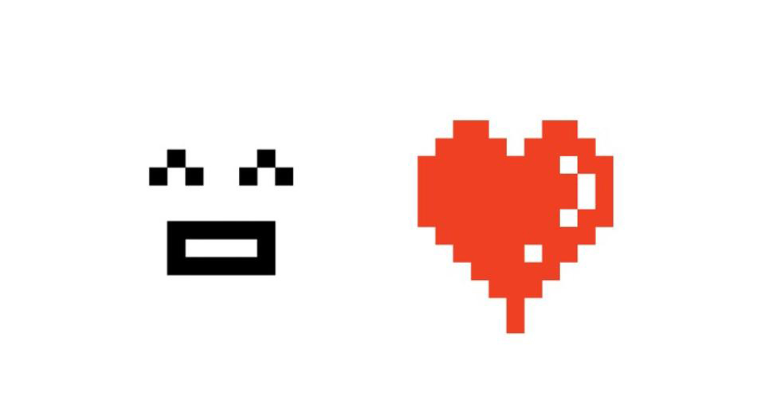
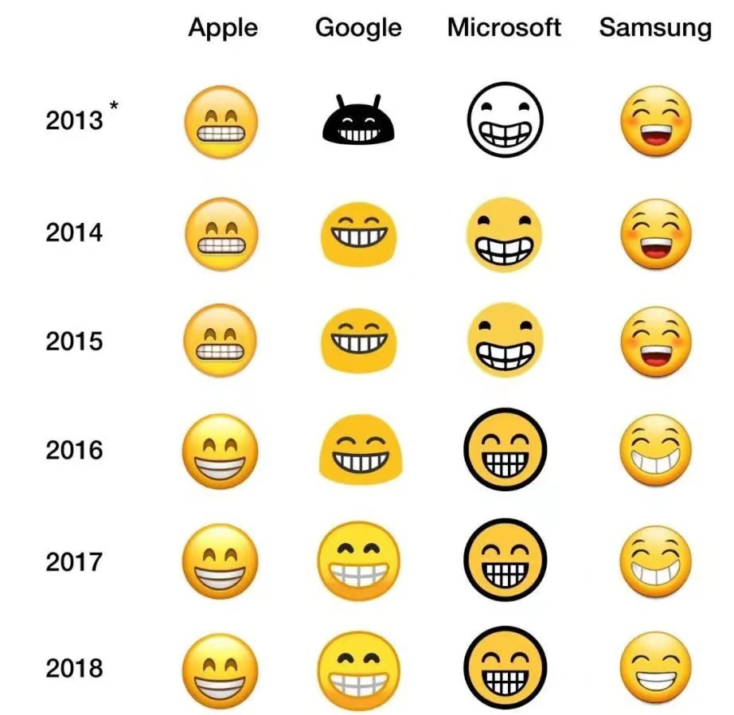
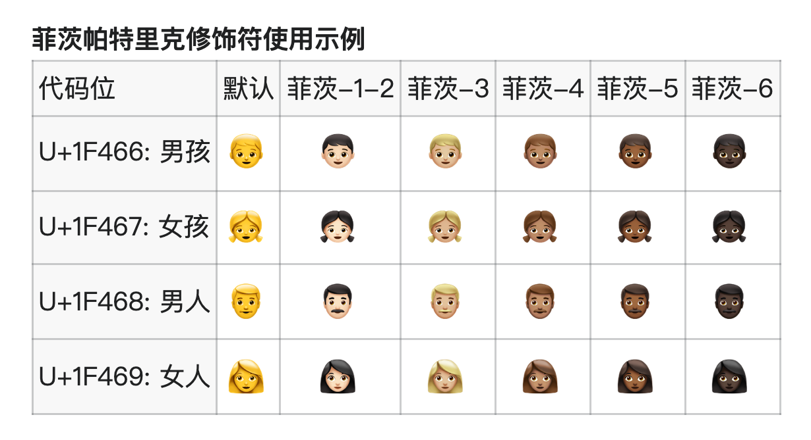
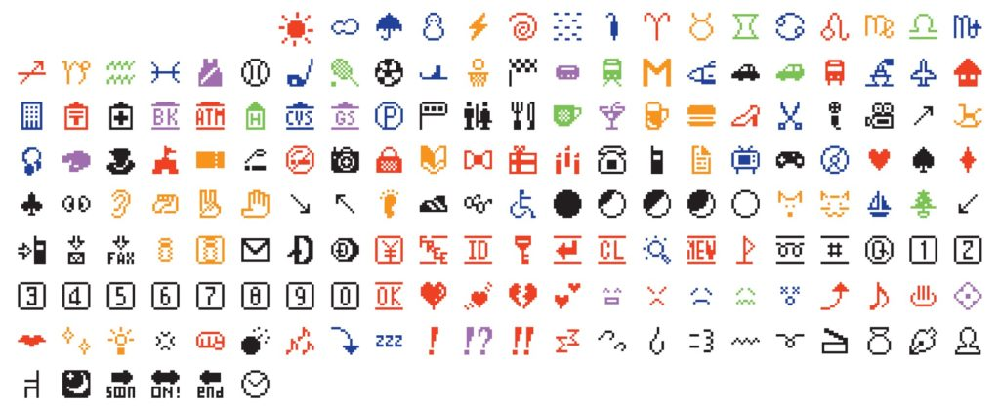
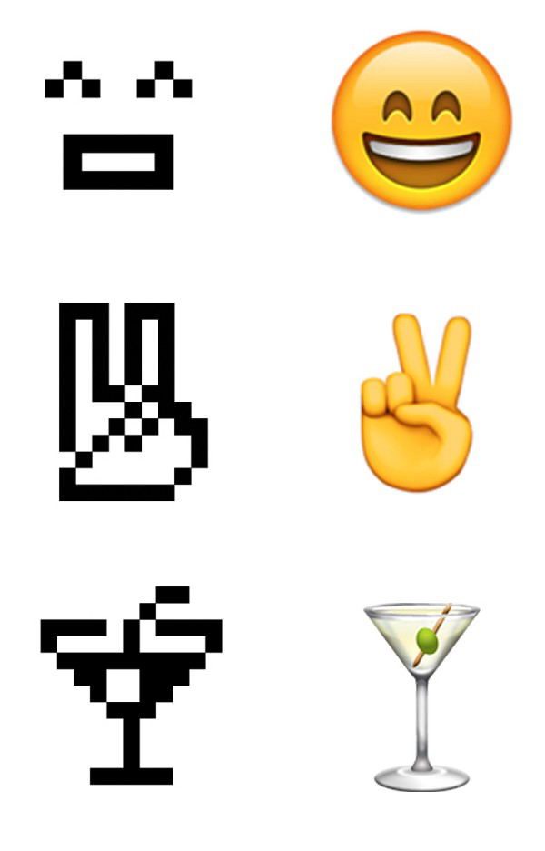
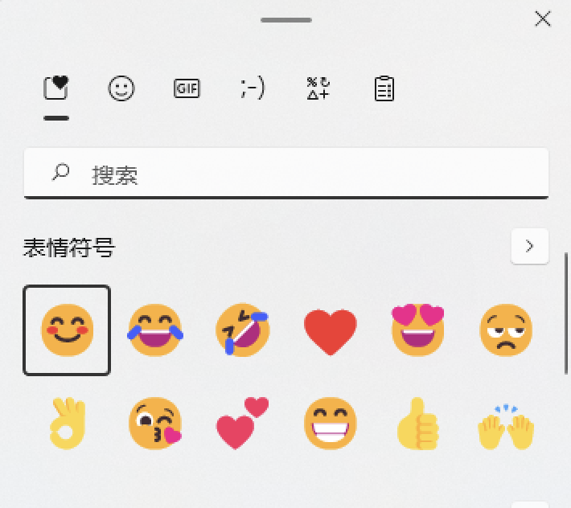
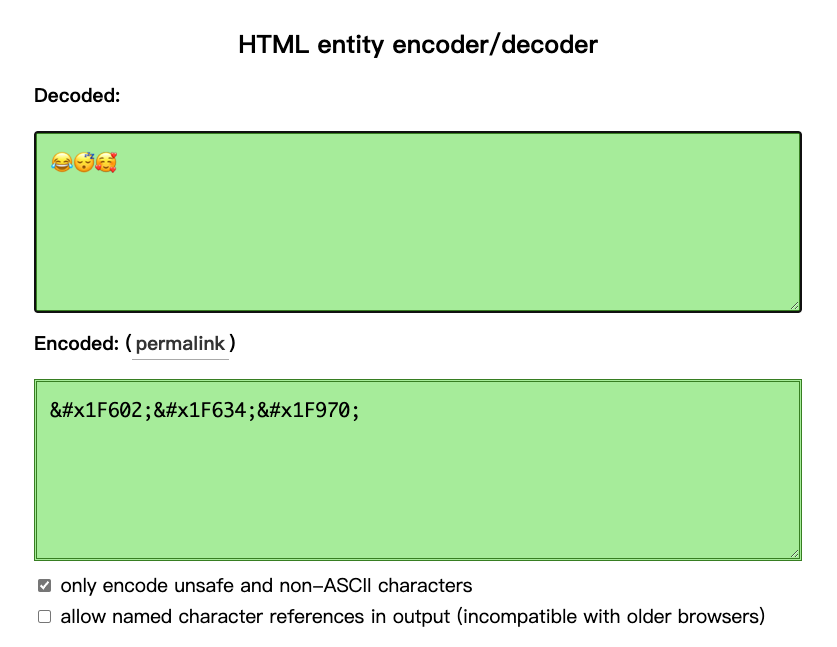

# 聊聊前端场景中的Emoji

## 00. 前言

Emoji相信大家耳熟能详，今天我们来聊聊emoji的发展历史，以及在前端开发中使用emoji的一些小技巧。


我国不同地区对于emoji的称呼稍有差别：

- 中国大陆：emoji、表情符号
- 中国台湾：表情图案、表情贴、绘文字、emoji
- 中国港澳：表情图标、emoji

## 01. Emoji的发展历史

1998年或1999年，日本人[栗田穰崇](https://zh.m.wikipedia.org/zh-sg/栗田穰崇)创造了第一个emoji，他当时隶属于[NTT DoCoMo](https://zh.m.wikipedia.org/zh-sg/NTT_DoCoMo)公司[iMode](https://zh.m.wikipedia.org/zh-sg/I-mode)移动互联网平台的团队，是当时iMode团队的开发负责人，现任[DWANGO](https://dwango.co.jp/)公司的董事。


第一个emoji是栗田穰崇在无线电寻呼系统中加入的一个爱心符号，但是在NTT DoCoMo推出新版呼叫机时，却放弃了这个符号。后来用户的流向转变让他意识到这种图画符号是非常有需求的，这也开启了他正式设计emoji的想法。




栗田穰崇：“在以数字信息互动为主的手机世界中，仅用文字来沟通的话，容易产生理解上的误会，因此有必要附加上感情语气，因此emoji的登场有其符合时代刚需的必然性”。


Emoji在推出之初，爆发性地获得了日本十多岁年轻人的追捧，到了2004年左右它已经被全日本所接受。


当初NTT DoCoMo公司并没有emoji的版权意识，导致其他竞争对手的争相借鉴，各自开发起自己的表情，引起了很长一段时间的大混战。


直到2009年，emoji被收录进[Unicode](https://zh.wikipedia.org/wiki/Unicode)，由Unicode联盟（Unicode Consortium）管理和维护，自此emoji成为了世界标准的通用字符，


2011年苹果在发布的iOS 5的输入法中加入了emoji的支持，2012年市面上很多智能手机也加入了对emoji的支持。这急剧加速了emoji在全球的普及。




2015年，Unicode 8.0中加入了5个修饰符，用来调节人形表情的肤色，即`-1-2`、`-3`、`-4`、`-5`和`-6`（U+1F3FB ~ U+1F3FF）。


这些修饰符学名叫：emoji菲茨帕特里克修饰符（EMOJI MODIFIER FITZPATRICK），对应了[菲茨帕特里克度量](https://zh.wikipedia.org/wiki/菲茨帕特里克度量)对人类肤色的分类。没有后缀肤色代码的emoji会显示非真实的通用肤色例如亮黄色、蓝色或灰色。非人形表情则不受修饰符影响。在Unicode9.0中菲茨帕特里克修饰符可以和86个人形 emoji 一起使用。




“😂”（中文：喜极而泣的表情，英语：Face with Tears of Joy，Unicode码位：U+1F602）被《牛津词典》评选为2015年度词汇。

PS：我一直当做“哭笑不得”用的……


2016年起，纽约现代艺术博物馆（MoMA）将NTT DoCoMo的iMode中提供的第一版176个emoji纳入永久收藏。



"Emoji表情是对拥有悠长历史的视觉表达语言的一种延伸"




如今，emoji已经成为了iOS、Android、Mac OS及Windows中默认支持的表情符号。[Unicode15.0](https://unicode.org/Public/emoji/15.0/)中的emoji数量，现在已经增加至3600多个。


[这里](https://emojipedia.org/most-popular/)可以看到**最新的最受欢迎的emoji排行榜**。

## 02. 需要消化的知识点

在讲如何在前端工作中如何使用emoji之前，需要消化以下知识点：

::: details 统一码Unicode
[统一码Unicode](https://home.unicode.org/)，又译作万国码、统一字元码、统一字符编码，是一种国际标准，由非营利机构Unicode联盟（UnicodeConsortium）负责维护。

它整理、编码了世界上大部分的文字系统，使得电脑能以通用划一的字符集来处理和显示文字，不但减轻在不同编码系统间切换和转换的困扰，更提供了一种跨平台的乱码问题解决方案。
:::

::: details 码位Code point
[码位Code point](https://developer.mozilla.org/zh-CN/docs/Glossary/Code_point)是字符集（例如Unicode）中用于表示抽象字符的数值。通俗点讲，不同的字符集，有自己的一张“字典表”，码位就是表示某个字符在这张“字典表”中的“坐标”，在JavaScript中一般会用十六进制去表示。

比如Unicode，包括1,114,112个码位，范围是0到10FFFF（十六进制）。字符“A”由代码点`U+0041`（十六进制）表示，也可以用65（十进制）表示。

```js
console.log('\u0041'); // 'A'
console.log('A'.codePointAt(0)); // 65
console.log(Number(65).toString(16)); // 41
console.log(parseInt('41', 16)); // 65
console.log(0x0041); // 65
console.log(String.fromCodePoint(65)); // 'A'
```
:::

::: details 码元Code unit
[码元Code unit](https://developer.mozilla.org/zh-CN/docs/Glossary/Code_unit)，字符编码系统（例如UTF-8或UTF-16）的最小单位。一个Unicode码位需要由一个或者多个码元去表示。

在UTF-16（JavaScript字符串使用的字符编码系统）中，一个码元是16位。索引到字符串，或者获取字符串长度这些操作，都是在码元的基础上进行的。所以有可能会出现一个特殊字符长度不是1：

```js
const str = "\u006E\u0303"; // \u006E 和 \u0303 即两个码元
console.log(str); // 'ñ'
console.log(str.length); // 2
```

此外，由于并非Unicode定义的所有码位都适合16位，因此很多Unicode码位都编码为一对UTF-16码元，称为代理对：

```js
const face = "😂";
console.log(face.length); // 2
```
:::

::: details JavaScript中的codePointAt和fromCodePoint
JavaScript中的`codePointAt`和`fromCodePoint`是ES6/ES2015中引入的新方法，可以处理UTF-16编码系统下大于16位的Unicode字符，其中包括emoji。它们是为了替代ES5中的`charCodeAt`方法，`charCodeAt`不能正确地处理emoji表情。

```js
console.log('😂'.codePointAt(0)); // 128514，正确

console.log('😂'.charCodeAt(0)); // 55357，错误
```
:::

::: details Javascript中的十六进制
1. 所有十六进制码位必须为4个字符，如果少于4个字符，须用`0`填充

```js
console.log('\u0041') // 合法，'A'

console.log('\u41') // 非法，Uncaught SyntaxError: Invalid Unicode escape sequence
```

2. 所有十六进制码位都不区分大小写

```js
console.log('\u1f602' === '\u1F602') // true

console.log('\ud83d\uDE02' === '\uD83D\ude02') // true
```

3. 十六进制可以用两种方式表示：'\u0041'和0x0041

```js
console.log(String.fromCodePoint(0x0041)) // 'A'

console.log('\u0041') // 'A'
```
:::

## 03.  前端使用emoji的一些技巧

### 3.1 直接输入emoji

不管在HTML中还是在JavaScript中，emoji都可以像普通字符那样直接键盘输入的，你可以当它们为特殊的文字。


```html
<!-- 在 HTML 中直接使用 -->
<span>😂😴🥰</span>
```


```js
// 在 JS 中直接使用
const str = '😂😴🥰'
console.log(str) // '😂😴🥰'
```


有的小伙伴可能会表示，这玩意儿在手机上怎么打我知道，在电脑端怎么打出来？


你可以在[这里](https://emojipedia.org/search/)找到最新的eomji表情，直接复制粘贴。


Windows 10、11可以通过`win + .`快捷键，调起表情输入面板（就是有丶丑，微软在审美这方面有时候真的一言难尽）：




Mac可以通过`control + command + 空格`快捷键，调起表情输入面板：


### 3.2 HTML中通过「HTML 实体」使用emoji

单说[HTML实体（HTML Entities）](https://developer.mozilla.org/zh-CN/docs/Glossary/Entity)，可能小伙伴们会比较陌生，但是在初学HTML的时候，你一定学过怎么在HTML中输入符号`<`，对没错，可以这么输入：`<span><</span>`。其中`<`就是一个「HTML实体」，也可以称作「HTML字符实体」。


HTML实体常常用于显示保留字符（这些字符会被解析为HTML代码）和不可见的字符（如“不换行空格”），也可以用实体来代替其他难以用标准键盘键入的字符。


一个HTML实体，可以有两种转义格式：实体名称（entity name）、实体编号（entity numbers）。`<`使用的是实体名称，可以改写成实体编号的形式：`<`或`<`，编号可以是十进制也可以是十六进制。

::: tip 注意
使用实体名称有一定的优点，即实体名称易于记忆。但是浏览器可能不支持所有实体名称，但对实体编号的支持很好，所以除了ASCII码的实体可以使用实体名称的形式以外，其他的字符都建议用实体编码的形式。
:::


通过上面的举例可以看出，实体名称和实体编号是通过`&`后面有没有`#`区分的。**而实体编号的编号部分其实就是字符的码位。**既然是码位，那用HTML实体能显示emoji就是很自然的事情。


```html
<!-- 在HTML中使用HTML实体显示emoji -->
<!-- 😂😴🥰 -->
<span>&#x1F602;&#x1F634;&#x1F970;</span>
```


可以使用[HTML实体解码工具](https://mothereff.in/html-entities)查看各种字符的HTML实体。




这时候，你可能会有疑惑：既然HTML中可以直接输入emoji的，为什么还要费事扒拉的去使用HTML实体？这一点都不直观啊！


HTML实体形式是有它的使用场景的，比如多方联调时，数据需要提交给第三方，假设第三方的MySQL的字符集用的是ut8编码。这时候如果提交给第三方的数据中包含 emoji，就会报错。


原因是MySQL的ut8编码是阉割版的，最多存储3个字节，而一个emoji表情是 4 个字节，所以插不进去。这种情况也很好解决，把字符集改成utf8mb4就行。但是如果第三方不肯改呢？是的你没听错，成年人的工作环境有时候就是这么恶劣😭。


这时候就是HTML实体出场的时候了，可以通过正则匹配出所有的emoji，然后替换成HTML实体的形式。这个正则怎么写？太复杂了，俺也不会，不过好在互联网上能人无数，比如可以参考[Lodash](https://lodash.com/)的：

```plain
(?:[\u2700-\u27bf]|(?:\ud83c[\udde6-\uddff]){2}|[\ud800-\udbff][\udc00-\udfff])[\ufe0e\ufe0f]?(?:[\u0300-\u036f\ufe20-\ufe23\u20d0-\u20f0]|\ud83c[\udffb-\udfff])?(?:\u200d(?:[^\ud800-\udfff]|(?:\ud83c[\udde6-\uddff]){2}|[\ud800-\udbff][\udc00-\udfff])[\ufe0e\ufe0f]?(?:[\u0300-\u036f\ufe20-\ufe23\u20d0-\u20f0]|\ud83c[\udffb-\udfff])?)*
```


转换示例：

```js
const emojiPattern =
  /(?:[\u2700-\u27bf]|(?:\ud83c[\udde6-\uddff]){2}|[\ud800-\udbff][\udc00-\udfff])[\ufe0e\ufe0f]?(?:[\u0300-\u036f\ufe20-\ufe23\u20d0-\u20f0]|\ud83c[\udffb-\udfff])?(?:\u200d(?:[^\ud800-\udfff]|(?:\ud83c[\udde6-\uddff]){2}|[\ud800-\udbff][\udc00-\udfff])[\ufe0e\ufe0f]?(?:[\u0300-\u036f\ufe20-\ufe23\u20d0-\u20f0]|\ud83c[\udffb-\udfff])?)*/g

const sentence = '你好👋👋👋，我是魔仙堡的魔仙乔治🥰，你可以叫我粉红色吹风机😘'
const result = sentence.replace(
  emojiPattern,
  match => `&#${match.codePointAt(0)};`
)

console.log(result) // '你好&#128075;&#128075;&#128075;，我是魔仙堡的魔仙乔治&#129392;，你可以叫我粉红色吹风机&#128536;'
```

### 3.3 JavaScript中通过代理对或码位转义字符来输入emoji

ES5中可以使用`\uXXXX`的格式使用Unicode，可以通过代理对的形式来表示 emoji。比如`'😂'`可以用`'\ud83d\ude02'`表示。


怎样根据一个emoji来获得这样的代理对？可以通过把码位转换为16进制的方式：

```js
function codePointToUTF16(codePoint) {
  var TEN_BITS = parseInt('1111111111', 2)
  function u(codeUnit) {
    return '\\u' + codeUnit.toString(16).toUpperCase()
  }

  if (codePoint <= 0xffff) {
    return u(codePoint)
  }
  codePoint -= 0x10000

  // Shift right to get to most significant 10 bits
  var leadingSurrogate = 0xd800 | (codePoint >> 10)

  // Mask to get least significant 10 bits
  var trailingSurrogate = 0xdc00 | (codePoint & TEN_BITS)

  return u(leadingSurrogate) + u(trailingSurrogate)
}

console.log(codePointToUTF16(0x01F602)) // '\uD83D\uDE02'
```


代理对的形式非常不直观，所以ES6/ES2015提供了新的码位转义方式：

```js
'\u{XXXXX}'
```


`'😂'`可以表示为：

```js
console.log('\u{1F602}') // '😂'
```


码位转义字符串可以通过`codePointAt`方法转换为代理对的形式：

```js
const cp1 = '\u{01F602}'[0].codePointAt(0).toString(16).toUpperCase() // D83D
const cp2 = '\u{01F602}'[1].codePointAt(0).toString(16).toUpperCase() // DE02
console.log(`\\u${cp1}\\u${cp2}`) // '\uD83D\uDE02'
```

### 3.4 通过「零宽连字」符号连接多个emoji表情

零宽连字ZWJ（Zero-width joiner）的Unicode码位是`U+200D`，主要用于一些复杂排版语言（阿拉伯语、印地语）的两个字符之间，可以使这两个本不会发生连字的字符产生了连字效果。


它可以用在emoji表情之间，让emoji表情连在一起，比如：

```js
const zwj = '\u200D';
const family1 = [
  '👨', // 男人
  '👩', // 女人
  '👦' // 男孩
]
console.log(family1.join(zwj)) // '👨‍👩‍👦'

const family2 = [
  '👨', // 男人
  '👩', // 女人
  '👦' // 女孩
]
console.log(family2.join(zwj)) // '👨‍👩‍👦'
```


Amazing！！「男人+女人+孩子」，三个eomji图标变成了一个「家庭」的emoji图标。


实际上加几个人都没关系，其他非人物类型的的emoji也可以随意连接，只不过不一定有“连字”效果：

```js
const zwj = '\u200D';
const family1 = ['👨', '👨', '👦']
// 可以两个爸爸......
console.log(family1.join(zwj)) // '👨‍👨‍👦'

const family2 = ['👩', '👩', '👧' ]
// 也可以两个妈妈......
console.log(family2.join(zwj)) // '👩‍👩‍👦'

const family3 = ['👨', '👩', '👦', '👧']
// 两个孩子
console.log(family3.join(zwj)) // '👨‍👩‍👦‍👧'

const family4 = ['👴', '👵', '👨', '👩', '👦', '👧']
// 三世同堂
console.log(family4.join(zwj)) // '👴‍👵‍👨‍👩‍👦‍👧'

const family5 = ['👩', '👩', '👧', '👧']
// 神奇的家庭组合：两个妈妈和两个女儿
console.log(family5.join(zwj)) // '👩‍👩‍👧‍👧'

const other = ['😂', '🥰', '😘', '😀']
console.log(other.join(zwj)) // '😂‍🥰‍😘‍😀'
```


还有一些特定的emoji之间会有“连字”效果，比如：

```js
const zwj = '\u200D';
// 白旗 彩虹
const demo1 = ['🏳️', '🌈']
// 彩虹旗
console.log(demo1.join(zwj)) // '🏳️‍🌈'

// 男人 学士帽
const demo2 = ['👨', '🎓']
// 男学生
console.log(demo2.join(zwj)) // '👨‍🎓'

// 男人 电脑
const demo3 = ['👨', '💻']
// 技术人员
console.log(demo3.join(zwj)) // '👨‍💻'
```

### 3.5 键帽emoji

除了通过「零宽连字」进行连接产出新的emoji，还可以用`0-9*#`拼上键帽修饰符的代理对：`'\ufe0f\u20e3'`，会产出一组键帽emoji：

```js
const res = [0, 1, 2, 3, 4, 5, 7, 8, 9, '*', '#'].map(
  num => num + '\ufe0f\u20e3'
)
console.log(res) // ['0️⃣', '1️⃣', '2️⃣', '3️⃣', '4️⃣', '5️⃣', '7️⃣', '8️⃣', '9️⃣', '*️⃣', '#️⃣']
```

### 3.6 通过菲茨帕特里克修饰符修改人物肤色

前面有讲到可以通过菲茨帕特里克修饰符调节人物肤色，那可以在代码中动态改变人物肤色吗？当然可以。


菲茨帕特里克修饰符的五个肤色分类`-1-2`、`-3`、`-4`、`-5`和`-6`，分别对应了代理对：

- `'\uD83C\uDFFB'`
- `'\uD83C\uDFFC'`
- `'\uD83C\uDFFD'`
- `'\uD83C\uDFFE'`
- `'\uD83C\uDFFF'`


在JavaScript中只需要通过字符串连接就可以实现肤色改变：

```js
const demo1 = '👨'
const fitz6 = '\uD83C\uDFFF'
const blackMan = demo1 + fitz6
// 黑人
console.log(blackMan) // '👨🏿'

const fitz12 = '\uD83C\uDFFB'
// 已经有肤色修饰符的 emoji 不可以再追加更改
console.log(blackMan + fitz12) // '👨🏿🏻'

const fitzPattern =
  /\uD83C\uDFFB|\uD83C\uDFFC|\uD83C\uDFFD|\uD83C\uDFFE|\uD83C\uDFFF/
// 修改有肤色的 emoji 前，须先剔除原本的修饰符
console.log(blackMan.replace(fitzPattern, '') + fitz12) // 👨🏻
```

### 3.7 emoji的长度问题

JavaScript中字符串的`length`只读属性，返回的是字符串中的码元的长度（以 UTF-16 编码表示）。

如果直接用`length`去获取emoji的长度，会有什么问题？请看示例：

```js
console.log('😂'.length) // 2
console.log('👨🏿'.length) // 4
console.log('👩‍👩‍👧‍👧'.length) // 11
console.log('👴‍👵‍👨‍👩‍👦‍👧'.length) // 17
```


emmmm……是不是有种不能好好玩耍的感觉。出现这种情况，是因为基础的emoji是两个码元长度，还有不少emoji是拼接而成的。可以通过展开运算符查看是否拼接：

```js
console.log([...'😂']) // ['😂']
console.log([...'👨🏿']) // ['👨', '🏿']
console.log([...'👩‍👩‍👧‍👧']) // ['👩', '‍', '👩', '‍', '👧', '‍', '👧']
console.log([...'👴‍👵‍👨‍👩‍👦‍👧']) // ['👴', '‍', '👵', '‍', '👨', '‍', '👩', '‍', '👦', '‍', '👧']
```


所以对于基础的emoji，可以通过展开运算符查看真实的长度：

```js
console.log([...'😂'].length) // 1
```


如果是ES5环境，可以通过第三方类库来实现，比如`punycode.js`：

```js
console.log(require('punycode').ucs2.decode('😂').length) // 1
```


但是对于拼接的emoji，就不太好弄了：

```js
console.log([...'👨🏿'].length) // 2
console.log([...'👩‍👩‍👧‍👧'].length) // 7
console.log([...'👴‍👵‍👨‍👩‍👦‍👧'].length) // 11

console.log(require('punycode').ucs2.decode('👨🏿').length) // 2
console.log(require('punycode').ucs2.decode('👩‍👩‍👧‍👧').length) // 7
console.log(require('punycode').ucs2.decode('👴‍👵‍👨‍👩‍👦‍👧').length) // 11
```


如果一串字符串中含有emoji，就是想要拿到**直觉上的真实的长度**，只能上大招：先把emoji替换成其他单个普通字符，然后再计算长度。

```js
const emojiPattern =
  /(?:[\u2700-\u27bf]|(?:\ud83c[\udde6-\uddff]){2}|[\ud800-\udbff][\udc00-\udfff])[\ufe0e\ufe0f]?(?:[\u0300-\u036f\ufe20-\ufe23\u20d0-\u20f0]|\ud83c[\udffb-\udfff])?(?:\u200d(?:[^\ud800-\udfff]|(?:\ud83c[\udde6-\uddff]){2}|[\ud800-\udbff][\udc00-\udfff])[\ufe0e\ufe0f]?(?:[\u0300-\u036f\ufe20-\ufe23\u20d0-\u20f0]|\ud83c[\udffb-\udfff])?)*/g

const sentence = '你好👋，我一家有六口人👴‍👵‍👨‍👩‍👦‍👧，我经常沉迷工作👨‍💻无法自拔'
const result = sentence.replace(
  emojiPattern,
  match => `a`
)

console.log(result.length) // 25
```


长度本身不是唯一要注意的问题，由于长度识别不对会导致`slice`、反转字符串等操作都会是灾难级的：

```js
const sentence1 = '你好👋😘'

console.log(sentence1.slice(3)) // '�😘'
console.log(sentence1.split('').reverse().join('')) // '\uDE18👋\uD83D好你'

const sentence2 = '你好👩‍👩‍👧‍👧'

console.log(sentence2.slice(3)) // '�‍👩‍👧‍👧'
console.log(sentence2.split('').reverse().join('')) // '��‍��‍��‍��好你'
```


用展开运算符的话，基础的emoji肯定没有问题，拼接的emoji肯定会有问题，虽然从代码逻辑上来看是对的，但是它不符合直觉：

```js
const sentence1 = '你好👋😘'

console.log([...sentence1].slice(3).join('')) // '😘'
console.log([...sentence1].reverse().join('')) // '😘👋好你'

const sentence2 = '你好👩‍👩‍👧‍👧'

console.log([...sentence2].slice(3).join('')) // '‍👩‍👧‍👧'
console.log([...sentence2].reverse().join('')) // '👧‍👧‍👩‍👩好你'
```


对于`slice`、反转字符串等操作，目前也没有特别好的解决方案，有一个思路是先把emoji替换成单个普通字符，处理完再把emoji填回去，但这种处理方式的繁琐点是最后要把emoji填回去，那替换的单个普通字符，在字符串中需要是唯一的，否则就很难办。如果小伙伴们有好的方法，欢迎交流。


------

以上就是本篇文章的全部内容啦🥰，希望对你有用。
