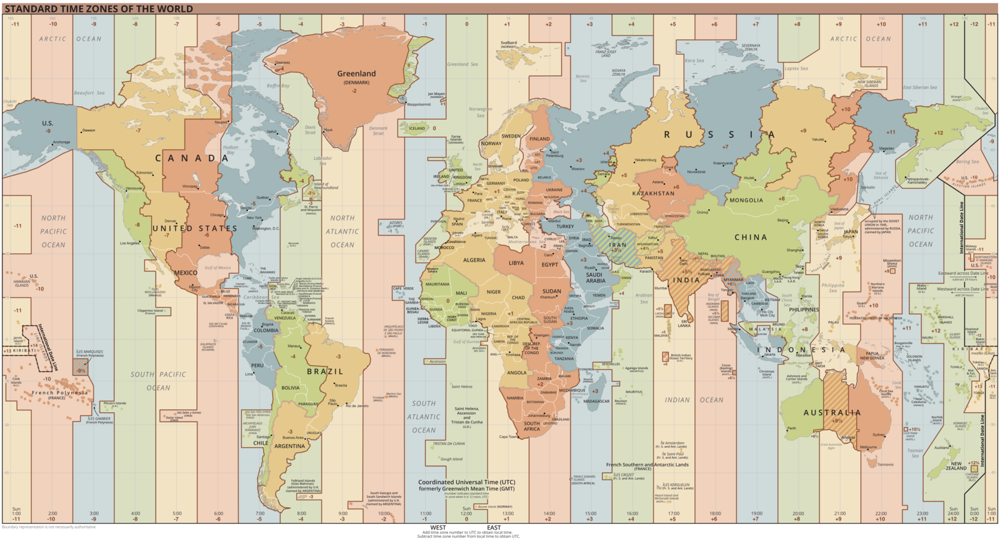
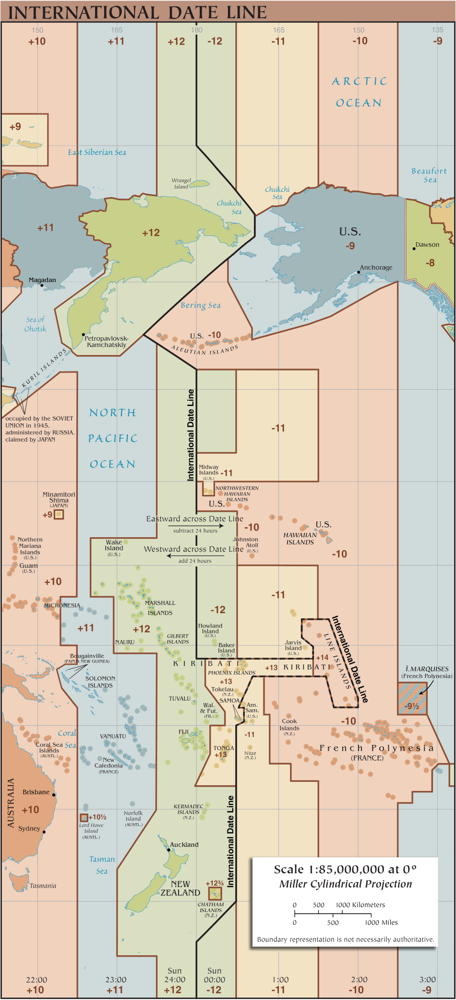
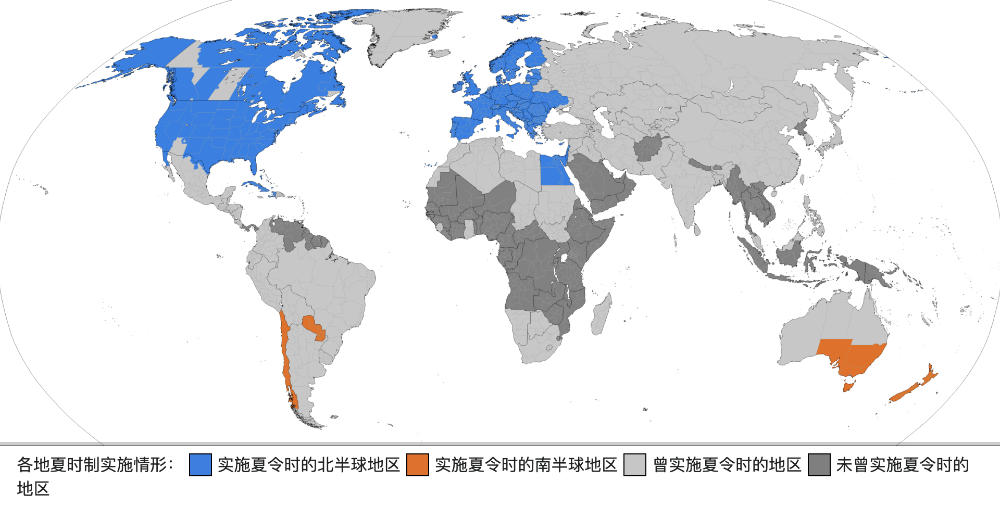
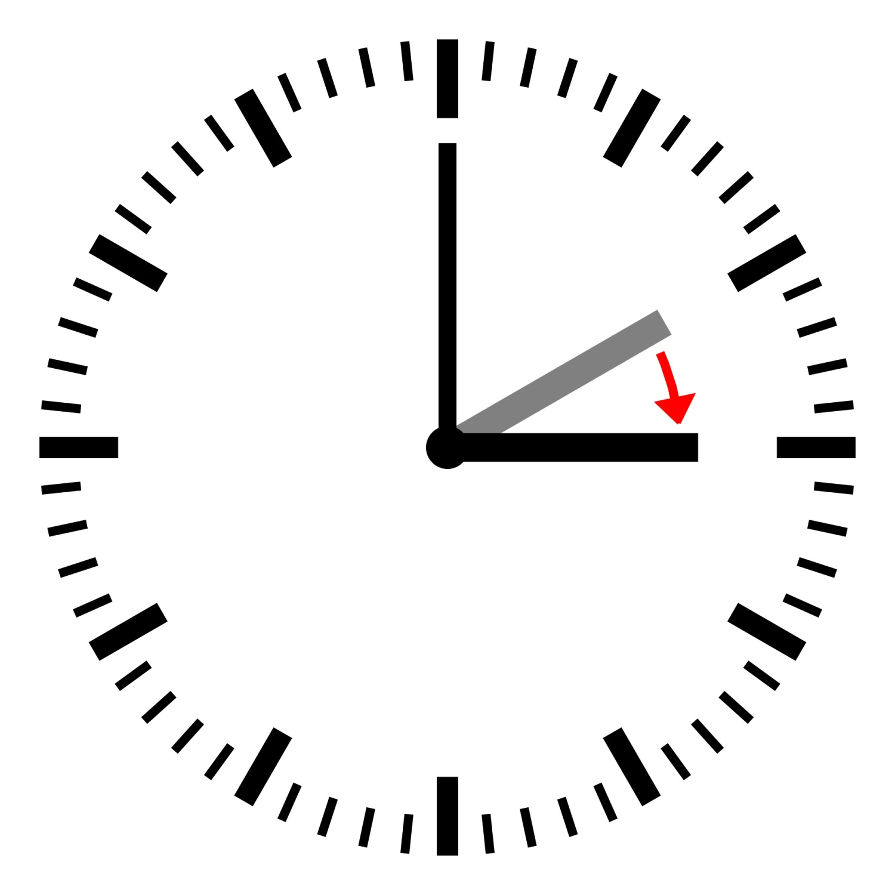
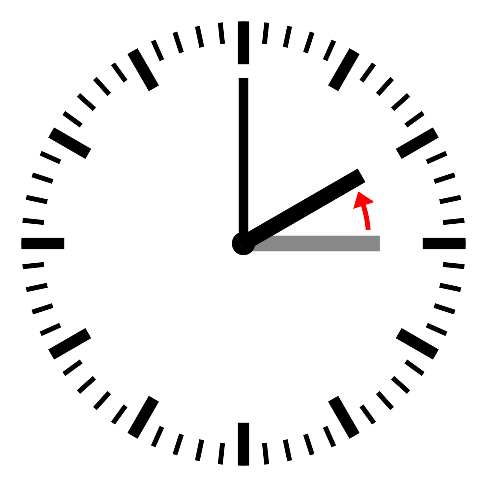

# 聊聊日期时间的那些事儿

我们念初一的时候，就学过地球公转自转、本初子午线和时区相关的内容，地球公转自传那些事儿听起来好像很简单，又好像没那么简单。

在从事前端工作之后，日期处理可以借助 [Moment.js](https://momentjs.com/)、[Day.js](https://day.js.org/)、[Date-fns](https://date-fns.org/) 等工具，操作起来好像也很简单。

<!-- more -->

但等到项目做的更多一些，更复杂一些，你可能会遇到各式各样的坑，比如：前后端交互的日期格式问题、部分浏览器格式化问题、跨国项目的服务器时区问题等。

这时候解决问题的同时，也会想要去深入地了解潜藏在“简单”背后的知识。你会发现有很多的概念压过来，比如：格林尼治标准时间（GMT）、时区、国际日期变更线、国际原子时、协调世界时（UTC），等等。

乍一接触，一脸懵逼，啥啥，这是啥，这又是啥 😵‍💫？不过既然工作中会遇到相关的问题，是硬骨头也得啃一啃 🧐。

## 01. 概念了解

### 1.1 格林尼治标准时间（Greenwich Mean Time/GMT）

[格林尼治标准时间](https://zh.wikipedia.org/wiki/格林尼治標準時間)，旧译：格林威治标准时间。你可以理解它为旧的国际通用的一个时间标准。

由于格林尼治平时是**基于天文观测**的，地球每天的自转是有些不规则的，而且正在缓慢减速，所以存在缺陷，**目前已经被原子钟报时的协调世界时（UTC）所取代**。

人们最初确定时间的方式是直接观测太阳在当地天空中的位置，例如使用日晷，这样测量出来的时间被称为“地方真太阳时”，但是存在问题，“地球公转轨道不是正圆”和“黄道与赤道之间存在夹角”会造成测出的时间的流逝不均匀。

为了解决这个问题，人们假想出了一个天体“平太阳”，作为基准测量时间，而不再以真太阳为基准，这样测量出来的时间被称为“地方平太阳时”。

格林尼治标准时间，就是指的是位于英国伦敦郊区的皇家格林尼治天文台当地的平太阳时。**本初子午线**被定义在通过那里的经线。

<div align="center">
  
</div>

为什么是格林尼治？自然有其历史原因，我把它归结为：“谁强大谁就可以制定标准”。

- 1851 年，格林尼治天文台在伦敦郊区格林尼治建立，开始成为英国的天文台和时间观测站。
- 1880 年，英国议会首次确定了格林威治时间为全英国的标准时间。
- 1884 年，在国际子午线会议上，格林尼治天文台的子午线被选定为国际时间的起点和基准。这一决定确立了格林尼治作为全球时间标准的地位。

自 1924 年 2 月 5 日开始，格林尼治天文台负责每隔一小时向全世界发放调时信息。

### 1.2 时区、国际日期变更线

以本初子午线即 0° 经线为基准，以可以被 15 整除的经线为中心，向东西两侧延伸 7.5° 为一个[时区](https://zh.wikipedia.org/zh-hans/时区)，即每 15° 划分一个时区，中心的经线为各个时区的子午线。由于地球是圆的，所以 360 / 15 = 24，拢共有 24 个时区。

以上描述的是理论上的时区，实际时区（法定时区）为了避开国界线，所以并不规则。

我们中国共跨越了五个时区，分别为东五区、东六区、东七区、东八区、东九区，但日常计时都是以北京时间的东八区为基准。



由于地球是个圆，所以实际上东 12 区与西 12 区是同一地方，为避免同一地方日期却相差一天的矛盾，1928 年，国际天文学联合会（IAU）引入了[国际日期变更线](https://zh.wikipedia.org/wiki/国际日期变更线)的概念，即 180° 经线作为国际日期变更线。

国际日期变更线，也被成为国际日界线、国际换日线或国际日期线。其实就是本初子午线对应的地球背面的那条线。

这条线其实也是东 12 区与西 12 区共用的子午线。实际使用的国际日界线是一条基本上只经过太平洋表面的折线。国际日期变更线东侧比西侧迟整整 24 小时。



### 1.3 国际原子时（TAI）、原子钟

1961 年，国际度量衡委员会（CIPM）决定基于原子钟的秒定义为国际单位制中的秒，为更为精确的时间测量奠定了基础。

1967 年，第 13 届国际计量大会决定采用原子钟定义的秒来重新定义格林尼治平均时间（GMT）为协调世界时（UTC），以提供更准确的时间标准。

在 1967 年此之前，一秒的定义，是在地球表面，摆长约一米的摆钟，一次摆动（没有反复的一次摆动）的时间大约是一秒。而之后定义了一秒为铯-133 原子基态两个超精细能级间跃迁辐射振荡 9,192,631,770 周所持续的时间。这个定义提到的铯原子必须在绝对零度时是静止的，而且在地面上的环境是零磁场。

秒的定义自此从宏观层面进入到微观层面。

[国际原子时](https://zh.wikipedia.org/wiki/國際原子時)其实就是根据以上秒的定义的一种国际参照时标，是一种国际单位制。

这种以原子共振频率来计时的时钟，称为[原子钟（Atomic clock）](https://zh.wikipedia.org/wiki/原子鐘)。它是目前世界上已知最准确的时间测量和频率标准，也是国际时间和频率转换的基准。

目前很多国家都研发了自己的铯原子钟，至少几千年不会误差 1 秒，有的甚至一两亿年不会误差 1 秒。

### 1.4 协调世界时（UTC）

[协调世界时](https://zh.wikipedia.org/wiki/协调世界时)是现在世界上调节时钟和时间的最主要的时间标准，它以国际原子时的秒长为基础，在时刻上尽量接近于格林尼治标准时间，是最接近格林尼治标准时间（GMT）的几个替代时间系统之一。

UTC 时间正式形成于 1963 年国际无线电咨询委员会的 374 号建议中，该建议由多国时间实验室共同提出。人们对该时间系统进行过数次调整，直到 1972 年引入了闰秒机制，调整工作得以简化。也有很多人提议用一个没有闰秒的时间系统来替换掉协调世界时，但目前尚未就此达成一致。

**现在大部分场景中所说的时间，基本都是 UTC 时间。对于大多数用途来说，\*\***UTC 时间和 GMT 时间几乎等同的\***\*。**

这里可以看到各个国家或地区的当前时间：[TIME.IS](https://time.is/zh/)。

### 1.5 世界时（UT）

[世界时](https://zh.wikipedia.org/wiki/世界时)（Universal Time，简称 UT）是一种以格林威治子夜起算的平太阳时。世界时和协调世界时，前者是基于天体宏观的，后者是基于原子微观的。协调世界时会根据世界时调整闰秒。

世界时是以地球自转为基准得到的时间尺度，其精度受到地球自转不均匀变化和极移的影响，为了解决这种影响，1955 年国际天文联合会定义了 UT0、UT1 和 UT2 三个系统：

- UT0 系统是由一个天文台的天文观测直接测定的世界时，没有考虑极移造成的天文台地理坐标变化。该系统曾长期被认为是稳定均匀的时间计量系统，得到过广泛应用。
- UT1 系统是在 UT0 的基础上加入了极移改正 `Δλ`，修正地轴摆动的影响。UT1 是目前使用的世界时标准。被作为目前世界民用时间标准 UTC 在增减闰秒时的参照标准。
- UT2 系统是 UT1 的平滑处理版本，在 UT1 基础上加入了地球自转速率的季节性改正 `ΔT`。

它们之间的关系可以表示为：

- UT1 = UT0 + Δλ
- UT2 = UT1 + ΔT

### 1.6 闰秒

[闰秒](https://zh.wikipedia.org/wiki/闰秒)是偶尔运用于协调世界时（UTC）的调整，通过增加或者减少一秒，以消弥精确的时间（使用原子钟测量）和不精确的观测太阳时（UT1）之间的差异。

通俗点理解就是，微观层面的原子钟非常精准，前面也说了，几千年上亿年都不会误差一秒，但是比如当精准的时间刻度过去了 24 小时，并不能保证地球将将好正好旋转一圈一点不差，长时间累计下来，总会有超过 1 秒误差的时候，这时候就需要通过闰秒的机制来对 UTC 时间进行 1 秒加减的调整。

如果不做调整，可能累计一万多年后，会出现凌晨 1 点钟太阳升起的情况。

因为地球的旋转速度会随着气候和地质事件的变化而变化，因此 UTC 的闰秒间隔不规则且不可预知。每个 UTC 闰秒的插入，通常由国际地球自转服务（IERS）提前约六个月决定，以确保 UTC 和 UT1 读数之间的差值永远不会超过 0.9 秒。

### 1.7 ISO 8601

[ISO 8601](https://www.iso.org/iso-8601-date-and-time-format.html)是一个**日期和时间的表示方法国际标准**，全称为《数据元和交换格式信息交换日期和时间表示法》。目前最新版本为 2004 年 12 月 1 日发行的第三版“ISO8601:2004”。

ISO 8601 标准对于年、月、周、日、时、分、秒、时间段、重复时间等，都有详细的规定，这里比较难概述，感兴趣的小伙伴可以自行查阅。

以下是有效的 ISO 8601 表示方法示例：

- 日期：`2023-08-12`
- UTC 日期与时间：`2023-08-12T05:24:41+00:00`、`2023-08-12T05:24:41Z`、`20230812T052441Z`、`2023-08-12T05:24:41.123+08:00`
- 周数：`2023-W32`
- 日期与周数：`2023-W32-6`
- 无年份标示之日期：`--08-12`
- 当年度累积日数：`2023-224`

这里着重关注下 UTC 日期与时间的表示法。年月日鱼时间之间，有一个 `T` 作分割，末尾的 `Z` 或 `+08:00` 表示时区，秒后面可以用 `.123` 表示毫秒数。0 时区可以用 `Z` 表示，也可以用 `+00:00` 表示。北京时间是东八区时间，所以北京时间可以表示为：`2023-08-12T05:24:41+08:00`。

### 1.8 CST、BJT

在浏览器控制台输出一个日期，会发现打印的日期格式后面追加了`(中国标准时间)`的字样。

```js
new Date()
// Tue Aug 15 2023 10:42:38 GMT+0800 (中国标准时间)
```

如果把系统改成英文，会发现 `(中国标准时间)` 变成了 `CST`。

```js
new Date()
// Tue Aug 15 2023 10:42:38 GMT+0800 (CST)
```

这么一看，好像中国标准时间的英文表示就是 CST？这一点是不太正确的，因为 CST 可以是好几个国家标准时间的缩写：

- China Standard Time：中国标准时间 UTC+8:00
- Central Standard Time (USA)：美国标准时间 UTC-6:00
- Central Standard Time (Australia)：澳大利亚标准时间 UTC+9:30
- Cuba Standard Time：古巴标准时间 UTC-4:00

所以 CST 就像是一个备注，不是唯一的，它代表哪个标准时间，重要的是看时区。只有东八区的时间后面追加的 CST 标志，才是中国标准时间。

中国标准时间其实就是北京时间（Beijing Time），所以也可以简写为 BJT。

### 1.9 时间戳（Timestamp）

一般程序员口中的时间戳一般是指从**UTC 时间 1970 年 1 月 1 日 0 时 0 分 0 秒**起至现在的总秒数或总毫秒数，不考虑闰秒。

```js
new Date(0)
// Thu Jan 01 1970 08:00:00 GMT+0800 (中国标准时间)
```

JavaScript 获取时间戳的几种方式：

```js
new Date('2023-08-12T05:24:41.123+08:00').getTime() // 1691789081123
new Date('2023-08-12T05:24:41.123+08:00').valueOf() // 1691789081123

// 注意用 Date.parse 解析 Date 对象会丢失掉毫秒
// 另外也不推荐在 ES5 之前使用 Date.parse 方法去解析字符串
// 不同浏览器在如何解析日期字符串上仍存在许多差异
// 解析日期字符串的工作还是交给日期工具库吧
Date.parse('2023-08-12T05:24:41.123+08:00') // 1691789081123
Date.parse(new Date('2023-08-12T05:24:41.123+08:00')) // 1691789081000
```

UNIX 或类 UNIX 系统的时间表示，也是用的从 UTC 时间 1970 年 1 月 1 日 0 时 0 分 0 秒起至现在的总秒数，所以这个总秒数的时间戳，也可以是叫做 UNIX 时间，或称 POSIX 时间。

时间戳数值是一个相对量，所以是跟时区无关的偏移值，或者说在任何一个时区，同一时刻的时间戳数值都是一样的。

### 1.10 网络时间协议（NTP）

[网络时间协议](https://zh.wikipedia.org/zh-hans/網路時間協定)是一个非常古老但是沿用至今的应用层协议。电脑和电脑之间时间能保持一致，其实就是 NTP 的功劳。

NTP 的目的是将所有参与计算机的协调世界时（UTC）时间同步到几毫秒的误差内。NTP 通常可以在公共互联网保持几十毫秒的误差，并且在理想的局域网环境中可以实现超过 1 毫秒的精度。

在闰秒事件的当天，ntpd 从配置文件、附加参考时钟或远程服务器收到通知，然后对系统时间进行微调。

- 如果需要增加 1 秒，会这么处理：`23:59:59 -> 23:59:60 -> 00:00:00`。
- 如果需要删除 1 秒，会这么处理：`23:59:58 -> 00:00:00`，跳过 `23:59:59`。

### 1.11 夏令时

夏令时（也叫夏时制、日光节约时间）是一种神奇的时间制度，一种为节约能源而人为规定地方时间的制度，旨在鼓励人民早睡早期，不要浪费电。具体做法是在夏季月份人为地将时间调快，一般是调快一个小时，也有半个小时的，等到秋季来临再调回正常时间。

全球有约百分之四十的国家在使用夏令时。我国香港、澳门及台湾在二战后曾经连续多年采用夏令时，至 1980 年停用，大陆也曾经在 1986 年采用，至 1992 年停用，现在亚洲与非洲地区一般不实施夏令时。



将时间调快的具体时间点，会因司法管辖区不同而有所差异。有的国家每年的政策也不太一样，有出国留学工作的小伙伴可以留意一下对应国家有没有夏令时 🤖。一般夏令时实行时，对应地区播报的世界协调时间（UTC）会同步调快。（没出过国，有疏漏欢迎指出 🤣）

<table>
<tr>
  <td>
    
    当夏令时开始时，时钟将会在开始当日的凌晨时段往后加1小时（也就是跳过1个小时）。
  </td>
  <td>
    
    当夏令时结束时，时钟会在结束当日的凌晨时段往前减1小时（也就是重复1个小时）。
  </td>
</tr>
</table>

## 02. 前端实践

### 2.1 前后端接口传递日期时间字段的格式要求

只要涉及到年月日时分秒的具体时间，不管传哪种格式，必须带时区！

如果想要一个程序可以**很健壮**地运行下去，具体日期格式参数的传递必须带有时区标志。可以是 ISO 8601 格式的 UTC 日期时间，也可以是时间戳。

如果不带时区，在以下场景可能会出现时间错乱的问题：

- 项目部署的服务器的时区与访问者的时区不一致
- 项目是一个国际化项目

设想一下：

- 我在中国东八区提交一条记录，比如「预约时间」字段提交的是 `2023-08-15 16:00`，没有带时区标记。
- 假设接收存储这条记录的服务器，是处于华盛顿西五区的服务器。
- 那位于华盛顿的服务器，可能会把它当做 0 时区的时间进行处理，最终存到库里的时间为 `2023-08-15T12:00-04:00`（正在实行夏令时）。
- 如果已经存库的「预约时间」需要显示在中国用户的电脑上，就会显示成 `2023-08-16 00:00`。

这显然是不对的，如果提交的时候带上时区：`2023-08-15T16:00+08:00`，就能避免这样的问题。

### 2.2 日期时间的解析问题

`Date()` 构造函数的参数，有五种形式：无参数、毫秒级时间戳、日期对象、日期和时间组件的单独值、日期字符串。

- 无参数时，返回当前的日期和时间
- 参数为毫秒级时间戳时，返回该时间戳对应的日期和时间
- 参数为日期对象时，实际上是复制了一个相同的日期和时间，等同于 `new Date(dateObject.valueOf())`
- 参数为日期和时间组件的单独值的情况，实际很少用到，请自行查阅，这里不作赘述

参数为日期字符串的情况，是日常使用最多的。但是字符串形式不同，或者浏览器不同，都对解析结果有影响。

举个例子：

```js
new Date('2023-08-15')
// Tue Aug 15 2023 08:00:00 GMT+0800 (中国标准时间)

new Date('2023/08/15')
// Tue Aug 15 2023 00:00:00 GMT+0800 (中国标准时间)
```

(╯°Д°)╯︵ ┻━┻，对于当年初学的我来讲，简直麻了。

为什么这样？原因是 `Date()` 构造函数的参数如果是日期字符串的格式，其内部其实是用 `Date.parse()` 方法进行解析的。

按照[JavaScript 规范](https://tc39.es/ecma262/multipage/numbers-and-dates.html#sec-date-time-string-format)，其实日期字符串的格式仅指定了一种普遍支持的格式，即以下 ISO 8601 格式：

```
YYYY-MM-DDTHH:mm:ss.sssZ
```

**而其他的字符串格式，都是\*\***宿主环境自行支持的\***\*，相同的字符串在不同的环境可能存在一定的解析差异。**所以在不使用日期工具库的情况下，想要保持最大的兼容性，保证格式正确是有必要的。

这时候回头来看前面的例子，按照规范，仅包括日期的 ISO 8601 格式，会自动添加上 UTC 0 时区，`2023-08-15` 符合这种情况。而 `'2023/08/15'` 被识别为非 ISO 格式，所以默认会使用本地时区进行解析。

不过需要注意，IE 不支持 ISO 8601 格式 😰……需要兼容 IE 的话，必须得使用日期工具库。（我更希望 2023 年了，你不会再因为 IE 而烦恼）

在使用第三方日期工具库的情况下，针对于 IE 这种 ISO 8601 格式都不支持的，可以这样兼容：

```js
import dayjs from 'dayjs'
import customParseFormat from 'dayjs/plugin/customParseFormat'

import { parseISO } from 'date-fns'

// 挂载解析插件
dayjs.extend(customParseFormat)

// Moment.js
moment('2023-08-12T05:24:41+08:00', moment.ISO_8601)

// Day.js
dayjs('2023-08-12T05:24:41+08:00', 'YYYY-MM-DDTHH:mm:ss.000ZZ')

// date-fns
parseISO('2023-08-12T05:24:41+08:00')
```

其他非 ISO 8601 标准格式的，可以通过指定具体格式的方式进行兼容：

```js
import dayjs from 'dayjs'
import customParseFormat from 'dayjs/plugin/customParseFormat'

import { parse } from 'date-fns'

// 挂载解析插件
dayjs.extend(customParseFormat)

// Moment.js
moment('2023-08-12 05:24:41', 'YYYY-MM-DD HH:mm:ss')
moment('2023-8/12 5:4:41', 'YYYY-M/D H:m:s')
moment('2023/08/12 05:24:41', 'YYYY/MM/DD HH:mm:ss')

// Day.js
dayjs('2023-08-12 05:24:41', 'YYYY-MM-DD HH:mm:ss')
dayjs('2023-8/12 5:4:41', 'YYYY-M/D H:m:s')
dayjs('2023/08/12 05:24:41', 'YYYY/MM/DD HH:mm:ss')

// date-fns
parse('2023-08-12 05:24:41', 'yyyy-MM-DD HH:mm:ss')
parse('2023-08/12 5:4:41', 'yyyy-M/D H:m:s')
parse('2023/08/12 05:24:41', 'yyyy/MM/DD HH:mm:ss')
```

### 2.3 获取当前的时区

`Intl`对象可以帮助获取当前的时区名：

```js
Intl.DateTimeFormat().resolvedOptions().timeZone // Asia/Shanghai
```

获取时区偏移量：

```js
const timezoneOffset = 0 - new Date().getTimezoneOffset() / 60 // 8
```

---

以上，希望对你有用。
