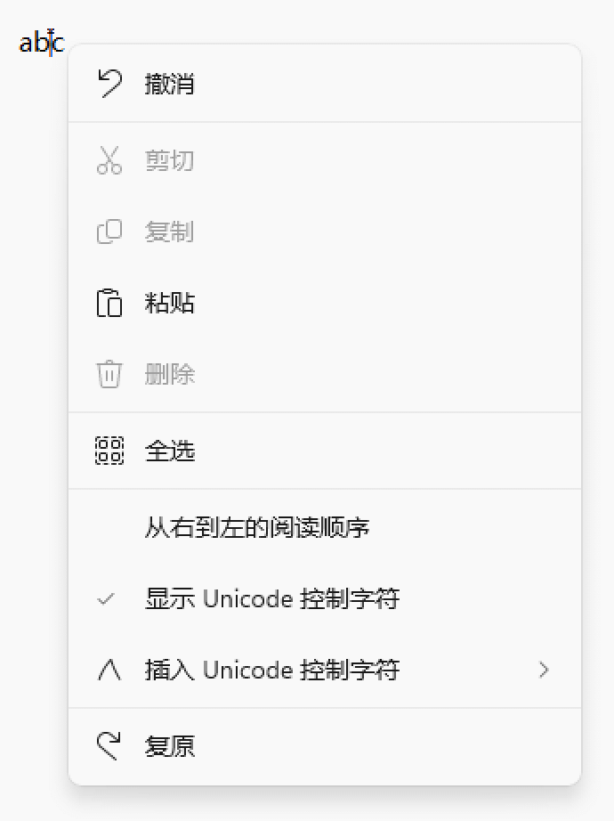
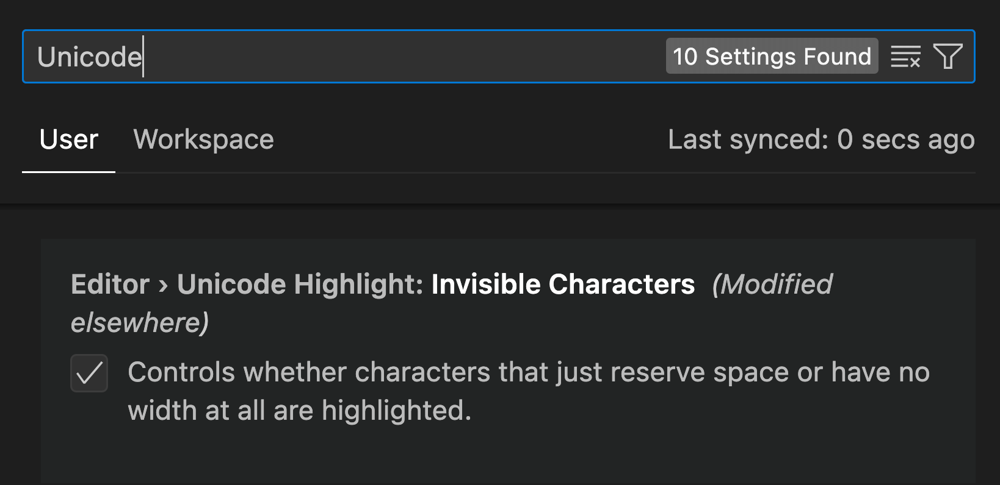
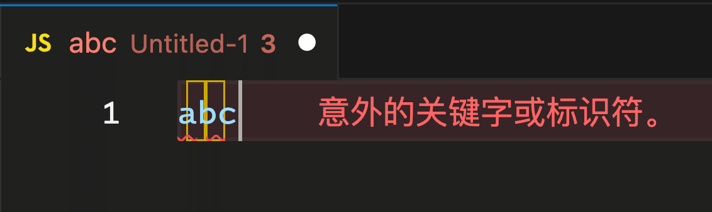
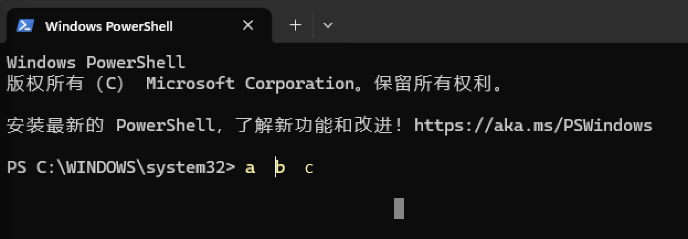
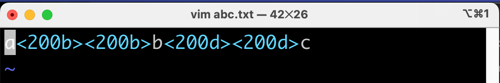
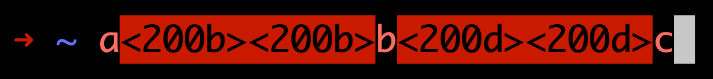

# 不可见的艺术：Unicode 控制字符

在字符的世界中，存在一类特殊的字符，如果把它们全部列在一个文本中打印出来，你将会看到一张空白的纸。这些特殊字符单独拎出来，都是肉眼看不到的，有的甚至不占据显示空间。它们就是今天的主角——「Unicode 控制字符」。

<!-- more -->

介绍 Unicode 控制字符之前，我们需要先来认识一下 ASCII 和 Unicode 这两大字符编码系统。

## 先认识两个字符编码系统

### 老前辈 ASCII

[ASCII（American Standard Code for Information Interchange 美国信息交换标准码）](https://zh.wikipedia.org/wiki/ASCII)是最早的字符编码系统。ASCII 码表最初只定义了 128 个字符，从 0 到 127。它包括了基本的拉丁字母、数字、标点符号、控制字符以及一些特殊字符。每个字符都有一个唯一的 7 位二进制表示，对应一个 0 到 127 的十进制值。

ASCII 码表还有个扩展版本——EASCII 码表（Extended ASCII）。EASCII 码表是将 ASCII 码由 7 位扩充为 8 位而成。EASCII 码表包含了原始 ASCII 码表的 128 个字符，并在其基础上添加了 128 个额外的字符，包括一些特殊符号、外语字符、图形符号等。不同的 ASCII 扩展码标准可能有一些差异，因为它们在额外的 128 个位置上可以定义不同的字符。

ASCII 是字符编码的起源。

### 大一统的 Unicode

[Unicode](https://home.unicode.org/) 被称作为**统一码**，是信息技术领域的业界标准，旨在涵盖全球范围内的**所有字符**。

Unicode 使用 16 位、32 位或更多位二进制数来表示字符，提供了数百万个码点，包括各种语言、符号、表情符号等。Unicode 堪称编码系统界的“秦始皇”。

Unicode 扩展了 ASCII，提供了更广泛的字符集，包括不同语言的字母、符号和特殊字符。ASCII 可以看作是 Unicode 的子集，因为 ASCII 的字符在 Unicode 中有对应的编码。

> 我在<a href="/posts/20230626-front-end-emoji.html" target="_blank">《聊聊前端场景中的 Emoji》</a>中的第二小节，也介绍到过 Unicode 相关的知识，有兴趣的小伙伴可以去瞅瞅。

## ASCII 控制字符

ASCII 码表中，编号范围是 0-31 和 127（16 进制：0x00-0x1F 和 0x7F）的 33 个字符，我们一般称之为 **ASCII 控制字符**。ASCII 控制字符被设计分为多重用途：打印和显示控制、数据结构化、传输控制、以及其他零散用途。

ASCII 控制字符可以说是 Unicode 控制字符的前身。

以下是 ASCII 码表中，所有的控制字符：

```bash
00  (NUL)    Null 空
01  (SOH)    Start of Header 报头开始
02  (STX)    Start of Text 正文开始
03  (ETX)    End of Text 正文结束
04  (EOT)    End of Transmission 传输结束
05  (ENQ)    Enquiry 查询
06  (ACK)    Acknowledge 确认
07  (BEL)    Bell 振铃
08  (BS)     Backspace 退格
09  (HT)     Horizontal Tab 水平制表
10  (LF)     Line Feed 馈行
11  (VT)     Vertical Tab 垂直制表
12  (FF)     Form Feed 馈页
13  (CR)     Carriage Return 回车
14  (SO)     Shift Out 移出
15  (SI)     Shift In 移入
16  (DLE)    Data Link Escape 数据链路转义
17  (DC1)    Device Control 1 设备控制1
18  (DC2)    Device Control 2 设备控制2
19  (DC3)    Device Control 3 设备控制3
20  (DC4)    Device Control 4 设备控制4
21  (NAK)    Negative Acknowledge 否认
22  (SYN)    Synchronous Idle 同步空闲
23  (ETB)    End of Transmission Block 传输块结束
24  (CAN)    Cancel 取消
25  (EM)     End of Medium 介质结束
26  (SUB)    Substitute 替换
27  (ESC)    Escape 转义
28  (FS)     File Separator 文件分隔符
29  (GS)     Group Separator 分组符
30  (RS)     Record Separator 记录分隔符
31  (US)     Unit Separator 单元分隔符
127 (DEL)    Delete 删除
```

## Unicode 控制字符

**Unicode 控制字符（Unicode control characters）是用于控制文本解释或者显示，但是不可见或不占空间的 Unicode 字符。**

这类字符其实是对 ASCII 码表中控制字符的继承和扩充，所以也包含所有的 ASCII 控制字符。

Unicode 控制字符可以分为以下几大类：

- ISO 6429 控制字符（C0 与 C1）
- 分隔符
  - 语言标记
  - 行间标注
- 双向文本控制
- 异体字选择器

具体的分类描述和作用，可以参考[此链接](https://zh.wikipedia.org/wiki/Unicode%E6%8E%A7%E5%88%B6%E5%AD%97%E7%AC%A6)。

## Unicode 控制字符的表示方法

Unicode 控制字符，视觉上不可见，但是总有需要手写出它们的时候，总要有写法去表示它们吧？上文中我们其实已经展示了几种 Unicode 控制字符的表示方法，以 ASCII 码第 127 位为例：

- 英文全称：`Delete`
- 英文缩写：`DEL`
- 中文：`删除`
- 码位表示法：`U+007F`

其中，英文全称、英文缩写和中文这三种表示法，都属于语义层面的，需要放在特定的语境中，不需要关注。

除以上表示法外，还有以下几种表示法：

- 二进制 `1111111`
- 八进制 `177`
- 十进制 `127`
- 十六进制 `7F`
- 十六进制的转义字符表示法 `\u007F`
- 脱字符表示法 `^?`

这里有个可能比较陌生的名词——「脱字符表示法」。脱字符表示法（Caret notation）是对 ASCII 码不可打印的控制字符的一种表示法。用一个脱字符（`^`）后跟一个大写字符来表示一个控制字符的 ASCII 码值。但是前文介绍了，ASCII 已经被淘汰了，所以这个概念不重要。

::: tip 提示
日常使用时，文章中书写一般用「码位表示法（`U+007F`）」，代码中一般用「十六进制的转义字符表示法（`'\u007F'`）」或十六进制字面量（JS：`0x007F`）。
:::

## 怎么查看 Unicode 控制字符？

非打印字符在网页和一般的编辑其中，是看不见的。比如这串字符串：`a​​b‍‍c`，包含了 4 个非打印字符，JS 写作：`'a\u200B\u200Bb\u200D\u200Dc'`。

```js
console.log('a​​b‍‍c'.length) // 7
```

拿到这样一串字符串，怎么查看它有没有隐藏的非打印字符？

#### 软件层面

1. 光标移动法（不能直观查看）<br>
   一个笨办法就是通过光标移动去判断有没有隐藏的字符，光标在移动时，经过 Unicode 控制字符时，也需要一格格的去移动。

2. 编辑器设置「显示 Unicode 控制字符」（不能直观查看具体是什么 Unicode）<br>
   很多编辑器都有「查看 Unicode 编辑器」的设置。

   - 比如 Windows 的文本编辑：
     
   - 比如 VSCode，VSCode 默认会打开该设置，但是需要在**非纯文本文件（Plain Text）**中：
     
     

3. 粘贴进 Windows Powershell 中（不能直观查看具体是什么 Unicode）



4. Vim 编辑器（可以直观查看具体是什么 Unicode）



5. 粘贴进 Linux 或 MacOS 的终端中（可以直观查看具体是什么 Unicode）



#### 代码层面

1. 正则匹配

```js
const pattern = /[\x00-\x1F\x7F-\x9F\u200B-\u200F\uFEFF\u202A-\u202E]/
console.log(pattern.test('a​​b‍‍c')) // true

// 全局匹配模式
const globalPattern = new RegExp(pattern, 'g')
const matches = 'a​​b‍‍c'.match(globalPattern)
const result = []
matches.forEach(m => {
  result.push(m.codePointAt(0).toString(16).toUpperCase())
})
console.log(result) // ['200B', '200B', '200D', '200D']
```

2. 码位比对

```js
function hasControlCharacters(inputStr) {
  for (var i = 0; i < inputStr.length; i++) {
    var charCode = inputStr.charCodeAt(i)
    if (
      (charCode >= 0x00 && charCode <= 0x1f) ||
      (charCode >= 0x7f && charCode <= 0x9f) ||
      (charCode >= 0x200b && charCode <= 0x200f) ||
      charCode === 0xfeff ||
      (charCode >= 0x202a && charCode <= 0x202e)
    ) {
      return true
    }
  }
  return false
}
console.log(hasControlCharacters('a​​b‍‍c')) // true
```

## 一个特殊的分类：零宽字符

Unicode 控制字符中，部分无法直接看到、不占据视觉宽度的字符，被称作**零宽字符**。这个“部分”的概念其实很玄学，原因是零宽字符并**不是一个官方的定义**，而是业内对部分常见的没有宽度的 Unicode 控制字符的统称。

### 常见的零宽字符和一般性作用

1. 零宽空格（zero-width space，ZWS）：`U+200B`。
   - 通常用于排版微调，提供不可见的、不占据宽度的空格，以调整文本的排列和显示效果。
2. 零宽不连字（zero-width non-joiner，ZWNJ）：`U+200C`
   - 通常用于指示两个字符之间不应该形成连字。在一些语言中，字符组合在一起可能会形成特定的字形，而插入零宽度非连字可以阻止它们形成连字。
3. 零宽连字（zero-width joiner，ZWJ）：`U+200D`
   - 通常用于指示两个字符之间应该形成连字。在字形连接的语言（阿拉伯语、印地语）中，一些字符组合在一起形成特定的字形，而插入零宽度连字可以促使它们形成连字。
4. 连词字符（word joiner，WJ），`U+2060`
   - 通常用于指示两个字符之间应该形成连词，而不是断开。这个字符的作用是促使字符形成连词，特别在一些字形连接的语境中。
5. 左至右符号（left-to-right mark, LRM），`U+200E`
   - 通常用于指示文本方向从左至右，影响其前面的字符在显示时保持左对齐的方向性特性。
6. 右至左符号（right-to-left mark, RLM），`U+200F`
   - 通常用于指示文本方向从右至左，影响其前面的字符在显示时保持右对齐的方向性特性。

### 零宽字符实现文本水印

零宽字符除了作为「控制字符」的一般性作用外，还有其他特殊的用处，比如**文本水印**。

将隐藏的零宽字符信息嵌入到文本中，而人眼无法察觉，这可以用于保护文件的所有权或者传递秘密信息。

下面是一个简单的 JavaScript 实现：

```js
/**
 * 生成文本水印
 */
function generateTextWatermark(originWatermark = '') {
  if (typeof originWatermark !== 'string' || originWatermark.length === 0) {
    throw new Error('Invalid watermark')
  }

  // 开始标记
  const startMarker = '\u200D'
  // 结束标记
  const endMarker = '\u200E'
  // 零宽空格 - 0
  const zws = '\u200B'
  // 零宽不连字 - 1
  const zwnj = '\u200C'
  // 连词字符 - 充当空格
  const wj = '\u2060'

  // 将文本转换为二进制字符串
  let binaryString = decodeURIComponent(encodeURIComponent(originWatermark))
    .split('')
    .map(char => char.charCodeAt(0).toString(2))
    .join(wj)

  // 将二进制字符串中的「0」替换为「零宽空」，「1」替换为「零宽不连字」
  const markedText = binaryString.replace(/0/g, zws).replace(/1/g, zwnj)

  return `${startMarker}${markedText}${endMarker}`
}

/**
 * 添加文本水印
 */
function addTextWatermark(originalText = '', watermark = '') {
  // 生成零宽字符拼接的文本水印
  const hiddenWatermark = generateTextWatermark(watermark)

  if (typeof originalText !== 'string' || originalText.length === 0) {
    throw new Error('Invalid original text')
  }

  // 在原始文本中插入水印
  let markedText = originalText
  if (originalText.length < 5) {
    markedText = originalText.split('').join(hiddenWatermark)
  } else {
    markedText = originalText
      .split('')
      .map((char, index) => {
        // 每隔几个字符插入一个隐藏字符
        if ((index + 1) % 5 === 0) {
          return char + hiddenWatermark
        }
        return char
      })
      .join('')
  }

  return markedText
}

/**
 * 提取水印信息
 */
function extractTextWatermark(markedText = '') {
  if (typeof markedText !== 'string' || markedText.length === 0) {
    throw new Error('Invalid marked text')
  }

  // 开始标记
  const startMarker = '\u200D'
  // 结束标记
  const endMarker = '\u200E'
  // 零宽空格 - 0
  const zws = '\u200B'
  // 零宽不连字 - 1
  const zwnj = '\u200C'
  // 连词字符 - 充当空格
  const wj = '\u2060'

  // 先提取出连续的 Unicode 零宽字符
  const hiddenWatermark = markedText.match(
    new RegExp(`${startMarker}.*?${endMarker}`, 'g')
  )

  if (!hiddenWatermark.length) {
    return ''
  }

  // 去掉标记字符，然后将零宽字符转换为二进制字符串
  let binaryString =
    '0' +
    hiddenWatermark[0]
      .replace(new RegExp(startMarker, 'g'), '')
      .replace(new RegExp(endMarker, 'g'), '')
      .replace(new RegExp(zws, 'g'), '0')
      .replace(new RegExp(zwnj, 'g'), '1')
      .replace(new RegExp(wj, 'g'), ' ')

  // 将二进制字符串转换为文本
  const watermark = binaryString
    .match(/.{8}/g)
    .map(byte => String.fromCharCode(parseInt(byte, 2)))
    .join('')

  return watermark
}

const markedText1 = addTextWatermark('你好', 'xc')
console.log(markedText1)
// 你<200d><200c><200c><200c><200c><200b><200b><200b>⁠<200c><200c><200b><200b><200b><200c><200c><200e>好
const markedText2 = addTextWatermark(
  '若能掬起一捧月光，我选择最柔和的；若能采来香山红叶，我选择最艳丽的；若能摘下满天星辰，我选择最明亮的。也许你会说，我的选择不是最好，但我的选择，我相信。',
  'xc'
)
console.log(markedText2)
// 若能掬起一<200d><200c><200c><200c><200c><200b><200b><200b>⁠<200c><200c><200b><200b><200b><200c><200c><200e>捧月光，我<200d><200c><200c><200c><200c><200b><200b><200b>⁠<200c><200c><200b><200b><200b><200c><200c><200e>选择最柔和<200d><200c><200c><200c><200c><200b><200b><200b>⁠<200c><200c><200b><200b><200b><200c><200c><200e>的；若能采<200d><200c><200c><200c><200c><200b><200b><200b>⁠<200c><200c><200b><200b><200b><200c><200c><200e>来香山红叶<200d><200c><200c><200c><200c><200b><200b><200b>⁠<200c><200c><200b><200b><200b><200c><200c><200e>，我选择最<200d><200c><200c><200c><200c><200b><200b><200b>⁠<200c><200c><200b><200b><200b><200c><200c><200e>艳丽的；若<200d><200c><200c><200c><200c><200b><200b><200b>⁠<200c><200c><200b><200b><200b><200c><200c><200e>能摘下满天<200d><200c><200c><200c><200c><200b><200b><200b>⁠<200c><200c><200b><200b><200b><200c><200c><200e>星辰，我选<200d><200c><200c><200c><200c><200b><200b><200b>⁠<200c><200c><200b><200b><200b><200c><200c><200e>择最明亮的<200d><200c><200c><200c><200c><200b><200b><200b>⁠<200c><200c><200b><200b><200b><200c><200c><200e>。也许你会<200d><200c><200c><200c><200c><200b><200b><200b>⁠<200c><200c><200b><200b><200b><200c><200c><200e>说，我的选<200d><200c><200c><200c><200c><200b><200b><200b>⁠<200c><200c><200b><200b><200b><200c><200c><200e>择不 是最好<200d><200c><200c><200c><200c><200b><200b><200b>⁠<200c><200c><200b><200b><200b><200c><200c><200e>，但我的选<200d><200c><200c><200c><200c><200b><200b><200b>⁠<200c><200c><200b><200b><200b><200c><200c><200e>择，我相信<200d><200c><200c><200c><200c><200b><200b><200b>⁠<200c><200c><200b><200b><200b><200c><200c><200e>。

console.log(extractTextWatermark(markedText1)) // xc
console.log(extractTextWatermark(markedText2)) // xc
```

::: warning 注意
这种文本水印的效果可能并不理想，因为零宽字符可能会在某些环境下显现或者影响布局，不一定都能做到完全“隐形”。
:::

文本水印只是零宽字符的一个应用场景，零宽字符还有其他的应用场景，比如**防止爬虫**、**隐藏敏感信息**等，等待小伙伴们自行探索。

---

以上就是 Unicode 控制字符的介绍，希望能帮助大家更好地理解和使用。
